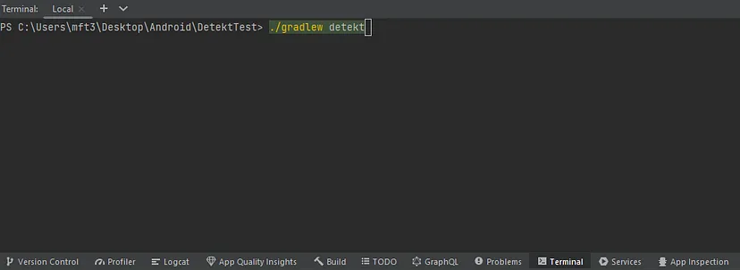
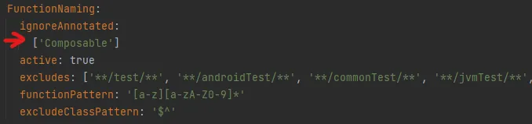

# Android Lint, Ktlint ve Detekt

## **İçindekiler**

- [Android Lint](#android-lint)
- [Ktlint](#ktlint)
- [Detekt](#detekt)
- [Sonuç](#sonuç)

<br>

<table>
  <tr>
    <th style="text-align: left; font-weight: bold;">Yayınlanma Tarihi</th>
    <td style="text-align: left;">22 Ağustos 2024</td>
  </tr>
  <tr>
    <th style="text-align: left; font-weight: bold;">Son Güncelleme Tarihi</th>
    <td style="text-align: left;"></td>
  </tr>
  <tr>
    <th style="text-align: left; font-weight: bold;">Tahmini Okuma Süresi</th>
    <td style="text-align: left;">9 dakika</td>
  </tr>
</table>


Bu yazımda Lint üzerine detaylı bir inceleme yapacağız. Sonrasında ise sektörde kullanılan iki
kütüphaneyi inceliyor olacağız.

<div align="center">
  
</div>

<br>


## Android Lint

Android Lint, kodunuzdaki hataları bulmaya yarayan statik bir kod analiz aracıdır. Buradaki
önemli nokta programınızı çalıştırmadan bu hataları görebiliyor olmanızdır. Her bir problem,
bu araç tarafından tespit edilir ve uyarı mesajı olarak size bildirilir. Genelde de bunu ampul
sembolüne tıkladığımızda görmüş oluyoruz zaten. Buraya kadar hakim olduğumuz bildiğimiz işleri
açıklamış olduk.

<br>

Bir tık daha ileri seviyeye taşıyalım ve bu tool'u uygulamalı olarak kullanmayı deneyelim.
Sıfırdan bir proje oluşturduğumuz senaryoda tek ekranlı (tek activity) bir kodumuz olsun.

```kotlin
class MainActivity : ComponentActivity() {
    override fun onCreate(savedInstanceState: Bundle?) {
        super.onCreate(savedInstanceState)

        setContent {
            AndroidLintToolTheme {
                // A surface container using the 'background' color from the theme
                Surface(
                    modifier = Modifier.fillMaxSize(),
                    color = MaterialTheme.colorScheme.background
                ) {
                    Greeting("Android")
                }
            }
        }
    }
}

@Composable
fun Greeting(name: String, modifier: Modifier = Modifier) {
    Text(
        text = "Hello $name!",
        modifier = modifier
    )
}

@Preview(showBackground = true)
@Composable
fun GreetingPreview() {
    AndroidLintToolTheme {
        Greeting("Android")
    }
}
```

<br>

Alt pencereden terminal sekmesini açıyoruz. `./gradlew lint` komutunu çalıştırıyoruz.


<br>

Yaklaşık 10 saniyelik bir işlemin ardından:


<br>

Bizim için bir `.html` uzantılı dosya üretti. Bu dosyaya tıkladığımızda bizi de uyarılar karşılıyor:


<br>

Görüldüğü üzere projemiz özelinde uyarıların bulunduğu bir dizin bu. Örneğin manifest dosyasında
label'ın gereksiz olduğu uyarısında bulunuyor. Gidip label'ı kaldırırsak bu uyarının kaybolduğunu
gözlemleyeceğiz. Peki activity kodumuzun biraz üzerine gitsek neler olur? Burada `Greeting`
fonksiyonunu biraz tatsız hale getirdik.

```kotlin
@Composable
fun Greeting(name: String, modifier: Modifier = Modifier) {


    Text(


        text = "Hello $name!",


        modifier = modifier


        

    )
}
```

<br>

Bakalım lint aracımız herhangi bir bildirimde bulunacak mı? İzleyelim.


<br>

Görüldüğü üzere herhangi bir uyarı veya hatayla karşılaşmadık. Aslında burası bir iş yükü
oluşturdu. Bu kod için pr açıldığı seneryoda review'ın iş yükü belki de fazlasıyla katlanmış oldu.
Hem kod okunabilirliği azaldı hem de task'a ayrılan eforun artmasına sebep oldu.

<br>

Bunun üstesinden gelmek için birkaç yol mevcut. Andorid'in sağladığı olanakların birinden yararlanıp
bir lint dosyası oluşturacağız ve `custom rules` yazacağız. Ancak bu gibi durumların sayısı artarsa
her bir kontrol için rules yazmak işleri zorlaştırabilir. Bir diğer yol da başlıkta adını verdiğimiz
kütüphaneleri kullanmak. Bahsedilen kütüphaneler bu gibi basit ve belki de daha kompleks işleri
kolay bir şekilde halledecek. Hatta halletmekle kalmayıp kodunuzu sizin için **düzenleyecek**.
Kulağa ne kadar da hoş geliyor değil mi? Hadi gelin biraz daha detaylı bakalım.


## Ktlint

Ktlint, aynı Android Lint gibi statik bir kod analiz aracıdır. Daha çok formatlama üzerine
kuruludur. Kotlin ve Java dillerini destekler. Herhangi bir konfigurasyon gerektirmez ve basitçe
uygulanabilir. Default olarak birçok rulesa sahiptir. Dilersek custom bir şekilde kendi rulesumuzu
da yazabilir ve entegre edebiliriz.

<br>

Birden fazla şekilde entegre edilebilir. Github'tan kodu indirilebilir, **plugin** olarak eklenebilir
veya **gradle** dosyasına eklenebilir.

<br>

Örnek seneryomuzda gradle üzerinden eklemeyi göreceğiz. Modül seviyesinde `build.gradle.kts`
dosyasına gidelim.

```kotlin
// ADIM-1
plugins {
    id("com.android.application")
    id("org.jetbrains.kotlin.android")
    id("org.jlleitschuh.gradle.ktlint") version "12.0.3"     // Uygun versiyonu githubtan kontrol edebiliriz 
}

android {
    namespace = "com.mustafatoktas.composelinttest"
    compileSdk = 34

    defaultConfig {
        applicationId = "com.mustafatoktas.composelinttest"
        minSdk = 27
        targetSdk = 34
        versionCode = 1
        versionName = "1.0"

        testInstrumentationRunner = "androidx.test.runner.AndroidJUnitRunner"
        vectorDrawables {
            useSupportLibrary = true
        }
    }

    buildTypes {
        release {
            isMinifyEnabled = false
            proguardFiles(
                getDefaultProguardFile("proguard-android-optimize.txt"),
                "proguard-rules.pro",
            )
        }
    }
    compileOptions {
        sourceCompatibility = JavaVersion.VERSION_21
        targetCompatibility = JavaVersion.VERSION_21
    }
    kotlinOptions {
        jvmTarget = "21"
    }
    buildFeatures {
        compose = true
    }
    composeOptions {
        kotlinCompilerExtensionVersion = "1.6.8"
    }
    packaging {
        resources {
            excludes += "/META-INF/{AL2.0,LGPL2.1}"
        }
    }
}

// ADIM-2
configure<org.jlleitschuh.gradle.ktlint.KtlintExtension> {
    android.set(true)                       // android projesi üzerinde çalışacağını bildiriyoruz
    ignoreFailures.set(false)              // true olursa herhangi bir bulguda app başlatılmaz, o yüzden false atıyoruz    
    reporters {                            //Android lintteki gibi hata bildirimlerini nasıl alacağımızı bildiriyoruz.
        reporter(org.jlleitschuh.gradle.ktlint.reporter.ReporterType.PLAIN)
        reporter(org.jlleitschuh.gradle.ktlint.reporter.ReporterType.CHECKSTYLE)
    }
}

dependencies {

    implementation("androidx.core:core-ktx:1.9.0")
    implementation("androidx.lifecycle:lifecycle-runtime-ktx:2.6.2")
    implementation("androidx.activity:activity-compose:1.8.2")
    implementation(platform("androidx.compose:compose-bom:2023.03.00"))
    implementation("androidx.compose.ui:ui")
    implementation("androidx.compose.ui:ui-graphics")
    implementation("androidx.compose.ui:ui-tooling-preview")
    implementation("androidx.compose.material3:material3")
    testImplementation("junit:junit:4.13.2")
    androidTestImplementation("androidx.test.ext:junit:1.1.5")
    androidTestImplementation("androidx.test.espresso:espresso-core:3.5.1")
    androidTestImplementation(platform("androidx.compose:compose-bom:2023.03.00"))
    androidTestImplementation("androidx.compose.ui:ui-test-junit4")
    debugImplementation("androidx.compose.ui:ui-tooling")
    debugImplementation("androidx.compose.ui:ui-test-manifest")
}
```

<br>

Şimdi gelelim yukarıda Android Lint’in yakalayamadığı şu okunması zor kodumuza.
Yani activity kodumuz şu şekilde:

```kotlin
package com.mustafatoktas.composelinttest

import android.os.Bundle
import androidx.activity.ComponentActivity
import androidx.activity.compose.setContent
import androidx.compose.foundation.layout.fillMaxSize
import androidx.compose.material3.MaterialTheme
import androidx.compose.material3.Surface
import androidx.compose.material3.Text
import androidx.compose.runtime.Composable
import androidx.compose.ui.Modifier
import androidx.compose.ui.tooling.preview.Preview
import com.mustafatoktas.composelinttest.ui.theme.ComposeLintTestTheme

class MainActivity : ComponentActivity() {
    override fun onCreate(savedInstanceState: Bundle?) {
        super.onCreate(savedInstanceState)
        setContent {
            ComposeLintTestTheme {
                // A surface container using the 'background' color from the theme
                Surface(
                    modifier = Modifier.fillMaxSize(),
                    color = MaterialTheme.colorScheme.background,
                ) {
                    Greeting(
                        "Lint Deneme Testi",
                    )
                }
            }
        }
    }
}

@Composable
fun Greeting(name: String, modifier: Modifier = Modifier) {

    Text(

        text = "Hello $name!",

        modifier = modifier


    )
}
@Preview(showBackground = true)
@Composable
fun GreetingPreview() {
    ComposeLintTestTheme {
        Greeting("Android")
    }
}
```

<br>

Bizim odaklanacağımız yer tabii yine burası:

```kotlin
@Composable
fun Greeting(name: String, modifier: Modifier = Modifier) {

    Text(

        text = "Hello $name!",

        modifier = modifier

    )
}
```

<br>

Terminal sekmesine gidiyoruz ve tarama işleminin yapılması için `./gradlew ktlintCheck` komutunu çalıştırıyoruz:


<br>

Komutun çalışması sonunda bir fail işlemi gerçekleşiyor:


<br>

Yukarı kaydırdığımızda ise gördüğümüz uyarılar şunlar:


<br>

Görüldüğü üzere uyarılar mevcut. Bunların arasında boş satır veya virgülden sonra boş alan
gibi örnekler bulunuyor. Şimdi yapmamız gereken bu boşlukları yok etmek. Peki bunu manuel mi yapacağız?
Evet, yapabiliriz ama Ktlint bunu zaten kendisi yapabiliyor. Tek yapmamız gereken terminal sekmesinde `./gradlew ktlintFormat` komutunu çalıştırıyoruz:


<br>

Tabii yine **fail** aldık çünkü birçok uyarı mevcut. Ancak görüldüğü üzere 2 update var:


<br>

Kodumuzu Tekrar inceleyecek olursak:

```kotlin
package com.mustafatoktas.composelinttest

import android.os.Bundle
import androidx.activity.ComponentActivity
import androidx.activity.compose.setContent
import androidx.compose.foundation.layout.fillMaxSize
import androidx.compose.material3.MaterialTheme
import androidx.compose.material3.Surface
import androidx.compose.material3.Text
import androidx.compose.runtime.Composable
import androidx.compose.ui.Modifier
import androidx.compose.ui.tooling.preview.Preview
import com.mustafatoktas.composelinttest.ui.theme.ComposeLintTestTheme

class MainActivity : ComponentActivity() {
    override fun onCreate(savedInstanceState: Bundle?) {
        super.onCreate(savedInstanceState)
        setContent {
            ComposeLintTestTheme {
                // A surface container using the 'background' color from the theme
                Surface(
                    modifier = Modifier.fillMaxSize(),
                    color = MaterialTheme.colorScheme.background,
                ) {
                    Greeting(
                        "Lint Deneme Testi",
                    )
                }
            }
        }
    }
}

@Composable
fun Greeting(
    name: String,
    modifier: Modifier = Modifier,
) {
    Text(
        text = "Hello $name!",
        modifier = modifier,
    )
}

@Preview(showBackground = true)
@Composable
fun GreetingPreview() {
    ComposeLintTestTheme {
        Greeting("Android")
    }
}
```

<br>

Yani değişen kısma bakacak olursak:

```kotlin
@Composable
fun Greeting(
    name: String,
    modifier: Modifier = Modifier,
) {
    Text(
        text = "Hello $name!",
        modifier = modifier,
    )
}
```

<br>

Boşluklar kaldırılmış ve kod düzenli bir hal almış. İşte işlemler bu kadar kolay yürütülüyor.


### Önemli Noktalar

Biraz daha havalı işlere bakalım. Örneğin kodumuzda ktlint tarafından bir bulgu var ve biz
buna aldırmak istemiyoruz. Bu composeable fonksiyonların büyük harfle başlaması olabilir ya da
yorum satırlarının kullanımıyla alakalı bir şey.

<br>

Burada gradle dosyasına gidiyoruz. Ve istemediğimiz kuralın derlenmesinin önüne geçiyoruz. Şu şekilde:

```kotlin
configure<org.jlleitschuh.gradle.ktlint.KtlintExtension> {
    android.set(true)
    ignoreFailures.set(false)
    disabledRules.set(setOf("no-consecutive-blank-lines")) // Uyarı vermesini istediğimiz kuralı disable ettik.
    reporters {
        reporter(org.jlleitschuh.gradle.ktlint.reporter.ReporterType.PLAIN)
        reporter(org.jlleitschuh.gradle.ktlint.reporter.ReporterType.CHECKSTYLE)
    }
}
```

<br>

Bir başka kritik nokta ise formatlama işlemini her seferinde manuel yapmamız. Elbette bu kulağa hoş gelmiyor.
Peki app'imiz her başlatıldığında bu düzenlemelerin otomatik bir şekilde yapılmasını istiyorsak ne yapmalıyız?
`build.gradle.kts` dosyasına şu kodu eklersek:

```kotlin
tasks.getByPath("preBuild").dependsOn("ktlintFormat")
```

<br>

Formatlama işlememiz her build işlemi öncesinde gerçekleştirilecektir. Tabii bunu çeşitlendirebiliriz.
Örneğin her commit işleminden önce formatlama işlemini yapmasını söyleyebiliriz veya her push işlemi öncesi `(Git Hook)`.
Böylece yukarıda bahsettiğimiz reviewerın işlemlerini kolaylaştırmış oluruz.


## Detekt

Detekt, Kotlin için yazılmış statik bir kod analiz aracıdır. Çok sayıda kuralı içersinde barındırır. Dilersek custom kurallar yazabiliriz.
Ktlint ile uyumlu çalışabilir. Yani Ktlint içersindeki kuralları buraya ekleyebilir veya formatlama işlemi için yine Ktlint kullanılabilir.
Entegresi de oldukça basittir.

```kotlin
// Adım-1
plugins {
    id("com.android.application")
    id("org.jetbrains.kotlin.android")
    id("io.gitlab.arturbosch.detekt") version "1.23.4"    // Pluginin eklenmesi
}

android {
    namespace = "com.mustafatoktas.detekttest"
    compileSdk = 34

    defaultConfig {
        applicationId = "com.mustafatoktas.detekttest"
        minSdk = 27
        targetSdk = 34
        versionCode = 1
        versionName = "1.0"

        testInstrumentationRunner = "androidx.test.runner.AndroidJUnitRunner"
        vectorDrawables {
            useSupportLibrary = true
        }
    }

    buildTypes {
        release {
            isMinifyEnabled = false
            proguardFiles(
                getDefaultProguardFile("proguard-android-optimize.txt"),
                "proguard-rules.pro"
            )
        }
    }
    compileOptions {
        sourceCompatibility = JavaVersion.VERSION_21
        targetCompatibility = JavaVersion.VERSION_21
    }
    kotlinOptions {
        jvmTarget = "21"
    }
    buildFeatures {
        compose = true
    }
    composeOptions {
        kotlinCompilerExtensionVersion = "1.6.8"
    }
    packaging {
        resources {
            excludes += "/META-INF/{AL2.0,LGPL2.1}"
        }
    }
}

// Adım-2
detekt {
    autoCorrect = true                                  // Ktlint ile otomatik olarak formatlama işleminin yapılması
    buildUponDefaultConfig = true                       // Default olarak yapılandırma
    allRules = false                                    // Bütün kuralların aktif edilip edilmemesi
    config.setFrom("$projectDir/detekt.yml")            // Kuralların bulunduğu detekt.yml dosyasını çalışması
    baseline = file("$projectDir/config/baseline.xml")  // Sorunların reportlandığı baseline.xml dosyası
}

// Adım-3
tasks.withType<io.gitlab.arturbosch.detekt.Detekt>().configureEach {
    jvmTarget = "1.8"
}
tasks.withType<io.gitlab.arturbosch.detekt.DetektCreateBaselineTask>().configureEach {
    jvmTarget = "1.8"
}

dependencies {

    implementation("androidx.core:core-ktx:1.9.0")
    implementation("androidx.lifecycle:lifecycle-runtime-ktx:2.6.2")
    implementation("androidx.activity:activity-compose:1.8.2")
    implementation(platform("androidx.compose:compose-bom:2023.03.00"))
    implementation("androidx.compose.ui:ui")
    implementation("androidx.compose.ui:ui-graphics")
    implementation("androidx.compose.ui:ui-tooling-preview")
    implementation("androidx.compose.material3:material3")
    testImplementation("junit:junit:4.13.2")
    androidTestImplementation("androidx.test.ext:junit:1.1.5")
    androidTestImplementation("androidx.test.espresso:espresso-core:3.5.1")
    androidTestImplementation(platform("androidx.compose:compose-bom:2023.03.00"))
    androidTestImplementation("androidx.compose.ui:ui-test-junit4")
    debugImplementation("androidx.compose.ui:ui-tooling")
    debugImplementation("androidx.compose.ui:ui-test-manifest")

    // Adım-4
    detektPlugins("io.gitlab.arturbosch.detekt:detekt-formatting:1.23.3")    // Formatlama için Ktlint'in eklenmesi
}
```

<br>

Buradaki önemli nokta `detekt.yml` manuel bir şekilde eklenecek olmasıdır.

<br>

İlaveten sadece Detekt’i eklemekle kalmadık. Aynı zaman da Detekt ile çalışabilmesi için Ktlint’i de entegre ettik.

<br>

Yeni bir proje oluşturalım ve activity içerisinde fonksiyonların okunabilirliğini zorlaştıralım.

```kotlin
class MainActivity : ComponentActivity() {
    override fun onCreate(savedInstanceState: Bundle?) {
        super.onCreate(savedInstanceState)
        setContent {
            DetektTestTheme {
                Surface(

                    modifier = Modifier.fillMaxSize(),
                    color = MaterialTheme.colorScheme.background
                ) {
                    Greeting("Android")
                }
            }
        }
    }
}

@Composable
fun Greeting(name: String, modifier: Modifier = Modifier) {
    Text(


        text = "Hello $name!",


        modifier = modifier
    )
}

@Preview(showBackground = true)
@Composable
fun GreetingPreview() {
    DetektTestTheme {


        Greeting("Android")
    }
}
```

<br>

Terminale gelip `./gradlew detekt` komutunu çalıştıracak olursak:



<br>

Activity kodumuza bakacak olursak:

```kotlin
class MainActivity : ComponentActivity() {
    override fun onCreate(savedInstanceState: Bundle?) {
        super.onCreate(savedInstanceState)
        setContent {
            DetektTestTheme {
                Surface(

                    modifier = Modifier.fillMaxSize(),
                    color = MaterialTheme.colorScheme.background
                ) {
                    Greeting("Android")
                }
            }
        }
    }
}

@Composable
fun Greeting(name: String, modifier: Modifier = Modifier) {
    Text(

        text = "Hello $name!",

        modifier = modifier
    )
}

@Preview(showBackground = true)
@Composable
fun GreetingPreview() {
    DetektTestTheme {
        Greeting("Android")
    }
}
```

<br>

Aslında Ktlint’teki gibi boşluk kaldırma olayı tam anlamıyla yerine getirilmemiş.
Bunun için terminal penceresinde çıktıya bir göz atalım:


<br>

Birden çok uyarı aldık. Bahsedilen boş alanlar ve bunlara ek fonksiyonlar isimlendirmesiyle alakalı bir hata.
Formatlama işleminin direk müdahale edememesinin bir sebebi var. Kurallarımızın bulunduğu `detekt.yml` dosyası.
Önceki kuralları tarıyor ve ardından formatlama işlemini gerçekleştiriyor. Örneğin fonksiyon isimlendirmesi üzerinden
bir hata aldık. Buradaki hata fonksiyonun küçük harfle başlanmasını beklediğinden kaynaklanıyor.
Ancak **composable** fonksiyonlarının isimlendirmesi büyük harfle başlar. Yani kabul budur. O yüzden `detekt.yml` dosyasının
içersine gidiyoruz ve fonksiyonlar isimlendirme kuralının altına `Composable` etiketi için **disable** faktörünü ekliyoruz:



<br>

Yeniden `./gradlew detekt` komutunu çalıştıralım ve sonuca bakalım:


<br>

Görüldüğü üzere istediğimiz hatayı yok etmiş olduk. Yok edilen hata ile birlikte farklı dosyalardaki hatalar için uyarıda bulunmaya başladı.
Dilersek onları da ortadan kaldırabiliriz.


### Önemli Noktalar

Detekt de aynı Ktlint başlığı altındaki önemli hususları karşılayabilir yani gerçekleştirebilir. Bunlara ek olarak **rule** seti
içersinde gelişmiş işler de pek ala yapılabilir. Örneğin **SOLID prensiplerini** baz alıp temiz kod yazılmasının takibini yapabiliriz.
Bir fonksiyona maksimum 6 parametre alabileceğini ya da sınıfın işlevleri hakkında işlemler uygulayabiliriz.
Bunun için [detekt.dev](https://detekt.dev) sayfasını ziyaret edebilir ve `detekt.yml` dosyasını detaylı inceleyerek proje özelinde kural setinizi belirleyebilirsiniz.


## Sonuç

Detekt ve Ktlint Kütüphaneleri, lint üzerindeki işlemlerini kolaylaştırmak üzere geliştirilmiştir. Detekt, Ktlint’e göre daha uzun bir
derlenme süresine sahiptir. Bunun sebebi geniş bir kural setine sahip olmasıdır. Aynı zamanda Ktlint ile koordine bir şekilde çalışabilir.
İncelemelerim sırasında daha büyük ve kapsamlı projelerde detekt, daha orta ve minimal düzeydeki projelerde Ktlint kullanıldığı bilgisine ulaştım.
Bunun tabii ki projeden projeye değişeceği de bir gerçek.


<a href="https://github.com/mustafatoktas/W.BE_RepoVisitorCounterAPI" target="_blank">  </a>

<a href="https://buymeacoffee.com/mustafatoktas" target="_blank">  </a>


## İletişim

<a href="mailto:info@mustafatoktas.com"              target="_blank">  </a>
<a href="https://t.me/mustafatoktas00"               target="_blank">  </a>
<a href="https://www.linkedin.com/in/mustafatoktas/" target="_blank">  </a>