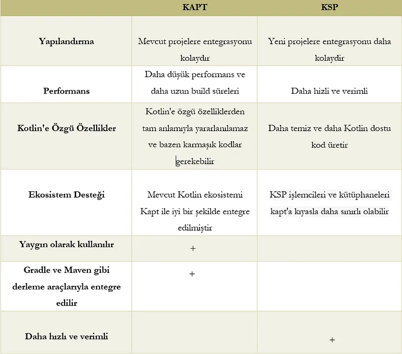

# Android’de KAPT ve KSP Arasındaki Farklar Nelerdir?

## **İçindekiler**

- [KAPT Nedir?](#kapt-nedir)
- [KSP Nedir?](#ksp-nedir)
- [KAPT ve KSP arasındaki farklar nelerdir?](#kapt-ve-ksp-arasındaki-farklar-nelerdir)
- [Sonuç](#sonuç)

<br>

<table>
  <tr>
    <th style="font-weight: bold;">Yayınlanma Tarihi</th>
    <td>23 Ağustos 2024</td>
  </tr>
  <tr>
    <th style="font-weight: bold;">Son Güncelleme Tarihi</th>
    <td></td>
  </tr>
  <tr>
    <th style="font-weight: bold;">Tahmini Okuma Süresi</th>
    <td>4 dakika</td>
  </tr>
</table>


<div align="center">
  
</div>  

<br>

Bu yazıda `KAPT` ve `KSP` arasındaki farklardan bahsedeceğim. KAPT ile başlayalım.


## KAPT Nedir?

`Kapt`'ın açılımı `Kotlin Annotation Processing Tool`'dur. Bir komut satırı aracıdır ve Kotlin programlama dili için eklentiler oluşturur.
Derleme işlemi sırasında Kotlin kodundaki ek açıklamaları işlememize yardımcı olur. Açıklamalı kodu analiz etmek ve ek kod oluşturmak için
`Gradle` ve `Maven` gibi derleme araçlarıyla çalışır.

KAPT'ın bazı önemli noktalarına bakalım.

**İşaretleme İşlemesi**

Bu aracın temel amacı Kotlin kodundaki işaretlemeleri işlemektir. Ek açıklamalar, derleyiciye ek bilgi sağlamak için kod öğelerine eklenen meta verilerdir.
KAPT, bu işaretlemelerin analiz edilmesinden sorumludur.

**Kod Üretimi**

Ek açıklamalara ve açıklamalı öğelere dayalı olarak ek Kotlin veya Java kodu oluşturabilir. Tekrarlanan görevleri otomatikleştirdiği için standart kodu azaltır.

**Özel Notasyonlar**

KAPT, özel notasyonları işleyecek ve geliştiricinin ihtiyaçlarına özel kod oluşturacak şekilde yapılandırılabilir.

**Kullanım Alanları**

Bağımlılık enjeksiyon çerçeveleri veya JSON serileştirme/seri durumdan çıkarma, veri tabanı erişim kodları ve API istemcisi oluşturarak
geliştirme sürecini otomatikleştirerek basitleştiren bir dizi kod oluşturur.

Bu kod satırlarını modül seviyesindeki `build.gradle.kts` dosyasına yazarak KAPT'ı uygulayabiliriz:

```kotlin
plugins {
    id("kotlin-kapt")
}
```

```kotlin
dependencies {
    implementation "com.google.dagger:dagger:2.x"
    kapt "com.google.dagger:dagger-compiler:2.x"
}
```


## KSP nedir?

`KSP`'nin açılımı `Kotlin Symbol Processors`'dır. Kotlin Sembol İşlemcileri anlamına gelir.
KSP, KAPT kullanılarak geleneksel açıklama işlemeyle ilgili bazı sınırlamaları ve zorlukları ele alan bir çerçevedir.
KSP, Kotlin'de açıklama işlemenin performansını ve kolaylığını artırmak için tasarlanmıştır.

KSP'nin bazı önemli noktalarına bakalım.

**Performans**

KSP'nin temel amacı açıklama işleme performansını arttırmaktır.

**Kotlin-Merkezli**

KSP, Kotlin tipi sistem ve dil özelliklerinden faydalanacak şekilde tasarlanmıştır. Bu sayede Kotlin ile sorunsuz bir şekilde çalışmaktadır.

**Kotlin-DSL Entegrasyonu**

KSP, `Kotlin DSL` (Etki Alanına Özel Dil) ile iyi bir şekilde bütünleşir. Bu, Kotlin kullanarak kod oluşturma mantığı yazmayı kolaylaştırarak
daha temiz kod elde edilmesini sağlar.

**Geliştirilmiş Kod Üretimi**

KSP, daha güçlü kod oluşturma yetenekleri sağlar. Yeni sembollerin ve türlerin oluşturulmasına olanak sağlar
Bu sayede bağımlılık enjeksiyonu ve serileştirme gibi durumları çok yönlü hale getirir.


## KAPT ve KSP arasındaki farklar nelerdir?

**Gelişmişlik**

KAPT daha köklü ve yaygın olarak kullanılan bir araçtır.

**Ekosistem**

Kotlin ekosistemindeki `Dagger 2` ve `Room` gibi birçok kütüphane ve çerçeve KAPT ile çalışacak şekilde tasarlanmıştır.
Eğer bu kütüphaneleri kullanıyorsanız KAPT önerilen araçtır.

**Yeni Araç**

KSP, daha yeni bir adlandırma işleme aracıdır. KAPT'ın bazı sınırlamalarını ve zorluklarını gidermek için tasarlanmıştır.

**Performans**

KSP, KAPT'tan 2x daha hızlıdır.

**Doğrudan Entegrasyon**

KSP, Kotlin derleyicisi ile doğrudan entegrasyon sunar. Kotlin sembolleri ve API'leri ile çalışır. Bu sayede daha temiz kod üretimi sağlar.

**Uyumluluk**

KSP umut vericidir ancak KAPT'a kıyasla erken bir aşamadadır. Eğer KSP proje gereksinimlerinizi karşılamıyorsa mevcut tüm kütüphanelerle ve
yapı sistemleriyle uyumlu olmayabilir.

Aşağıdaki tabloda farklılıkları açıkça görebiliriz:



<br>

KAPT'tan KSP'ye geçiş yapmak istiyorsanız [bu yazıyı](https://medium.com/@rchaitanya/android-migrate-from-kapt-to-ksp-4df449d2e269) okuyup talimatları takip edebilirsiniz.

Ayrıca KSP kullanacaksanız öncelikle [desteklenen kütüphanelere](https://kotlinlang.org/docs/ksp-overview.html#resources) göz atmanızı öneririm.

## Sonuç

KSP, KAPT'tan daha hızlıdır. KSP'yi kullanarak yapım sürelerini azaltabilirsiniz. Projeniz mevcut bir proje ise KAPT'ı kullanmak daha kolay olabilir.
Ancak projeniz daha yeni bir proje ise KSP'yi kullanmak daha kolay olabilir.

<br>

Eğer bu makaleden keyif aldıysanız ve faydalı bulduysanız desteğiniz benim için çok değerli. Beni takip ederek veya bir kahve
ısmarlayarak takdirinizi gösterebilirsiniz. Desteğiniz, kaliteli içerik üretmeye devam etmem için beni motive ediyor.


## İletişim

<a href="mailto:info@mustafatoktas.com"             ></a>
<a href="https://t.me/mustafatoktas00"              ></a>
<a href="https://www.linkedin.com/in/mustafatoktas/"></a>

<div align="center">
  <a href="#androidde-kapt-ve-ksp-arasındaki-farklar-nelerdir"></a>
</div>