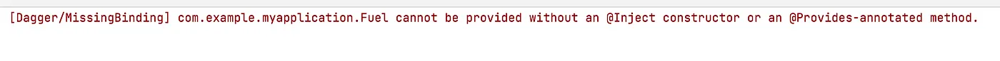
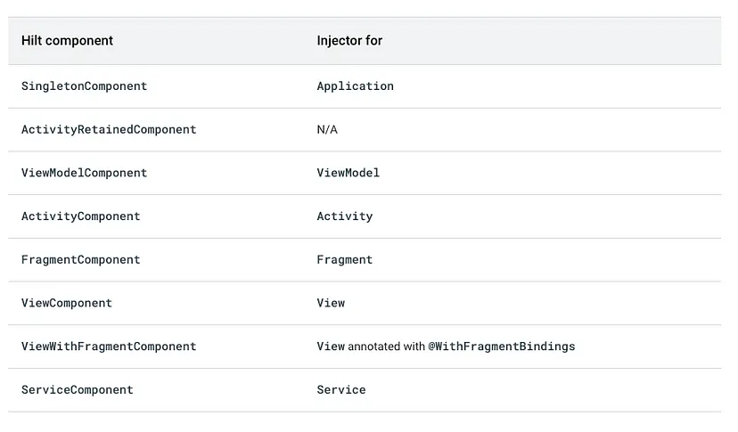
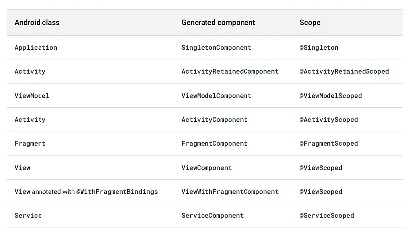

# Hilt ile Dependency Injection

## **İçindekiler**

- [Dependencies](#dependencies)
- [@HiltAndroidApp](#hiltandroidapp)
- [@AndroidEntryPoint](#androidentrypoint)
- [@Inject](#inject)
- [Modules](#modules)
- [@Binds](#binds)
- [@Provides](#provides)
- [Aynı Tür için Birden Fazla Binding Sağlama](#aynı-tür-için-birden-fazla-binding-sağlama)
- [Components ve Scopes](#components-ve-scopes)

<br>

<table>
  <tr>
    <th style="text-align: left; font-weight: bold;">Yayınlanma Tarihi</th>
    <td style="text-align: left;">29 Ağustos 2024</td>
  </tr>
  <tr>
    <th style="text-align: left; font-weight: bold;">Son Güncelleme Tarihi</th>
    <td style="text-align: left;"></td>
  </tr>
  <tr>
    <th style="text-align: left; font-weight: bold;">Tahmini Okuma Süresi</th>
    <td style="text-align: left;">12 dakika</td>
  </tr>
</table>


<div align=center>
  
</div>

<br>

`Hilt`, Android için projemizde manuel dependency injection yapmamızı azaltan, bu işlemi otomatik olarak yapmamıza olanak tanıyan bir `dependency injection` kütüphanesidir.

**Dependency Injection (DI)**

Sınıf, servis vb. yapılar içerisinde bağımlılık oluşturabilecek yapıların ayrılıp
bu yapıların dışarıdan verilmesiyle bağımlılıkları minimuma indirmeyi hedefleyen bir tasarım modelidir. Örneğin `Car` sınıfı
içerisinde `Engine` sınıfının nesnesini oluşturup kullanıyorsanız **Car sınıfı Engine sınıfına bağımlı** hale gelir.

Bu bağımlılığı manuel dependency injection uygulayarak da ortadan kaldırabiliriz.

2 adet ana injection çeşidi bulunmaktadır.

1. **Constuctor Injection**

Bir sınıfın bağımlılıklarını contructor'ına ileterek uygulanan injection türüdür. Yani bağımlılıkları contructor'da enjekte edebiliriz.

`Car` sınıfı içerisinde `Engine` sınıfından bir nesne oluşturmak yerine **Engine tipli bir değişkeni** parametre olarak verebiliriz.

```kotlin
class Car(private val engine: Engine) {
    fun start() {
        engine.start()
    }
}

fun main(args: Array) {
    val engine = Engine()
    val car = Car(engine)
    car.start()
}
```

<br>

2. **Field Injection**

Bir sınıfın bağımlılığını o sınıfa bir değişken/değer şeklinde verdiğimiz injection türüdür.

`Car` sınıfı içerisinde `lateinit` şeklinde **Engine tipli değişkeni** tanımlayıp kullanırız. Daha sonra main içerisinde
`Engine` sınıfından bir nesne üretip `Car` sınıfındaki **lateinit tipli bu değişkenine** eşitleriz.

```kotlin
class Car {
    lateinit var engine: Engine

    fun start() {
        engine.start()
    }
}

fun main(args: Array) {
    val car = Car()
    car.engine = Engine()
    car.start()
}
```
<br>

Bu şekilde **manuel dependency injection** yapmak büyük projelerde sorunlara yol açabilir. Sınıf sayısı arttıkça tüm bağımlılıkları
diğer sınıflara sağlamamız gerekir ve gittikçe kontrolü zorlaşır. Bu noktada devreye Hilt giriyor.

<br>

Hilt, Jetpack'in dependency injection için önerilen kitaplığıdır. Projemizdeki her Android sınıfı için container'lar
sağlar ve yaşam döngülerini bizim için otomatik olarak yöneterek uygulamamızda DI yapmanın standart bir yolunu tanımlar.
Yapıların bağlı oldukları kaynakları bulup iletişim kurma sorumluluğunu üstlenir.

<br>

Hilt, bir sınıfın bağımlı olduğu nesneleri otomatik olarak **initialize** eder. Ayrıca dış kütüphane objeleri ile de çalışabilir,
bu kütüphanelerin objelerinizi de initialize eder. Bu işlemi de compile time sırasında yapar. Yani uygulama derlenirken henüz **run time**
aşamasına geçmeden initialize işlemini yapar.

<br>

Daha iyi anlamak adına bir senaryo üzerinden gidelim.

`Car` adlı bir sınıfımız olsun ve bu sınıf parametre olarak `Engine` ve `Fuel` tipli değişkenler alsın.

```kotlin
class Car (val fuel: Fuel, val engine: Engine) {

    fun drive() {
        fuel.thereIsFuel()
        engine.engineIsStarting()
        println("driving...")
    }
}


class Fuel() {

    fun thereIsFuel() {
        println("there is fuel...")
    }
}


class Engine() {

    fun engineIsStarting() {
        println("engin is starting...")
    }
}
```

<br>

Şimdi MainActivity'de `Car` sınıfından nesne oluşturup drive fonksiyonunu çalıştıralım. Bunun için `Fuel` ve `Engine` sınıflarından da nesne oluşturmamız gerekir.

```kotlin
class MainActivity : AppCompatActivity() {
        override fun onCreate(savedInstanceState: Bundle?) {
        super.onCreate(savedInstanceState)
        setContentView(R.layout.activity_main)

        val engine = Engine()
        val fuel = Fuel()
        val car = Car(fuel,engine)
        car.drive()

      }
}
```

<br>

Fakat eğer ki `Car` sınıfı birçok sınıf tipinde değişkeni parametre alsaydı veya `Car` sınıfı dışında diğer sınıflar
da başka sınıflar tipinde parametreler alsaydı bütün bu sınıfların nesnelerini aynı `engine` ve `fuel` gibi **initialize**
ettikten sonra ilgili sınıflara vermemiz gerekirdi.

<br>

Bütün bu nesneleri MainActivity içerisinde initialize etmek yerine bu nesneler otomatik olarak initialize edilseydi
ve biz MainActivity içerisinde `Car` sınıfından bir değişken oluşturup sadece `car.drive()` satırını çalıştırsaydık daha güzel olmaz mıydı?

<br>

İşte bu güzelliği sağlayacak olan yapı Hilt'tir. Aynı senaryoyu bir de Hilt ile birlikte ele alalım.


## Dependencies

İlk olarak ilgili dependency'leri projemize ekleyelim.

**Proje Seviyesi build.gardle**

```gradle
plugins {
    ...
    id 'com.google.dagger.hilt.android' version '2.50' apply false
}
```

<br>

```gradle
plugins {
    id 'kotlin-kapt'
    id 'com.google.dagger.hilt.android'
}

android {
    ...
}

dependencies {
    implementation "com.google.dagger:hilt-android:2.50"
    kapt "com.google.dagger:hilt-compiler:2.50"
}

kapt {
    correctErrorTypes true
}
```

<br>

Hilt, `Java 8` özelliklerini kullanır. Java 8'i projenizde etkinleştirmek için `modül seviyesi build.gradle` dosyasına şu
satırları da ekliyoruz. Zaten varsa olduğu gibi kalabilir.

```gradle
android {
    ...
    compileOptions {
        sourceCompatibility JavaVersion.VERSION_21
        targetCompatibility JavaVersion.VERSION_21
    }
}
```

<br>


## @HiltAndroidApp

Hilt'i kullanabilmemiz için `Application` sınıfından kalıtım alan ve `@HiltAndroidApp` **annotation**'ına (açıklamasına) sahip bir sınıf oluşturmamız gerekiyor.

Oluşturduğumuz bu sınıf aslında Hilt'i projemizde kullanacağımızı haber verir ve Hilt'in kendi içerisinde oluşturması
gereken kodların başlatılmasını sağlar. Uygulama düzeyinde bağımlılıkları sağlayacak temel bir **container sınıfı** görevi görür.

```kotlin
@HiltAndroidApp
class HiltApplication : Application()
```

<br>

Ardından bu sınıfı `manifests/AndroidManifest.xml` dosyasına eklemeliyiz.

```xml
<application
android:name=".HiltApplication"
...
</application>
```


## @AndroidEntryPoint

Bağımlılıkları enjekte edeceğimiz ve kullanacağımız Android sınıflarına `@AndroidEntryPoint` açıklamasını eklemeliyiz
Mesela senaryomuzda Car sınıfını MainActivity içerisine enjekte edip kullanacağımızdan ötürü MainActiviy'ye
@AndroidEntryPoint açıklamasını eklemeliyiz. Yani MainActivity'nin enjeksiyonlar için bir giriş noktası ve enjeksiyonlar
için hazır halde olduğunu belirtiyoruz.

```kotlin
@AndroidEntryPoint
class MainActivity : AppCompatActivity() {
    override fun onCreate(savedInstanceState: Bundle?) {
        super.onCreate(savedInstanceState)
        setContentView(R.layout.activity_main)

    }
}
```

<br>

Hilt'in desteklediği bağımlılıkları enjekte edebileceğimiz ve giriş noktası olarak belirleyebileceğimiz diğer Android sınıfları
ise `Fragment`, `View`, `Service` ve `BroadcastReceiver` sınıflarıdır.

<br>

**Not:** Bir Android sınıfına `@AndroidEntryPoint` ile açıklama eklerseniz buna bağlı Android sınıflarına da bu açıklamayı eklemelisiniz.
Örneğin bir Fragment’a @AndroidEntryPoint açıklamasını eklediğinizde bu Fragment’ı kullandığınız **tüm Activity'lere** de açıklama eklemelisiniz.

<br>

Şimdi biz istiyoruz ki MainActivity'de sadece `Car` tipli bir değişken olsun ve bunun drive fonksiyonunu çalıştıralım. `Car` sınıfından
hatta Car sınıfında kullandığımız `Engine` ve `Fuel` sınıflarından dahi nesne oluşturmayalım. Bu nesne oluşturma işlemleri otomatik olarak gerçekleşsin.


## @Inject

Bu senaryoda MainActivity için Car tipli değişken bağımlılığı temsil ediyor. Bu bağımlılığı MainActivity'ye enjekte etmek için `@Inject`
açıklamasını ekleyerek `field injection` yapmalıyız. Bu işlemi yaparken de bağımlılığı temsil eden değişkeni `lateinit` olarak enjekte ediyoruz.

```kotlin
@AndroidEntryPoint
class MainActivity : AppCompatActivity() {

    @Inject
    lateinit var car: Car

    override fun onCreate(savedInstanceState: Bundle?) {
        super.onCreate(savedInstanceState)
        setContentView(R.layout.activity_main)

        car.drive()
    }
}
```

<br>

Artık MainActivity'e ilgili bağımlılığı enjekte ettik.

Peki Hilt, `Car` sınıfının nesnesini MainActivity'ye nasıl sağlayacak? Field injection gerçekleştirmek için Hilt’'in ilgili
bileşenden gerekli bağımlılıkların `instance`'larını (örneklerini, nesnelerini) nasıl sağlayacağını bilmesi gerekir.

<br>

**Not:** Bir `binding` (bağlama), bir türün nesnelerini, bir bağımlılık olarak sağlamak için gerekli bilgileri içerir.

<br>

Hilt'e binding bilgisi sağlamanın bir yolu constructor injection'dır. Hilt'e bir sınıfın instance'larını nasıl sağlayacağını
söylemek için o sınıfın contructor'ına `@Inject` açıklamasını eklemeliyiz. Yani nesne oluşturulmasını istediğimiz tüm sınıflar
`injectable` olmalıdır. Bunu da yine @Inject açıklamasını ekleyerek bu sefer contructor injection yaparak sağlarız.

<br>

Car sınıfı aşağıdaki şekilde güncellenirse artık Hilt, Car sınıfından nasıl nesne oluşturabileceğini bilir ve bu nesneyi
otomatik olarak oluşturur.

```kotlin
class Car @Inject constructor(val fuel: Fuel, val engine: Engine) {
    fun drive() {
        fuel.thereIsFuel()
        engine.engineIsStarting()
        println("driving...")
    }
}
```

<br>

Fakat görüldüğü üzere `Car` sınıfını kullanabilmemiz için `Fuel` ve `Engine` sınıflarından da nesne oluşturulması gereklidir.
Yine aynı şekilde bu sınıfların contructor'larına **@Inject** açıklamasını ekleyerek **injectable** hale getirelim.

```kotlin
class Fuel @Inject constructor() {
    fun thereIsFuel() {
        println("there is fuel...")
    }
}

class Engine @Inject constructor()  {
    fun engineIsStarting() {
        println("engin is starting...")
    }
}
```

<br>

Contructor'lara @Inject açıklamasını eklemezsek aşağıdaki şekilde bir hata alırız. Yani Hilt bu sınıfların nesnelerini nasıl sağlayacağını bilemez.



<br>

Evet artık ilgili sınıfların tüm nesneleri arka planda otomatik olarak initialize edilecektir.
Birçok nesneyi manuel olarak oluşturma işinden kurtulmuş olduk.

<br>

Hilt'in en basit haliyle kullanımı bu şekildeydi. Fakat projelerde sıklıkla interface'ler, diğer Jetpack kütüphaneleri vb. yapılar kullanılıyor
ve bu yapılar işin içine girdiğinde işler ufaktan değişiyor. Bir de bu yapılarla birlikte Hilt'in kullanımını inceleyelim.


## Modules

Bazen bazı türler, `constructor` tarafından `inject` edilemez. Örneğin interface'ler veya harici kütüphanelerden kullanılan sınıflar gibi
bizim oluşturmadığız türleri contructor ile inject edemeyiz. Bu durumlarda Hilt module'lerini kullanarak Hilt'e binding bilgileri sağlayabiliriz.

<br>

Module dediğimiz aslında `@Module` açıklaması eklenmiş bir sınıftır. Bu sınıf, Hilt'e belirli bir türden instance'ların nasıl sağlanacağını bildirir.

<br>

İlk olarak interface'leri ele alalım. Bir interface'imiz olsun. Bu interface'i implement eden bir sınıfımız olsun. Bu sınıfı da parametre
alan başka bir sınıfımız olsun. Bunların hepsini birbirine inject edelim.

```kotlin
interface ExampleInterface {
    fun printFunciton() : String
}

class InterfaceImplementor @Inject constructor() : ExampleInterface {
    override fun printFunciton(): String {
        return "Interface implementor is working.."
    }
}

class ExampleClass @Inject constructor(val myInterfaceImplementor : ExampleInterface) {
    fun myPrintFunction() : String {
        return myInterfaceImplementor.printFunciton()
    }
}
```

<br>

Görüldüğü üzere `ExampleClass` sınıfı `ExampleInterface` tipli parametre almıştır. Aslında bu ExampleInterface tipli parametre, InterfaceImplementor'ı temsil etmektedir.

**Not:** Bir sınıf, bir interface'i implement ediyorsa eğer o interface tipiyle temsil edilebilir.
Bu sınıfı parametre olarak vereceğimiz yerlerde interface tipini kullanarak temsil edebiliriz.

<br>

Fakat şu an Hilt, `ExampleInterface` ile `InterfaceImplementor` arasındaki bağlantıyı kuramaz. `ExampleClass` sınıfında `printFunction`
fonksiyonunu çağırdığımızda aslında `InterfaceImplementor` sınıfındaki `printFunction` fonksiyonu çağrılsın istiyoruz. İşte bunu sağlayabilmek
için Hilt'e `ExampleInterface` ile `Interfacemplementor` arasındaki bağlantıyı haber vermemiz gerekiyor.

<br>

Bu haberi vermenin iki yolu vardır. `@Binds` veya `@Provides` açıklamalarını kullanarak Hilt'e binding bilgilerini söyleyebiliriz.


## @Binds

Bir module sınıfı içerisinde `@Binds` açıklaması eklenmiş abstract bir fonksiyon oluşturularak Hilt'e binding bilgisi sağlanabilir.

<br>

`@Binds` ek açıklaması Hilt'e, interface tipli bir parametre kullanıldığında hangi implementation'nı kullanılacağını söyler.
Yani hangi sınıf bu interface'i implement ettiyse o sınıfın kullanması gerektiğini söyler.

`@Binds` kullanırken oluşturacağımız module sınıfı bir abstract sınıf olmalıdır. Aynı zamanda bu sınıfa `@Module` açıklamasına ek
olarak `@InstallIn` şeklinde bir açıklama eklememiz gerekiyor. Bu açıklama her bir module'un hangi Android sınıfında kullanılacağını
veya kurulacağını Hilt'e söyler. Mesela **bu module, Activity'de, Fragment'da veya tüm uygulama düzeyinde kullanılacak** şeklinde Hilt'e
bu durumu belirtmemize olanak sağlar.

```kotlin
@InstallIn(ActivityComponent::class)
@Module
abstract class MyModule {
    @Binds
    abstract fun bindExample (exampleInterfaceImplementor: ExampleInterfaceImplementor) : ExampleInterface
}
```

<br>

Bu module içerisindeki `bindExample` fonksiyonu binding işlemini yaptığımız fonksiyondur. Fonksiyon ismini istediğimiz şekilde verebiliriz.

Fonskiyonun dönüş türü Hilt'e, hangi interface'in instance'larını sağlanacağını söyler.

Fonksiyonun parametresi Hilt'e, hangi implementation'ın sağlanacağını söyler. Yani hangi sınıf bu interface'i
implement etmiş onu haber verdiğimiz kısımdır.

Bu fonksiyonun ifade ettiği şudur, bir sınıfa `ExampleInterface` tipinde bir parametre inject edildiği zaman, aslında
bu parametre `ExampleInterfaceImplemenator` sınıfını temsil etmektedir. Hilt'e bu bildirimi yapmış olduk.

Artık Hilt arka planda bu binding işlemini yaparak `ExampleInterfaceImplemenator` sınıfından otomatik olarak nesne üretecek
ve bu sınıfın fonksiyonunun çalışmasını sağlayacaktır.

Bu işlemi `@Provides` açıklaması ile de yapabiliriz. Genelde bu tür binding işlemleri için `@Provides` tercih edilir. `@Provides`
açıklaması ile harici bir kitaplıktan kullanılan sınıfları için de binding işlemi yapabiliriz.


## @Provides

`@Provides` açıklaması da aynı `@Binds` gibi, Hilt'e bir interface örneği sağlaması gerektiğinde hangi
implementation'nı kullanılacağını söyler. Ek olarak harici kütüphaneden gelen sınıflardan instance
oluşturmamız gerekiyorsa bu instance'ları nasıl sağlayacağımızı da Hilt'e belirtmemizi sağlar.

`Binds` açıklamasından farklı olarak **Module** sınıfını ve fonskiyonları `abstract` yapmamıza gerek yoktur.
Hatta sınıf yerine `object` olarak da **Module** tanımlayabiliriz.

```kotlin
@InstallIn(ActivityComponent::class)
@Module
object MyModule {
    @Provides
    fun provideExample() : ExampleInterface {
        return ExampleInterfaceImplementor()
    }
}
```

<br>

Fonskiyonun dönüş türü Hilt'e, interface'ler için hangi interface instance'larının sağlanacağını, harici kütüphane
sınıfları için de hangi sınıfın instance'larının sağlanacağını söyler.

<br>

Fonskiyonun gövdesi Hilt'e, ilgili türün örneğini nasıl sağlayacağını söyler. Hilt, bu fonksiyonun gövdesini, bu türün
örneğini sağlaması gerektiğinde her zaman yürütür.

<br>

Fonksiyonun parametreleri Hilt'e, return edilecek türün bağımlılıklarını söyler. Örneğin Room'u kullanarak database
oluşturma işlemi için bize `Context` gereklidir. Yani Room db tipli bir nesne return edebilmek için gereklidir.
Context, Room sınıfının bir bağımlılığıdır. Context'i bu fonksiyona parametre olarak veririz.

<br>

**Not:** Hilt, önceden tanımlanmış bazı niteleyiciler sağlar. Örneğin Application'dan veya Activity'den Context
sınıfına ihtiyaç duyabileceğiniz için Hilt, `@ApplicationContext` ve `@ActivityContext` niteleyicilerini sağlar.
Yani Context'e ihtiyaç duyarsak bu niceleyicileri parametrelerin başına koymamız yeterlidir.

```kotlin
class AnalyticsAdapter @Inject constructor(
    @ActivityContext private val context: Context,
    private val service: AnalyticsService
) { ... }
```

<br>

Peki aynı interface'i implement etmiş iki farklı sınıf varsa bu durumda interface'i inject ettiğimiz zaman Hilt hangi implementation'ı kullanacağını nasıl anlar?


## Aynı Tür için Birden Fazla Binding Sağlama

Bunun için kendi `annotation`'ımızı (ek açıklamamızı) oluşturmamız gereklidir. Mesela `FirstImplemantor` ve `SecondImplementor` adlı iki adet ek açıklama oluşturup bu açıklamaları Module sınıfında belirtmemiz gereklidir. İlgili senaryoyu tekrar ele alalım bu sefer ikinci bir sınıf da interface'i implement etsin.

```kotlin
interface ExampleInterface {
    fun printFunciton() : String
}

class ExampleInterfaceImplementor @Inject constructor() : ExampleInterface {
    override fun printFunciton(): String {
        return "Interface implementor is working.."
    }
}

class ExampleInterfaceImplementor2 @Inject constructor() : ExampleInterface {
    override fun printFunciton(): String {
        return "Interface implementor 2 is working.."
    }
}

class ExampleClass @Inject constructor(val myInterfaceImplementor : ExampleInterface, val myInterfaceImplementor2 : ExampleInterface) {
    fun myPrintFunction() : String {
        return myInterfaceImplementor.printFunciton()
    }

    fun myPrintFunction2() : String {
        return myInterfaceImplementor2.printFunciton()
    }
}
```

<br>

MainActivity'ye ExampleClass'ı inject ettiğimizde ve `myPrintFunction` ile `myPrintFunction2` fonksiyonlarını çağırdığımız
zaman ilgili implementor sınıflarındaki fonksiyonların çalışmasını isteriz.

```kotlin
@AndroidEntryPoint
class MainActivity : AppCompatActivity() {
    @Inject
    lateinit var exampleClass: ExampleClass

    override fun onCreate(savedInstanceState: Bundle?) {
        super.onCreate(savedInstanceState)
        setContentView(R.layout.activity_main)

        println(exampleClass.myPrintFunction())
        println(exampleClass.myPrintFunction2())

    }
}
```

<br>

Fakat Hilt'e bu ayrımı yapabilmesi için herhangi bir geliştirme yapmadık. Şimdi bu ayrımı yapabilmesi için bu iki implemantor
sınıfını temsil edecek ek açıklamalarımızı oluşturalım.

```kotlin
@Qualifier
@Retention(AnnotationRetention.BINARY)
annotation class FirstImplementor

@Qualifier
@Retention(AnnotationRetention.BINARY)
annotation class SecondImplementor
```

<br>

Şimdi de bu ek açıklamaları Module sınıfında belirtelim.

```kotlin
@InstallIn(ActivityComponent::class)
@Module
object MyModule {
    @FirstImplementor
    @Provides
    fun provideExample() : ExampleInterface {
        return ExampleInterfaceImplementor()
    }

    @SecondImplementor
    @Provides
    fun provideExample2() : ExampleInterface {
        return ExampleInterfaceImplementor2()
    }
}
```

<br>

Son olarak contructor injection yaptığımız sınıfta da parametrelerin başına bu ek açıklamaları eklemeliyiz.

```kotlin
class ExampleClass @Inject constructor(
@FirstImplementor val myInterfaceImplementor : ExampleInterface, 
@SecondImplementor val myInterfaceImplementor2 : ExampleInterface) {
   
 fun myPrintFunction() : String {
        return myInterfaceImplementor.printFunciton()
    }

    fun myPrintFunction2() : String {
        return myInterfaceImplementor2.printFunciton()
    }
}
```

<br>

Artık Hilt, `ExampleClass` sınıfındaki `ExampleInterface` tipli parametreleri ilgili ek açıklamalara göre ayırır, hangi sınıftan nesne oluşturulacak anlar.

Interface injection işleminden sonra bir de harici bir kütüphane nesnesi nasıl inject edilir ona bakalım. Bu işlemi Retrofit için yapalım.

<br>

**Not:** Retrofiti kullamak için bir interface oluşturmamız gerekir. Retrofit sınıfı, bu interface'i implement eden bir nesne
oluşturur ve bu nesne üzerinden işlemlerimizi gerçekleştirmemize olanak sağlar.

<br>

`MyAPI` isimli bir interface oluşturalım. Ardından Hilt'e nasıl Retrofit nesnesini oluşturup bu interface ile ilişkilendireceğini söyleyelim.
Son olarak da Repository sınıfında bu nesneyi kullanalım.

```kotlin
interface MyAPI {
    @Get("api/example/.....")
    suspend fun getExample():Response<List<ExampleModel>>
}
```

<br>

```kotlin
@InstallIn(ActivityComponent::class)
@Module
object MyModule {
    @Provides
    fun provideRetrofit() : MyAPI {
        return Retrofit.Builder()
            .addConverterFactory(GsonConverterFactory.create())
            .baseUrl(BASE_URL)
            .build()
            .create(MyAPI::class.java)
    }
}
```

<br>

```kotlin
class MyRepository @Inject constructor(private val myAPI: MyAPI) {
    suspend fun getExample() {
        myAPI.getExample("myExample")
    }
}
```

<br>

Görüldüğü üzere `MyAPI` ile ilişkilendirilmiş Retroift nesnesini kullanmak istediğimizde ilgili sınıflara `MyAPI` türünde
bir parametre inject ederek bu nesneye erişebiliriz.

## Components ve Scopes

Component'lar, dependencies'lerin (bağımlılıkların) hangi sınıfa ve ne zaman uygulanacağını tanımlamamızı sağlarlar. Hilt, her Android
sınıfı için ilişliki bir componenet sağlar. Bu component'lar ilişkili oldukları sınıflar için injector görevi görürler. Aynı zamanda ilişkili
oldukları bu Android sınıflarının yaşam döngülerine sahiptirler. Yani bağımlılıkların yaşam sürelerini de belirlerler.

<br>

Hilt bize `field injection` yapabildiğimiz her Android sınıf için `@InstallIn` açıklaması ile belirtebileceğimiz ilişkili bir component sağlar.
Bu componentler ilişkili oldukları sınıflara bağımlılıkları enjekte etmekten sorumludurlar. Aşağıdaki tabloda hangi componenet'in hangi Android sınıfı
için `injector` görevi gördüğünü görebilirsiniz.



<br>

Hilt, ilgili Android sınıflarının yaşam döngüsüne göre oluşturulan component sınıflarının instance'larını otomatik olarak oluşturur ve yok eder.
Mesela ActivityComponenet kullanırsak eğer Hilt, oluşturduğu instance'ları Activity yaşadığı sürece yaşatır, Activity öldüğü zaman da bu instance'lar yok edilir.

Component ile birlikte scope kavramını da bilmeliyiz.

<br>

Genel olarak `scope` (kapsam) kavramı, instance'ların belirli bir süre boyunca korunduğu alan anlamına gelmektedir.

Hilt'te varsayılan olarak tüm binding'ler scopesuzdur. Bu her binding bilgisi sağladığımızda o türün yeni bir örneğinin oluşturulacağı anlamına gelir.
Yani Hilt, bir türü her inject etmesi gerektiği zaman, o türden yeni bir instance oluşturur.

Fakat bazen uygulama boyunca veya bir Activity içerisindeki tüm Fragment'larda aynı örneği kullanmak isteyebiliriz.
Bu noktada devreye scope'lar giriyor. Hilt bize bir türün örneğinin scope'unu belirleme seçeneği sunar.

Tüm Hilt componenet'ları beraberinde bir scope bilgisi ile gelmektedirler. Scope bilgisi belirttiğimiz zaman ilgili componenet'e
karşılık gelen her Android sınıfı için uygulanan bağımlılıklar aynı örneği temsil eder.

Scope bilgisini ihtiyacımız olduğu durumlarda kullanmalıyız. Scope belirtmenin hem **oluşturulan kod boyutu** hem de **çalışma zamanı performansı**
üzerinde bir maliyeti vardır. Bu nedenle idareli ve ihtiyaca göre kullanmamız gerekir.

Aşağıdaki tabloda ilgili componenet'lara karşılık gelen scope'ları görebilirsiniz.




<br>

Bir Activity'de olan iki Fragment için Car sınıfının aynı instance'ının sağlandığı senaryoyu ele alalım.

Bu sefer Activity üzerinde A ve B adlı iki Fragment olsun. Car tipli değişkeni hem A hem de B Fragment'ına inject edelim.
Fakat bu inject işlemi sonucunda A ve B Fragment'larında aynı Car instance'ı olsun istiyoruz. Eğer ki Car sınıfına ActivityScoped
açıklamasını eklersek bu Activity üzerinde olan tüm yapılar için aynı Car instance'ı sağlanır. Hilt, Activity yaşam süresi boyunca
sadece bir kez Car instance'ı oluşturur. Activity destroy olmadığı sürece Activity üzerindeki yapılara inject edilen tüm Car instance'ları aynıdır.

```kotlin
@ActivityScoped
class Car @Inject constructor(val fuel: Fuel, val engine: Engine) {
    fun drive() {
        fuel.thereIsFuel()
        engine.engineIsStarting()
        println("driving...")
    }
}

@AndroidEntryPoint
class AFragment : Fragment() {

    @Inject
    lateinit var car: Car

    lateinit var button : Button

    override fun onCreateView(
        inflater: LayoutInflater, container: ViewGroup?,
        savedInstanceState: Bundle?
    ): View? {
        return inflater.inflate(R.layout.fragment_a, container, false)
    }
    override fun onViewCreated(view: View, savedInstanceState: Bundle?) {
        super.onViewCreated(view, savedInstanceState)
        println("A fragment car: " + car)

        button = view.findViewById(R.id.Abutton)
        button.setOnClickListener {
            findNavController().navigate(R.id.BFragment)
        }
    }
}


@AndroidEntryPoint
class BFragment : Fragment() {
    @Inject
    lateinit var car: Car
    override fun onCreate(savedInstanceState: Bundle?) {
        super.onCreate(savedInstanceState)
    }

    override fun onCreateView(
        inflater: LayoutInflater, container: ViewGroup?,
        savedInstanceState: Bundle?
    ): View? {
        return inflater.inflate(R.layout.fragment_b, container, false)
    }

    override fun onViewCreated(view: View, savedInstanceState: Bundle?) {
        super.onViewCreated(view, savedInstanceState)
        println("B Fragment car: " + car)
    }
}
```

<br>

A Fragment'ından B Fragment'ına geçiş sağlandığında Car instance'ının yine aynı olduğu görülür.


<br>

Umarım faydalı olmuştur.


<a href="https://github.com/mustafatoktas/W.BE_RepoVisitorCounterAPI" target="_blank">  </a>

<a href="https://buymeacoffee.com/mustafatoktas" target="_blank">  </a>


## İletişim

<a href="mailto:info@mustafatoktas.com"              target="_blank">  </a>
<a href="https://t.me/mustafatoktas00"               target="_blank">  </a>
<a href="https://www.linkedin.com/in/mustafatoktas/" target="_blank">  </a>