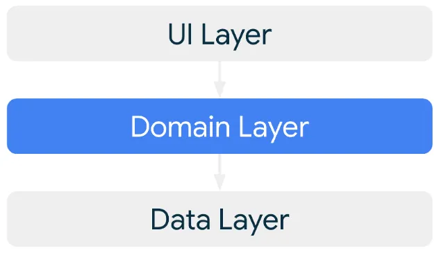

# Android'de UseCase Kullanımı ve Dikkat Edilmesi Gerekenler

## İçindekiler

- [UseCase nedir?](#usecase-nedir)
- [Neden Kullanmaya İhtiyaç Duyarız ve Her Projede Kullanmalı mıyız?](#neden-kullanmaya-i̇htiyaç-duyarız-ve-her-projede-kullanmalı-mıyız)
- [UseCase'ler Nasıl İsimlendirilmelidir?](#usecaseler-nasıl-i̇simlendirilmelidir)
- [UseCase'leri Kodlarken Dikkat Edilmesi Gerekenler](#usecaseleri-kodlarken-dikkat-edilmesi-gerekenler)
- [Kod Örnekleri ](#kod-örnekleri)

<br>

<table>
  <tr>
    <th style="text-align: left; font-weight: bold;">Yayınlanma Tarihi</th>
    <td style="text-align: left;">5 Eylül 2024</td>
  </tr>
  <tr>
    <th style="text-align: left; font-weight: bold;">Son Güncelleme Tarihi</th>
    <td style="text-align: left;"></td>
  </tr>
  <tr>
    <th style="text-align: left; font-weight: bold;">Tahmini Okuma Süresi</th>
    <td style="text-align: left;">3 dakika</td>
  </tr>
</table>


## UseCase Nedir?

Android'de UseCase, uygulamanın business logic'ini UI ve data katmanlarından ayıran domain katmanında
bulunan belirli bir işlemi temsil eden bir sınıftır.

UseCase'i daha iyi anlamak için `data` `domain` `UI` katmanlarını kısaca inceleyelim.

<div align="center">
  
</div>

### Data Katmanı

Data katmanı, `business logic` içeren kısımdır. **Network işlemleri** ve **local database** işlemleri burada yapılır.
**Repository** ve **datasource**'dan oluşur. Datasource'lar local database, network, cache veya sensörlerden veriyi
alan kısımdır. Repository'ler bu veri kaynaklarını ihtiyaca göre yönetir. Bir repository hem local hem de network işlemlerini yapabilir.

**Data source kod örneği:**

```kotlin
interface CryptoApi {
    @GET("assets")
    suspend fun getCrypto(
        @Query("apikey") apiKey :String = API_KEY
    ):List<Root>

    @GET("assets/{asset_id}")
    suspend fun getAssetIdCrypto(
        @Path("asset_id") asset_id : String,
        @Query("apikey") apiKey :String = API_KEY
    ):List<Root>
  }
```

<br>

**Repository kod örneği:**

```kotlin
class CryptoRepoImpl @Inject constructor(private val api : CryptoApi)  : CryptoRepo {
    override suspend fun getCrypto(): List<Root> {
        return api.getCrypto()
    }

    override suspend fun getAssetIdCrypto(assetId: String): List<Root> {
        return api.getAssetIdCrypto(assetId)
    }
}
```

### UI Katmanı

Presentation katmanı olarak da isimlendirilebilir. View veya Jetpack Compose ile yazdığımız `tasarım kodlarını` içerir.
ViewModel'lar da bu katmanda bulunur.

### Domain Katmanı

Opsiyonel bir katmandır. İhtiyaç varsa oluşturulmalıdır. UseCase'ler bu katmanda bulunur. `UI` ile `data` katmanı arasında bağlantıdır.

<div align="center">
  
</div>

## Neden Kullanmaya İhtiyaç Duyarız ve Her Projede Kullanmalı mıyız?

UseCase'ler küçük projelerde çok önemli olmasa da büyük projelerde **hayati öneme** sahiptir. Örneğin büyük bir uygulamamız var ve
uzak sunuculardan veri çekiyoruz. Çektiğimiz bu veriyi 10 ayrı sayfada göstereceğiz. Tek tek her ViewModel'da aynı kodla repository'den
alıp kod tekrarına düşmek yerine bir UseCase yazarız ve `Hilt` ile ihtiyacı olan bütün ViewModellere verip tek bir class ile işimizi hallederiz.
Bu, kodun daha `parçalı` `düzenli` `test edilebilir` bir hale gelmesini sağlar.

## UseCase'ler Nasıl İsimlendirilmelidir?

`Fiil` + `isim` + `UseCase` formatında isimlendirilmelidir.

**Örnekler:**

- FormatDateUseCase
- LogOutUserUseCase
- GetLatestNewsWithAuthorsUseCase
- MakeLoginRequestUseCase

## UseCase'leri Kodlarken Dikkat Edilmesi Gerekenler

1. **Single Responsibility İlkesinin İhlali**

   Bir UseCase'in birden fazla sorumluluğu üstlenmesi, örneğin hem veri çekme hem de UI güncelleme işlemlerini yapması.

2. **UseCase İçinde Bağımlılıkları Doğrudan Oluşturmak**

   Bağımlılıkları doğrudan oluşturmak yerine dependency injection ile constructor'da gerekli parametreler verilmelidir.

3. **Uygun Dispatcher Kullanmamak**

   İş yüküne uygun dispatcher kullanın ve dispatcher'ları dependency injection ile sağlayarak esnekliği artırın.

4. **Aşırı Büyüklükte UseCase Yazma**

   UseCase'leri küçük ve yönetilebilir parçalara bölün. Her bir UseCase'in tek bir sorumluluğu olsun.

5. **Doğrudan UI ile veya Database ile İletişime Geçme**

   Doğrudan iletişime geçilmemelidir. ViewModel'lar ve repository'ler kullanarak iletişim sağlanmalıdır.


## Kod Örnekleri 

Bildiğiniz üzere UseCase'ler data ve UI katmanları arasında bulunur ve bunlar arasında bağlantı kurar. Bu bağlantıyı sağlamak için
verileri almak için bir repository sınıfına ihtiyaç duyarlar ve bu verileri aktarmak için de ViewModel'lere ihtiyaçları vardır.

```kotlin
class SaveFavUseCase @Inject constructor(
    private val repository: CryptoFavRepo,
    @IODispatcher private val ioDispatcher: CoroutineDispatcher
) {
    suspend operator fun invoke(
        authId: String,
        asset_id: String,
        id_icon: String,
        name: String,
        price_usd: String
    ) = withContext(ioDispatcher) {
        try {
            repository.saveFav(authId, asset_id, id_icon, name, price_usd)
        } catch (e: Exception){
            Log.e(e.message, e.message.toString())
        }
    }
}
```

<br>

Burda görüldüğü üzere favorileri kaydeden bir UseCase var. `CryptoFavRepo` adında bir repository'nin nesnesini parametre
olarak alıyor ve ilgili fonksiyonu çağırıyor.

Şimdi viewmodel tarafında nasıl çağırıldığına bakalım.

```kotlin
@HiltViewModel
class DetailViewModel @Inject constructor(
    private val saveFavUseCase : SaveFavUseCase,
) : ViewModel(){

    private fun saveFavUser(authId:String,
                            asset_id:String,
                            id_icon:String,
                            name:String,
                            price_usd:String) {
        viewModelScope.launch {
            saveFavUseCase(authId, asset_id, id_icon, name, price_usd)
        }
    }
}
```

<br>

Viewmodel tarafında da görüldüğü üzere viewmodel useCase'in nesnesini parametre olarak alıyor ve çağırıyor.

<br>

<div align="center">
İçeriğim hoşunuza gittiyse bana destek olmak için beni takip edebilir veya bir kahve ısmarlayabilirsiniz.
Desteğiniz daha fazla kaliteli içerik üretmem konusunda motivasyonumu arttırıyor.
</div>

<br>

<div align="center">
  <a href="https://buymeacoffee.com/mustafatoktas" target="_blank">  </a>
</div>

<br>

<div align="center">
Android ile ilgili daha fazla makale okumak isterseniz <a href="https://github.com/mustafatoktas/O_Makalelerim?tab=readme-ov-file#android">buraya tıklayarak</a> göz atabilirsiniz.
</div>


<div align="center">
  <a href="https://github.com/mustafatoktas/W.BE_RepoVisitorCounterAPI" target="_blank">  </a>
</div>


## İletişim

<a href="mailto:info@mustafatoktas.com"              target="_blank">  </a>
<a href="https://t.me/mustafatoktas00"               target="_blank">  </a>
<a href="https://www.linkedin.com/in/mustafatoktas/" target="_blank">  </a>

<p align="center">
  <a href="#androidde-usecase-kullanımı-ve-dikkat-edilmesi-gerekenler">  </a>
</p>