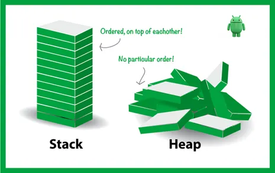
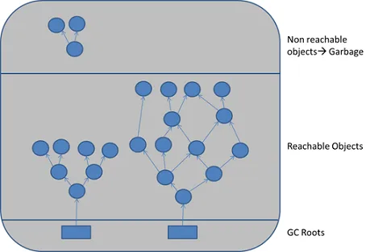
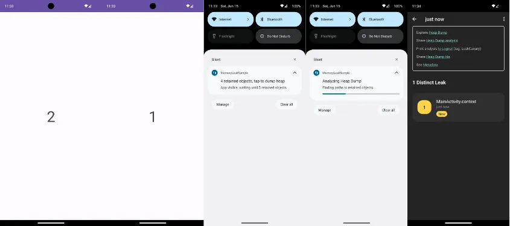
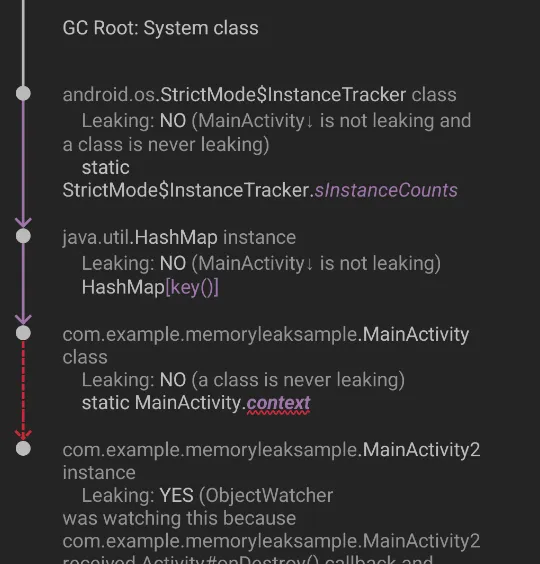

<h1 align="center">
Memory Leak ve LeakCanary Kullanımı<a name="header-top"></a>
</h1>

## İçindekiler

- [Memory leak nedir?](#memory-leak-nedir)
- [Memory Leak'leri Ele Almazsak Oluşacak Sorunlar Nelerdir?](#memory-leakleri-ele-almazsak-oluşacak-sorunlar-nelerdir)
- [Memory Leak Oluşturan Örnek Kodlar ve Çözümleri](#memory-leak-oluşturan-örnek-kodlar-ve-çözümleri)
- [LeakCanary Nedir ve Kullanımı](#leakcanary-nedir-ve-kullanımı)

<br>

<table>
  <tr>
    <th>Yayınlanma Tarihi</th>
    <td>9 Eylül 2024</td>
  </tr>
  <tr>
    <th>Son Güncelleme Tarihi</th>
    <td></td>
  </tr>
  <tr>
    <th>Tahmini Okuma Süresi</th>
    <td>6 dakika</td>
  </tr>
</table>


## Memory Leak Nedir?

`Memory leak` **(bellek sızıntısı)**, bir uygulamanın artık kullanmadığı halde bellek alanını serbest bırakamaması durumudur.
Bu durum uygulamanın zamanla daha fazla bellek tüketmesine ve sonuç olarak yavaşlamasına veya çökmesine neden olabilir
Android'de bellek sızıntıları genellikle yanlış yönetilen nesneler veya uzun ömürlü referanslar nedeniyle meydana gelir.

<div align="center">
  
</div>

<br>

Memory leak kavramını daha iyi anlamanız için `ART` `Stack` `Heap` `Garbage Collection` kavramlarını inceleyelim.

### ART (Android Run Time)

ART, uygulamalarımızı geliştirdikten sonra elde ettiğimiz APK dosyasının içindeki byte kodlarını yükleme esnasında
makine koduna çevirir ve bu kodları çalıştırır. Android 4.4 KitKat sürümünden sonra **Dalvik'in** yerini almıştır.
ART ayrıca memory yönetimi ile ilgilidir.

<div align="center">
  
</div>

### Stack

- Primitive tipler ve heap'te tutulan nesnelerin referanslarını saklar.

- Fonksiyon çağrıları sırasında kullanılan geçici veriler de burada saklanır.

- LIFO mantığı ile çalışan bir bellek yapısıdır.

- Statik olarak çalışır.

Örnek: 

```kotlin
fun main() {
    val x = 10   // x adında bir primitive değişken oluşturulur ve stack'te saklanır
    val y = 20   // y adında bir primitive değişken oluşturulur ve stack'te saklanır

    val result = add(x, y) 
    println("Sonuç: $result") 
}

fun add(a: Int, b: Int): Int {
    return a + b   // sonuç stack'te saklanır
}
```

### Heap

- Nesnelerin değerleri burada tutulur, referansları stack'te saklanır.

- Dinamik olarak oluşturulan nesnelerin ve verilerin saklandığı bellek bölgesidir.

- Veriler, bir referans aracılığıyla erişildiği için daha karmaşık bir yapıya sahiptir.

Örnek:

```kotlin
fun main() {
    val person = Person("John", 30)   // Person sınıfından bir nesne oluşturulur ve referansı stack'te saklanır value heapte tutulur
    println("Kişi: ${person.name}, Yaş: ${person.age}") 
}

class Person(val name: String, val age: Int) 
```

### Garbage Collection

Bir nesne oluşturduğumuzu düşünelim. `Nesnenin referansı stack'te` tutulur, `değeri ise heap'te` saklanır.
Eğer nesne ile işimiz bittiğinde ve referansını sildiysek o değer artık erişilemez olur. Burada garbage collection
devreye girer ve heap'te yer kaplayan artık erişilemeyen nesneleri siler.

#### Garbage Collection (GC) Bu İşlemi Nasıl Yapar?

<div align="center">
  
</div>

<br>

GC, heap üzerinde çalışır. Yukarıda ki fotoğrafta gördüğünüz üzere `birbiriyle bağlantılı düğümler` bulunmaktadır.
Bu düğümlerin hepsi bir kök düğüme bağlıdır. Kök düğümler, Android'in Root dosyaları olarak bilinen ve uygulama çalıştığı
sürece var olan dosyalardır. Bütün nesnelerin mutlaka Root dosyalarla bir bağlantısı vardır. Garbage collection (GC) işte bu
özelliği kullanarak temizlik yapar.

Öncelikle Root dosyalarını belirler ve bu dosyalarla bağlantılı olan tüm nesneleri işaretler. Ardından heap'te kalan işaretsiz nesneleri siler.


## Memory Leak'leri Ele Almazsak Oluşacak Sorunlar Nelerdir?

Memory leak arttıkça uygulamanın RAM tüketimi artacaktır ve bunun sonucunda `OutOfMemoryError` hatası alıp uygulama çökebilir.
Bu da kötü bir kullanıcı deneyimine neden olur ve uygulamanın kullanılamaz hale gelmesine yol açabilir.

<br>

Memory leak'ler, GC'nin daha fazla çalışmasına neden olacaktır. Bu durum uygulamaya drop'ların girmesine yol açabilir ve eğer çok
ileri giderse `ana iş parçacığı` **(main thread)** 5 saniyeden fazla süre kullanılırsa `ANR` **(Application Not Responding)** hatası alınabilir.


## Memory Leak Oluşturan Örnek Kodlar ve Çözümleri

### 1. LiveData veya StateFlow Kullanımıyla İlgili Sorunlar

#### Memory Leak Sebebi

ViewModel içinde kullanılan `LiveData` veya `StateFlow` uygun şekilde temizlenmezse Activity veya Fragment'tan
referans almaya devam edebilir. Özellikle LiveData, observe edilen bir LifecycleOwner'ın yaşam döngüsü sona erdiğinde
bile veriyi güncellemeye çalışabilir. Bu da memory leak'e yol açabilir.

```kotlin
class MyViewModel : ViewModel() {
    private val dataRepository = DataRepository()

    private val mutableData = MutableLiveData<String>()

    fun fetchData() {
        viewModelScope.launch {
            val result = dataRepository.fetchData()
            mutableData.value = result
        }
    }

    fun getData(): LiveData<String> {
        return mutableData
    }
}
```

#### Çözüm

LiveData veya StateFlow kullanımında LifecycleOwner'a bağlı olarak veri akışını kontrol etmek ve
observe işlemlerini düzgün bir şekilde yönetmek gereklidir.
Örneğin `Fragment` veya `Activity` içinde `LiveData observe` işlemlerini başlatırken viewLifecycleOwner'ı kullanmak.

```kotlin
viewModel.getData().observe(viewLifecycleOwner, Observer { data ->

    // Veri güncelleme işlemleri
})
```

### 2. Context Yönetimi

#### Memory Leak Sebebi

Repository sınıfı, Activity veya Fragment context'ini doğrudan tutarsa context sona erdikten sonra
bile veritabanı bağlantıları gibi kaynaklar uzun süre bellekte kalabilir.

```kotlin
class MyRepository(private val context: Context) {
    private val dbHelper = DatabaseHelper(context)

    // Veri işlemleri
}
```

#### Çözüm

Context kullanımını `WeakReference` **(zayıf referans)** olarak saklamak veya Context'in genel uygulama context'ine (applicationContext) yönlendirmek önemlidir.

```kotlin
class MyRepository(private val context: Context) {
    private val applicationContext = context.applicationContext
    private val dbHelper = DatabaseHelper(applicationContext)

    // Veri işlemleri
}
```

### 3. ViewBinding veya DataBinding Kullanımı

#### Memory Leak Sebebi

Fragment veya Activity içinde kullanılan `ViewBinding` veya `DataBinding`, `onDestroyView()` metodunda düzgün bir
şekilde temizlenmezse bağlı olan view ve referanslar bellekte kalabilir.

```kotlin
class MyFragment : Fragment() {
    private var _binding: FragmentMyBinding? = null
    private val binding get() = _binding!!

    override fun onCreateView(
        inflater: LayoutInflater, container: ViewGroup?,
        savedInstanceState: Bundle?
    ): View? {
        _binding = FragmentMyBinding.inflate(inflater, container, false)
        val view = binding.root
        return view
    }    
}
```

#### Çözüm

`ViewBinding` veya `DataBinding` kullanımında, `onDestroyView()` metodunda bağlantının null olarak ayarlanması önemlidir.

```kotlin
override fun onDestroyView() {
    super.onDestroyView()
    _binding = null
}
```

### 4. LiveData veya StateFlow'un Yanlış Şekilde Güncellenmesi

#### Memory Leak Sebebi

`LiveData` veya `StateFlow`, arka planda yapılan işlemler sonucunda doğrudan güncellenirse bu işlemler UI thread'inde
gerçekleşebilir ve performans sorunlarına yol açabilir. Ayrıca LiveData veya StateFlow'un doğrudan güncellenmesi
doğru şekilde LifecycleOwner ile bağlanmayı ihmal edebilir.

```kotlin
class MyViewModel : ViewModel() {
    private val mutableData = MutableLiveData<String>()

    fun fetchData() {
        // Network işlemleri, sonuç alındığında LiveData güncellenir
        val result = fetchDataFromNetwork()
        mutableData.value = result
    }

    fun getData(): LiveData<String> {
        return mutableData
    }
}
```

#### Çözüm

LiveData veya StateFlow’un güncellenmesi, coroutine'ler veya arka plan işlemleri üzerinden yapılmalı
ve sonuçlar `LiveData` veya `StateFlow` üzerinden uygun şekilde yayınlanmalıdır.

```kotlin
class MyViewModel : ViewModel() {
    private val _mutableData = MutableLiveData<String>()
    val data: LiveData<String> = _mutableData

    fun fetchData() {
        viewModelScope.launch {
            val result = fetchDataFromNetwork()
            _mutableData.value = result
        }
    }
}
```

### 5. ViewModel'ın Doğru Şekilde Temizlenmemesi

#### Memory Leak Sebebi

Activity veya Fragment, ViewModel'i `onCreate()` içinde oluştururken ViewModel'ın yaşam döngüsü yönetimine
uygun şekilde dikkat edilmemesi. ViewModel'ın doğru şekilde temizlenmemesi Activity veya Fragment'in yaşam
döngüsü sona erdikten sonra bile gereksiz bellek kullanımına yol açabilir.

```kotlin
class MyActivity : AppCompatActivity() {
    private lateinit var viewModel: MyViewModel

    override fun onCreate(savedInstanceState: Bundle?) {
        super.onCreate(savedInstanceState)
        setContentView(R.layout.activity_main)

        viewModel = ViewModelProvider(this).get(MyViewModel::class.java)
        observeData()
    }

    private fun observeData() {
        viewModel.getData().observe(this, Observer { data ->
            // Veri güncelleme işlemleri
        })
    }
}
```

#### Çözüm

ViewModel'ın uygun şekilde temizlenmesi için `ViewModelProvider` ile `ViewModelStoreOwner` **(Activity veya Fragment)** bağlamı
kullanılmalı ve ViewModel'ın `onCleared()` metodunda kaynakları serbest bırakma işlemleri yapılmalıdır.

```kotlin
override fun onDestroy() {
        super.onDestroy()
        // ViewModel'in kaynakları temizleme
        viewModel.onCleared()
    }
```

## LeakCanary Nedir ve Kullanımı

LeakCanary, Android uygulamaları için memory leak'leri tespit eden ve raporlayan güçlü bir araçtır.

### Projeye Leak Canary Ekleme

```kotlin
dependencies {
  debugImplementation ("com.squareup.leakcanary:leakcanary-android:2.14")
}
```

### Basit Bir Memory Leak Oluşturma

```kotlin
class MainActivity : AppCompatActivity() {
    override fun onCreate(savedInstanceState: Bundle?) {
        super.onCreate(savedInstanceState)
        setContentView(R.layout.activity_main)

        Intent(this,MainActivity2::class.java).also {
            startActivity(it)
        }
    }

    companion object {
        lateinit var context: Context
    }
}
```

```kotlin
class MainActivity2 : AppCompatActivity() {
    override fun onCreate(savedInstanceState: Bundle?) {
        super.onCreate(savedInstanceState)
        setContentView(R.layout.activity_main2)

        MainActivity.context = this
    }
}
```

<br>

Bu kodda statik referanslarla ilgili bir leak var. Main Activity'de oluşturduğumuz Activity context'ini başka bir Activity'ye veriyoruz.
Ardından intent ile sayfa geçişi yapıyoruz. Tekrar birinci sayfaya döndüğümüzde ikinci Main Activity'nin yok edilmesi gerekirken
context ile onu bağladığımız için yok edilemiyor.

<div align="center">
  
</div>

<br>

Bu fotoğrafta görüldüğü üzere ilk fotoğraf uygulama ilk açılmış ve sayfa geçişi olmuş, ikinci sayfaya geçmişiz.
Ardından geri tuşuna basıp birinci sayfaya dönüp 5 saniye beklediğimizde bir bildirim alacağız.
Üçüncü fotoğrafta görüldüğü gibi bu bildirime tıkladığımız zaman yüklenme olacak. Ardından tıkladığımızda başka bir uygulamaya geçecek
ve burada beşinci sayfadaki görüntü ile karşılaşıyoruz ve tespit edilen leak'e tıklıyoruz.

<div align="center">
  
</div>

<br>

Bizi böyle bir sayfa karışılıyor burada görüldüğü üzere leak altı çizili olarak gözüküyor.

<br>

<div align="center">
İçeriğim hoşunuza gittiyse bana destek olmak için beni takip edebilir veya bir kahve ısmarlayabilirsiniz.
Desteğiniz daha fazla kaliteli içerik üretmem konusunda motivasyonumu arttırıyor.
</div>

<br>

<div align="center">
  <a href="https://buymeacoffee.com/mustafatoktas"></a>
</div>

<br>

<div align="center">
Android ile ilgili daha fazla makale okumak isterseniz <a href="https://github.com/mustafatoktas/O_Makalelerim?tab=readme-ov-file#android">buraya tıklayarak</a> göz atabilirsiniz.
</div>


## İletişim

<a href="mailto:info@mustafatoktas.com"             ></a>
<a href="https://t.me/mustafatoktas00"              ></a>
<a href="https://www.linkedin.com/in/mustafatoktas/"></a>

<div align="center">
  <a href="#header-top"></a>
</div>
