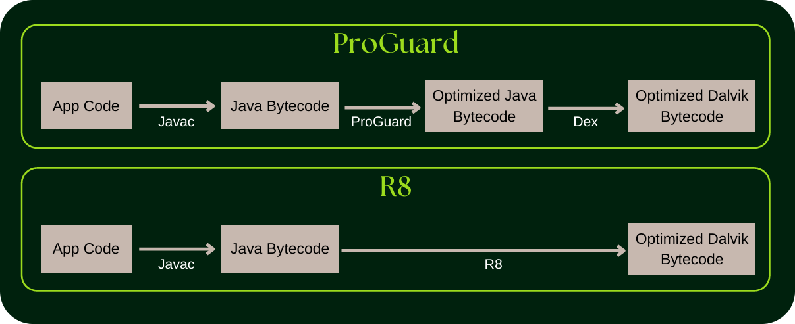
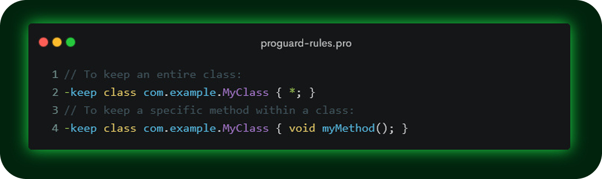
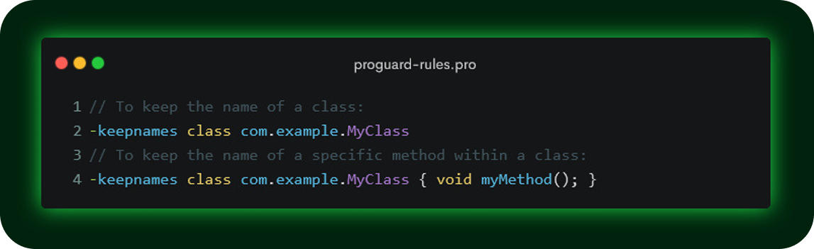
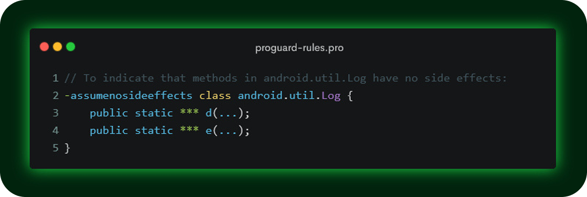

<h1 align="center">
Android R8 ve Kod Optimizasyonu
</h1>

## İçindekiler

- [R8 Nedir?](#r8-nedir)
- [R8 ve ProGuard Arasındaki Farklar](#r8-ve-proguard-arasındaki-farklar)
- [R8'in Öne Çıkan Özellikleri](#r8in-öne-çıkan-özellikleri)
- [R8'in Çalışma Modları](#r8in-çalışma-modları)
- [ProGuard Kuralları ve R8](#proguard-kuralları-ve-r8)
- [Sonuç](#sonuç)

 

<table>
  <tr>
    <th style="text-align: left; font-weight: bold;">Yayınlanma Tarihi</th>
    <td style="text-align: left;">15 Eylül 2024</td>
  </tr>
  <tr>
    <th style="text-align: left; font-weight: bold;">Son Güncelleme Tarihi</th>
    <td style="text-align: left;"></td>
  </tr>
  <tr>
    <th style="text-align: left; font-weight: bold;">Tahmini Okuma Süresi</th>
    <td style="text-align: left;">4 dakika</td>
  </tr>
</table>

  

 

Android geliştirme dünyasında uygulamaların `boyutu` `performansı` `güvenliği` her zaman öncelikli konular arasında yer almıştır.
Bu bağlamda Android R8 geliştiricilere büyük kolaylık sağlayan bir araç olarak öne çıkıyor.
R8, Java bytecode'u optimize edilmiş DEX koduna çeviren bir derleyici olup kodunuzu `küçültme` `optimize etme` `gizliliğini koruma`
görevlerini yerine getirir. Bu makalede R8'in sunduğu avantajları ve neden bu kadar önemli bir araç olduğunu detaylı bir şekilde ele alacağız.

## R8 Nedir?

Android R8, Java bytecode'unu optimize edilmiş `Dalvik Executable` **(DEX)** koduna dönüştüren bir derleyicidir.
Uygulamanızın verimliliğini ve güvenliğini artırmak için kodunuzu optimize eder, küçültür ve karmaşıklaştırır.
Bu süreç uygulamanızın çalışma zamanında daha hızlı çalışmasına, boyutunun azalmasına ve tersine mühendislik girişimlerine karşı daha korunaklı olmasına yardımcı olur​.

 

R8'in temel amaçlarından biri kodun yetkisiz kişiler tarafından deşifre edilmesini zorlaştırmaktır. Bu, özellikle mobil uygulama geliştiricileri
için oldukça kritik bir konudur. R8 `sınıf adlarını` `metodları` `değişkenleri` karmaşık hale getirerek kodunuzun anlaşılmasını ve geri mühendislik
ile çözülmesini zorlaştırır. Bu durum uygulama güvenliği için büyük bir avantajdır.

## R8 ve ProGuard Arasındaki Farklar

Android'de R8'den önce kullanılan ProGuard, kod küçültme ve gizleme işlemlerinde yaygın olarak kullanılan bir araçtı. Ancak ProGuard,
bytecode'u optimize ettikten sonra bunu DEX formatına çevirmek için ek adımlar gerektiriyordu. Bu da bazı durumlarda süreci uzatıyordu.
R8 bu adımları daha verimli hale getirerek doğrudan Java bytecode'unu optimize edilmiş DEX koduna dönüştürür ve süreçteki adım sayısını azaltır.
Bu da hem hız hem de verimlilik açısından önemli bir gelişmedir​.

  

## R8'in Öne Çıkan Özellikleri

- **Kod Küçültme (Shrinking)**

  R8 `kullanılmayan sınıfları` `metodları` `değişkenleri` tespit eder ve kaldırır. Bu özellik, özellikle büyük üçüncü parti
  kütüphanelerin sadece bir kısmını kullanan uygulamalar için oldukça etkilidir.
  Bu sayede uygulama boyutu küçülür ve gereksiz koddan arındırılır.

- **Kaynak Küçültme (Resource Shrinking)**

  Uygulamanızda kullanılmayan kaynakları (resimler, layout dosyaları vb.) tespit edip kaldırarak uygulama boyutunu daha da küçültür.

- **Optimizasyon**

  R8, uygulamanızın performansını artırmak için kodu optimize eder. Bu özellik çalışma zamanında uygulamanızın daha hızlı çalışmasına
  ve daha küçük bir DEX dosyası üretmesine olanak tanır​.

- **Karmaşıklaştırma (Obfuscation)**

  Kodunuzu tersine mühendislik saldırılarından korumak için sınıfları, metodları ve değişkenleri rastgele adlarla değiştirir.
  Bu özellik uygulamanızın deşifre edilmesini oldukça zorlaştırır.

## R8'in Çalışma Modları

R8 iki ana modda çalışabilir: `Uyumluluk modu` ve `Tam mod`.

- **Uyumluluk Modu**

  Bu mod ProGuard'dan R8'e geçiş yapan geliştiriciler için geçici bir çözümdür. Bu modda R8 daha az agresif optimizasyonlar yapar.
  Android Gradle plugin 8.0'a kadar bu mod varsayılan moddu.

- **Tam Mod**

  Android Gradle plugin 8.0 ile birlikte gelen bu mod daha agresif optimizasyonlar yapar. Bu modda bazı ek ProGuard yapılandırma
  kurallarına ihtiyaç duyabilirsiniz. Ancak bu mod uygulamanızın performansını ve boyutunu optimize etmek için oldukça etkilidir​.

## ProGuard Kuralları ve R8

R8, ProGuard ile aynı yapılandırma dilini kullanır. Yani ProGuard kurallarını R8 ile kullanmaya devam edebilirsiniz
ProGuard kuralları uygulamanızın hangi bölümlerinin korunacağını ve hangi bölümlerinin optimize edileceğini belirler.

- **Keep Kuralları**

  Belirli sınıfların, metodların veya alanların optimize edilmeden korunmasını sağlar.

  

    
  

- **Veri Sınıflarını Koru**

  Özellikle serileştirme ve deseralizasyon işlemleri için kullanılan veri sınıflarının korunması önemlidir.
  Bu sınıflar optimize edilirse uygulamanızın işleyişi olumsuz etkilenebilir.

- **İsimleri Koru**

  Belirli sınıf, metod veya alan isimlerinin orijinal haliyle kalmasını sağlayabilirsiniz.

  

    
  

- **Yan Etki Yok Varsayımı**

  Belirli metodların yan etkisi olmadığını belirterek R8'in daha agresif optimizasyon yapmasına izin verebilirsiniz​.

  

    
  

## Sonuç

Android R8, modern Android geliştirme süreçlerinde vazgeçilmez bir araç haline gelmiştir.
Uygulamanızın boyutunu küçültmek, performansını artırmak ve kodunuzu daha güvenli hale getirmek için R8'in sunduğu avantajlardan
faydalanabilirsiniz. Özellikle ProGuard'dan daha verimli olması geliştiriciler için büyük bir avantaj sağlar.
Eğer uygulamanızda R8'i tam potansiyeliyle kullanıyorsanız kodunuzu optimize etmek ve uygulamanızı daha
güvenli hale getirmek için etkili bir çözüm elde edersiniz.

 

İçeriğim hoşunuza gittiyse bana destek olmak için beni takip edebilir veya bir kahve ısmarlayabilirsiniz.
Desteğiniz daha fazla kaliteli içerik üretmem konusunda motivasyonumu arttırıyor.

 

  

 

Android ile ilgili daha fazla makale okumak isterseniz <a href="https://github.com/mustafatoktas/O_Makalelerim?tab=readme-ov-file#android">buraya tıklayarak</a> göz atabilirsiniz.

  

## İletişim

  

