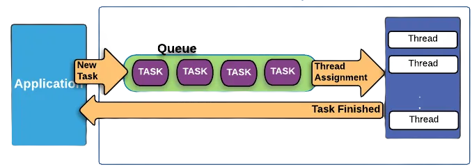
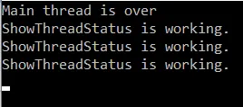
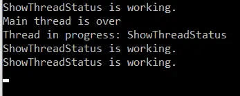
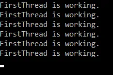
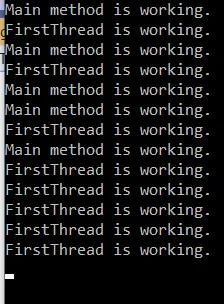

# C# Thread ve Task Kullanımı

## **İçindekiler**

- [Thread Nedir?](#thread-nedir)
- [Task Nedir?](#task-nedir)
- [Task ve Thread Arasındaki Farklar](#task-ve-thread-arasındaki-farklar)

<br>

<table>
  <tr>
    <th style="font-weight: bold;">Yayınlanma Tarihi</th>
    <td>28 Ağustos 2024</td>
  </tr>
  <tr>
    <th style="font-weight: bold;">Son Güncelleme Tarihi</th>
    <td></td>
  </tr>
  <tr>
    <th style="font-weight: bold;">Tahmini Okuma Süresi</th>
    <td>4 dakika</td>
  </tr>
</table>


<div align="center">
  
</div>  


## Thread Nedir?

`Thread` **(iş parçacığı)** kendi program ve memory alanına sahip temel bir CPU kullanım birimidir. Bir zamanlayıcı tarafından bağımsız
bir şekilde yönetilebilen talimatların en küçük bölümüdür. Thread'ler `.NET`'e ait bir yapı değildir, OS'daki iş parçacıklarıdır.
.NET'in `Thread sınıfı` aslında threadleri oluşturabilmenin ve yönetmenin bir yoludur.
.NET Framework [System.Threading](https://learn.microsoft.com/tr-tr/dotnet/api/system.threading?view=net-5.0) ad alanı altında thread ve yine
bu konuyla ilişkili class'lara sahiptir. C#, `Foreground Thread` ve `Background Thread` olmak üzere iki tür thread yapısını desteklemektedir.


### Foreground Thread

Bir foreground thread, main thread'in sonlanmış olmasından etkilenmez, yalnızca kendisine verilen iş bittiğinde tamamlanır.
Yani foreground bir thread'in yaşam döngüsü main thread'e bağlı değildir. Foreground thread'ler, son foreground thread sonlandırılıncaya kadar
çalışmaya devam edecek olan evrelerdir. Thread'ler **default olarak** foreground oluşturulurlar. Küçük bir örnek üzerinden gidelim.

```C#
using System;
using System.Collections.Generic;
using System.Linq;
using System.Text;
using System.Threading;
using System.Threading.Tasks;

namespace ThreadTask
{
    class Program
    {
        static void Main(string[] args)
        {
            Thread thread = new Thread(ShowThreadStatus);
            thread.Start();

            Console.WriteLine("Main thread is over");
        }

        static void ShowThreadStatus()
        {
            for (int c = 0; c < 3; c++)
            {
                Console.WriteLine("ShowThreadStatus is working.");
                Thread.Sleep(1000);
            }
        }
    }
}
```

<br>



<br>

Çıktıdan anlaşılacağı üzere oluşturduğumuz **ShowThreadStatus thread**'i main thread'in tamamlanmış olmasını önemsemedi ve kendisine tanımlanmış olan görevi tamamladı ve sonlandı.


### Background Thread

Foreground'un tersine bu thread'lerin çalışması main thread'in veya diğer tüm foreground thread'lerin aktif durumda olmasına bağlıdır.
Main thread veya diğer tüm foreground thread'ler sonlandırıldığında background thread görevini tamamlayamadan sonlanır.
Background thread yapısını kullanabilmek için thread'in `IsBackground` özelliğini `true` olarak ayarlamamız gerekmektedir.

```C#
using System;
using System.Collections.Generic;
using System.Linq;
using System.Text;
using System.Threading;
using System.Threading.Tasks;

namespace ThreadTask
{
    class Program
    {
        static void Main(string[] args)
        {
            Thread thread = new Thread(ShowThreadStatus);
            thread.Start();

            Thread thread2 = new Thread(ShowThreadNames);
            thread2.Name = "ShowThreadStatus";
            thread2.IsBackground = true;
            thread2.Start();

            Console.WriteLine("Main thread is over");
        }

        static void ShowThreadStatus()
        {
            for (int c = 0; c < 3; c++)
            {
                Console.WriteLine("ShowThreadStatus is working.");
                Thread.Sleep(1000);
            }
        }

        static void ShowThreadNames()
        {
            Console.WriteLine("Thread in progress: {0}", Thread.CurrentThread.Name);

            Thread.Sleep(3000);

            Console.WriteLine("Completed thread: {0}", Thread.CurrentThread.Name);
        }
    }
}
```

<br>



<br>

Normal şartlarda ShowThreadNames thread'inin `Completed thread: Background thread` yazdıktan sonra sonlanması gerekiyordu. Ancak **ShowThreadStatus**
işlemini tamamladı ve artık çalışacak başka bir **foreground thread** kalmadığı için döngü sonlandı ve **ShowThreadNames background thread'i** işlemini sonlandıramadı.


## Task Nedir?

Task yapılması gereken görevleri temsil eden bir nesnedir. Bir işi paralel olarak yürütmek istediğimizde bu yapıyı kullanırız.
`Async` ve `await` anahtar kelimelerini kullanarak `asenkron` **(eş zamanlı çalışan)** uygulamalar gerçekleştirebiliriz.
.Net'de [System.Threading.Tasks](https://learn.microsoft.com/en-us/dotnet/api/system.threading.tasks?view=net-5.0) isim alanı altında
Task yapısına ulaşabiliriz. Task yapısında bir işin tamamlanıp tamamlanmadığını öğrenebilir ve bu işlem bir sonuç döndürüyorsa bu
sonuca ulaşabiliriz. Değer döndüren işlemler için `Task <TResult>` sınıfını kullanmamız gerekmektedir.

```C#
using System;
using System.Collections.Generic;
using System.Linq;
using System.Text;
using System.Threading;
using System.Threading.Tasks;

namespace ThreadTask
{
    class Program
    {
        static void Main(string[] args)
        {
            FirstThread();

            for (int i = 0; i < 5; i++)
            {
                Thread.Sleep(1000);
                Console.WriteLine("Main method is working.");
            }

            Console.ReadLine();
        }

        static void FirstThread()
        {
            while (true)
            {
                Thread.Sleep(1500);
                Console.WriteLine("FirstThread is working.");
            }
        }
    }
}
```

<br>



<br>

İşlemi senkron bir şekilde yaptık dolayısıyla yapılacak işler parçalara ayrılmadı ve ekranda sadece **FirstThread** metodunun çıktısını görebildik.
Çünkü bu metodun içerisinde sonsuz bir döngü var ve bu işlem tamamlanamadığı için main metodu FirstThread metodunu beklemek durumunda kalıyor.

<br>

Aynı yapıyı asenkron bir şekilde kurgulayalım.

```C#
using System;
using System.Collections.Generic;
using System.Linq;
using System.Text;
using System.Threading;
using System.Threading.Tasks;

namespace ThreadTask
{
    class Program
    {
        static void Main(string[] args)
        {
            FirstThreadAsync();

            for (int i = 0; i < 5; i++)
            {
                Thread.Sleep(1000);
                Console.WriteLine("Main method is working.");
            }

            Console.ReadLine();
        }

        async static void FirstThreadAsync()
        {
            void InnerThread()
            {
                while (true)
                {
                    Thread.Sleep(1500);
                    Console.WriteLine("FirstThread is working.");
                }
            }

            Task task = new Task(() => InnerThread());
            task.Start();
            await task;
        }
    }
}
```

<br>



<br>

Çıktıyı incelediğimizde hem FirstThreadAsync metodu hem de paralelinde diğer işlemler gerçekleşti. Herhangi bir bloklama durumu oluşmadı.


## Task ve Thread Arasındaki Farklar

- Thread'ler bir iş parçacığı oluşturmak ve yürütmek için kullanılır. Task asenkron işlemleri temsil eder ve paralel bir şekilde işleri yürütebilmemize olanak sağlar.

- Task yürütülen işlem için bir sonuç döndürebilir. Fakat thread yapısında bunu doğrudan gerçekleştirebileceğimiz bir yapı yoktur.

- Task aynı anda birden fazla görevi gerçekleştirebilir. Thread'ler ise aynı anda yalnızca bir görevi yürütebilir.

- Task içerisinde `async` ve `await` anahtar kelimelerini kullanarak asenkron yapılar oluşturabiliriz.

- `ThreadPool` arka planda belli bir işi yapmak üzere planlanmış görevlerin Thread'lere bölünmesi ve bu Thread'lerin
  bir koleksiyon şeklinde tutularak asenkron işleyişlerinin yönetilmesi amacıyla kullanılan sarmalayıcı bir alan olarak düşünülebilir.
  Oluşturulan yeni bir thread ThreadPool ile ilgilenmez, Task ise doğrudan bu havuzu kullanır.

- Task yapısı Thread ile karşılaştırıldığında daha yüksek seviyeli bir kavramdır diyebiliriz.


## İletişim

<a href="mailto:info@mustafatoktas.com"             ></a>
<a href="https://t.me/mustafatoktas00"              ></a>
<a href="https://www.linkedin.com/in/mustafatoktas/"></a>

<div align="center">
  <a href="#c-thread-ve-task-kullanımı"></a>
</div>