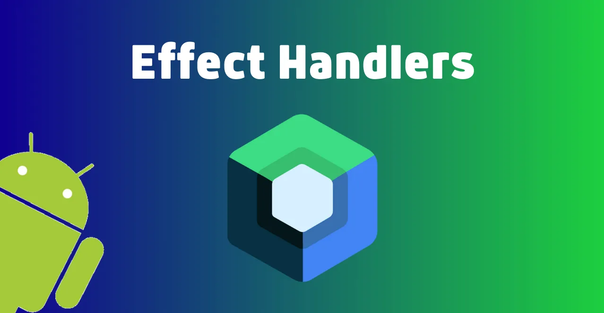

# Jetpack Compose’da Effect Handlers Nedir?

## **İçindekiler**

- [Effect Handlers Nedir?](#effect-handlers-nedir)
- [Side Effect Nedir?](#side-effect-nedir)
- [Side Effect](#side-effect)
- [Launched Effect](#launched-effect)
- [Disposable Effect](#disposable-effect)
- [rememberUpdateState](#rememberupdatestate)
- [rememberCoroutineScope](#remembercoroutinescope)
- [derivedStateOf](#derivedstateof)
- [ProduceState](#producestate)
- [Sonuç](#sonuç)

<br>

<table>
  <tr>
    <th style="text-align: left; font-weight: bold;">Yayınlanma Tarihi</th>
    <td style="text-align: left;">25 Ağustos 2024</td>
  </tr>
  <tr>
    <th style="text-align: left; font-weight: bold;">Son Güncelleme Tarihi</th>
    <td style="text-align: left;"></td>
  </tr>
  <tr>
    <th style="text-align: left; font-weight: bold;">Tahmini Okuma Süresi</th>
    <td style="text-align: left;">7 dakika</td>
  </tr>
</table>


<div align="center">
  
</div>  

<br>

Jetpack Compose, Android UI geliştirmeyi basitleştiren modern ve deklaratif bir `toolkit`'tir. Kullanıcı ara yüzünüzü
Kotlin ile tanımlamanıza olanak tanır ve UI bileşenlerinin durumlarındaki değişikliklere dinamik olarak yanıt verir.
Jetpack Compose, fonksiyonel programlama prensiplerini benimser ve UI oluşturmak için composable fonksiyonlar kullanır.
Ancak bu paradigma içerisinde `side effect`'lerin **(yan etkilerin)** nasıl ele alınacağı önemli bir konudur. Jetpack Compose'da
bu amaçla çeşitli `effect handler`'lar kullanılır.


## Effect Handlers Nedir?

Effect handlers, Jetpack Compose'da side effect'leri yönetmek için kullanılan yapılardır. Bir side effect, bir fonksiyonun
ana işlevinin dışında ekstra bir iş yapmasıdır. Örneğin veri tabanına erişmek, dosya sistemine yazmak veya API'den veri çekmek gibi.
Composable fonksiyonlar UI'ı yeniden çizmek için tasarlandığından side effect işlemlerini doğrudan içermemelidir.
Bunun yerine Compose bu amaç için çeşitli effect handlerlar sunar. Bunlar:

1. Side Effect

2. Launched Effect

3. Disposable Effect

4. Remember Update State

5. Remember Coroutine Scope

6. Derived State Of

7. Produce State


## Side Effect Nedir?

Side Effect'ler, işlevin kapsamı dışında gerçekleşen herhangi bir eylemi ifade eder. Jetpack Compose'da side effect'lerin kullanılması normal UI oluşturma sürecinin dışında gerçekleşen görevlerin ele alınmasını içerir.


### Side Effectleri Ne Zaman Kullanmalıyız?

Side effect'leri Jetpack Compose içindeki durum veya veri akışı dışındaki sistemleri veya durumları değiştirmeniz gerektiğinde kullanmalısınız. Genellikle Compose'un reaktif ve deklaratif modeline uymayan ancak uygulamanızın işlevselliği için gerekli olan işlemler için gereklidirler.
İşte side effect kullanmanız gereken bazı yaygın durumlar:

1. **Asenkron Veri Yüklemek**

   Uygulamanız bir API’den veri çekerken veya bir veri tabanından asenkron olarak veri yüklerken, bu işlemleri tetiklemek için side effect’leri kullanabilirsiniz.

2. **Kaynakları Yönetmek**

   Bir listener kaydetmek, bir timer başlatmak veya bir aboneliği başlatmak gibi kaynakları yönetirken bu kaynakların yaşam döngüsünü doğru bir şekilde yönetmek için side effect'leri kullanabilirsiniz.

3. **Dış Sistemleri Güncellemek**

   Compose dışındaki bir sistem veya bileşeni **(Örneğin sistem durum çubuğunun rengini değiştirmek)** güncellemeniz gerektiğinde side effect'ler kullanılabilir.

4. **Durum Güncellemeleri**

   Compose'un dışında tutulan durumu **(Örneğin bir ViewModel'daki durumu)** temel alan kararlar almanız gerektiğinde bu durumu dinlemek ve değişikliklere yanıt olarak UI'ı güncellemek için side effect'leri kullanabilirsiniz.

<br>

Side effect'lerin kullanımı, Compose'un doğasını bozmadan side effect'leri yönetmenize olanak tanır. Ancak yan etkileri yönetirken dikkatli olmak önemlidir çünkü yanlış kullanımlar hafıza sızıntılarına, istenmeyen tekrar çalışmalara veya tahmin edilemeyen UI davranışlarına neden olabilir. Jetpack Compose, `LaunchedEffect`, `DisposableEffect`, `rememberCoroutineScope` ve daha fazlası gibi çeşitli araçlar sunarak bu işlemleri kolaylaştırır ve yan etkileri güvenli bir şekilde yönetmenize yardımcı olur.

## Side Effect

SideEffect genellikle Composable'lar tarafından tetiklenen ancak UI ile doğrudan ilişkili olmayan yan etkiler için kullanılır. Örneğin bir durumun loglanması:

```kotlin
@Composable
fun UserLogger(user: User) {
    SideEffect {
        Log.d("UserLogger", "Kullanıcı güncellendi: ${user.name}")
    }

    // Kullanıcı bilgisini gösteren UI burada oluşturulur
    Text(text = "Merhaba, ${user.name}")
}
```

<br>

Bu örnekte SideEffect kullanıcı bilgisi her güncellendiğinde bir log mesajı basar. Bu Composable'ın yeniden oluşturulması sırasında UI dışında bir etki yaratmanızı sağlar.


## Launched Effect

Kotlin Jetpack Compose'da `Launched Effect`, bir `coroutine builder`'ıdır ve genellikle asenkron işlemleri yönetmek için kullanılır. Örneğin ağ istekleri yapmak veya uzun süren hesaplamaları gerçekleştirmek gibi işlemler bu kapsamda yer alabilir. `Launched Effect` ara yüzü engellemeden arka planda işlem yapmayı sağlar.

Örnek Olarak:

```kotlin
import androidx.compose.foundation.layout.*
import androidx.compose.foundation.text.BasicTextField
import androidx.compose.material.*
import androidx.compose.runtime.*
import androidx.compose.runtime.livedata.*
import androidx.compose.ui.Alignment
import androidx.compose.ui.Modifier
import androidx.compose.ui.text.input.TextFieldValue
import androidx.compose.ui.unit.dp
import kotlinx.coroutines.delay
import kotlinx.coroutines.launch

@Composable
fun LaunchedEffectExample() {
    var inputValue by remember { mutableStateOf(TextFieldValue()) }
    var loading by remember { mutableStateOf(false) }

    Column(
        modifier = Modifier
            .padding(16.dp)
            .fillMaxWidth(),
        horizontalAlignment = Alignment.CenterHorizontally,
        verticalArrangement = Arrangement.Center
    ) {
        BasicTextField(
            value = inputValue,
            onValueChange = {
                inputValue = it
            },
            modifier = Modifier.fillMaxWidth(),
            singleLine = true,
            textStyle = MaterialTheme.typography.body1
        )

        Spacer(modifier = Modifier.height(16.dp))

        Button(
            onClick = {
                loading = true
                // LaunchedEffect kullanarak arka planda işlem yap
                LaunchedEffect(Unit) {
                    // Örnek bir asenkron işlem (bekleme)
                    delay(2000)
                    loading = false
                    // Sonuçlarla ilgili başka işlemler yapılabilir
                }
            },
            modifier = Modifier.align(Alignment.CenterHorizontally),
            enabled = !loading
        ) {
            if (loading) {
                CircularProgressIndicator()
            } else {
                Text("Submit")
            }
        }
    }
}
```

<br>


## Disposable Effect

DisposableEffect, Jetpack Compose'un yaşam döngüsü yönetimine yardımcı olan bir bileşendir. Bu bileşen bir Composable bileşen oluşturulduğunda bir işlemi başlatmanıza ve bileşen yok edildiğinde bu işlemi temizlemenize olanak tanır.

Bir DisposableEffect, genellikle bir Composable fonksiyon içinde kullanılır ve genellikle kaynak yönetimi için kullanılır. Örneğin bir dosya okuma veya yazma işlemi başlatırken bu işlemi tamamlamak için DisposableEffect kullanabilirsiniz. Böylece Composable fonksiyon çalışmaz hale geldiğinde **(Örneğin ekran geçişleri veya bileşenin yeniden oluşturulması nedeniyle)** kaynaklarınızı temizleyebilirsiniz.

Bir DisposableEffect, birkaç ana parçadan oluşur:

1. **Effect Block**

   Bu, DisposableEffect içindeki işlemlerin tanımlandığı bloktur. Genellikle bir kaynağı başlatmak veya başka bir etkileşim başlatmak için kullanılır.

2. **onDispose Bloğu**

   Bu blok, DisposableEffect kapsamından çıkıldığında çalıştırılacak olan kodu içerir. Bu blokta kaynakların temizlenmesi veya kapatılması gibi işlemler gerçekleştirilir.

<br>

Örnek Uygulama:

```kotlin
@Composable
fun DisposableEffectExample() {

    var isLoading by remember { mutableStateOf(true) }

    // DisposableEffect kullanımı
    DisposableEffect(Unit) {

        // Yükleniyor durumunu belirleyelim
        isLoading = true

        // API çağrısını yapalım
        val data = fetchData()

        // Yükleme tamamlandığında durumu güncelleyelim
        isLoading = false

        // Dispose fonksiyonu, bileşen yok edildiğinde çağrılacak olan kodu içerir
        onDispose {
            // Eğer işlem tamamlanmadıysa iptal et
            if (isLoading) {
                cancelDataFetch()
            }
        }
    }

    Box(
        modifier = Modifier
            .fillMaxSize()
            .padding(16.dp),
        contentAlignment = Alignment.Center
    ) {
        if (isLoading) {
            // Yükleniyor göstergesi
            CircularProgressIndicator(color = Color.Black)
        } else {
            // Veri yüklendiyse göster
            Text(text = "Veri yüklendi!", fontSize = 24.sp)
        }
    }
}
```


## rememberUpdateState

Jetpack Compose'da remember fonksiyonu, bir değeri veya nesneyi bellekte tutmak için kullanılır. remember fonksiyonu, bir Composable bileşeni içinde kullanıldığında, bileşenin yeniden oluşturulması durumunda bile değerin veya nesnenin bellekte tutulmasını sağlar. Bu bir bileşenin durumu veya verisi değişse bile bellekteki değerin korunmasını sağlar.

`rememberUpdatedState` ise bir state değerini güncellemek için kullanılan bir fonksiyondur. Bu fonksiyon normalde state değerini güncelleyen mutableStateOf gibi işlevlerin yerine kullanılabilir. rememberUpdatedState fonksiyonu değeri güncellenen bir state değeri döndürür. Bu state değeri her oluşturulma sonrasında yeni bir değere sahip olur ve Composable bileşenin yeniden oluşturulmasını tetikler.

İşte rememberUpdatedState'in kullanımıyla basit bir örnek:

```kotlin
import androidx.compose.foundation.layout.*
import androidx.compose.material.*
import androidx.compose.runtime.*
import androidx.compose.ui.*
import androidx.compose.ui.tooling.preview.*
import androidx.compose.ui.unit.*

@Composable
fun Counter() {

    // State değerini güncellemek için rememberUpdatedState kullanımı
    val countState = rememberUpdatedState(0)

    // State değerini almak
    val count = countState.value

    Column(
        modifier = Modifier
            .fillMaxSize()
            .padding(16.dp),
        verticalArrangement = Arrangement.Center,
        horizontalAlignment = Alignment.CenterHorizontally
    ) {
        Text(text = "Count: $count", fontSize = 24.sp)
        Button(onClick = { countState.value++ }) {
            Text(text = "Increment")
        }
    }
}
```

<br>

Yukarıdaki örnekte rememberUpdatedState fonksiyonu kullanılarak bir countState adında bir state değeri oluşturuluyor. Bu state değeri her güncelleme sonrasında yeni bir değer alır ve Composable bileşenin yeniden oluşturulmasını tetikler. Böylece butona tıklandığında count değeri güncellenir ve bu değişiklik UI'ı günceller.


## rememberCoroutineScope

Jetpack Compose'da `rememberCoroutineScope` fonksiyonu, coroutine'lerin oluşturulması ve yönetilmesi için kullanılan bir `scope` (kapsam) sağlar. Bu kapsam, Composable bileşenler içinde kullanılarak coroutine'lerin çalıştırılmasını ve özellikle UI ile etkileşimli işlemlerin yapılmasını sağlar. Bu özellikle arka planda çalışan işlemlerin sonuçlarını alıp UI'da güncelleme yapmak için yaygın olarak kullanılır.

rememberCoroutineScope fonksiyonu, Composable bileşenler içinde çağrıldığında bu bileşene özgü bir coroutine kapsamı döndürür. Bu kapsam bileşenin yaşam döngüsüne bağlı olarak otomatik olarak iptal edilir, böylece bileşen yok edildiğinde tüm coroutine'lerin otomatik olarak sonlandırılır.

İşte rememberCoroutineScope'un kullanımıyla basit bir örnek:

```kotlin
import androidx.compose.foundation.layout.*
import androidx.compose.material.*
import androidx.compose.runtime.*
import androidx.compose.ui.*
import androidx.compose.ui.tooling.preview.*
import androidx.compose.ui.unit.*
import kotlinx.coroutines.*

@Composable
fun CoroutineExample() {

    // Coroutine kapsamını 
    val coroutineScope = rememberCoroutineScope()

    // State değerini tanımlama
    var message by remember { mutableStateOf("") }

    // Butona tıklandığında bir coroutine başlatma
    Button(onClick = {
        // Coroutine kapsamı içinde bir işlem başlatma
        coroutineScope.launch {
            // Uzun sürecek işlemi başlatma (örneğin, ağ isteği gibi)
            delay(1000)

            // UI üzerinde bir değişiklik yapma (örneğin, mesajı güncelleme)
            message = "Coroutine işlemi tamamlandı!"
        }
    }) {
        Text("Start Coroutine")
    }

    Column(
        modifier = Modifier
            .fillMaxSize()
            .padding(16.dp),
        verticalArrangement = Arrangement.Center,
        horizontalAlignment = Alignment.CenterHorizontally
    ) {
        Text(text = message, fontSize = 24.sp)
    }
}
```

<br>

Yukarıdaki örnekte rememberCoroutineScope fonksiyonu kullanılarak bir coroutine kapsamı oluşturulur. Bu kapsam, butona tıklandığında bir coroutine başlatmak için kullanılır. Coroutine başlatıldığında, bir saniye boyunca beklenir `(delay(1000))` ve ardından message değişkeni güncellenerek UI'da bir mesaj görüntülenir. Bu işlem coroutine kapsamının yönetimi altında gerçekleştirilir ve bileşen yok edildiğinde otomatik olarak iptal edilir.

## derivedStateOf

Jetpack Compose'da `derivedStateOf`, bir veya daha fazla state değerinden türetilen bir `derived` (türetilmiş) state değeri oluşturmak için kullanılan bir fonksiyondur.

derivedStateOf fonksiyonu, Composable fonksiyon içinde kullanılabilecek bir fonksiyondur. Bu fonksiyon birden fazla state değerini girdi olarak alır ve bu değerlerin bir değişikliği olduğunda otomatik olarak yeniden hesaplanır. Yani herhangi bir girdi state değeri değiştiğinde türetilmiş state değeri de otomatik olarak güncellenir ve bu değişiklik UI'ı günceller.

İşte derivedStateOf kullanarak basit bir örnek:

```kotlin
import androidx.compose.foundation.layout.*
import androidx.compose.material.*
import androidx.compose.runtime.*
import androidx.compose.ui.*
import androidx.compose.ui.tooling.preview.*
import androidx.compose.ui.unit.*

@Composable
fun DerivedStateExample() {

    // State değerleri
    var count1 by remember { mutableStateOf(0) }
    var count2 by remember { mutableStateOf(0) }

    // Derived state değeri
    val totalCount = derivedStateOf {
        count1 + count2
    }

    Column(
        modifier = Modifier
            .fillMaxSize()
            .padding(16.dp),
        verticalArrangement = Arrangement.Center,
        horizontalAlignment = Alignment.CenterHorizontally
    ) {
        Text(text = "Count 1: $count1", fontSize = 24.sp)
        Text(text = "Count 2: $count2", fontSize = 24.sp)
        Text(text = "Total Count: $totalCount", fontSize = 24.sp)
        Button(onClick = { count1++ }) {
            Text(text = "Increment Count 1")
        }
        Button(onClick = { count2++ }) {
            Text(text = "Increment Count 2")
        }
    }
}
```

<br>

Yukarıdaki örnekte derivedStateOf fonksiyonu kullanılarak `totalCount` adında bir türetilmiş state değeri oluşturuluyor. Bu türetilmiş state değeri `count1` ve `count2` state değerlerinden türetilir. Herhangi bir count1 veya count2 değeri değiştiğinde, totalCount değeri otomatik olarak güncellenir ve bu değişiklik UI'da yansıtılır. Bu şekilde türetilmiş state değeri belirli bir mantığa dayalı olarak dinamik olarak hesaplanır ve güncellenir.

## ProduceState

`produceState`, remember ve LaunchedEffect fonksiyonlarının işlevselliğini birleştiren basit bir kavramdır. Bu bir durum değişkeni oluşturur ve bu değişkenin değerini bir yan etki sonucunda günceller. Bu sayede bileşenleriniz her zaman en güncel verileri gösterir.

produceState bileşeni, `initialValue` ve `producer` parametrelerini alır. initialValue, durum değişkeninin başlangıç değeridir. producer ise durum değişkeninin değerini güncellemek için yürütülecek olan lambda ifadesidir. Bu lambda ifadesi produceState bileşeni ilk oluşturulduğunda ve durum değişkeninin değeri değiştiğinde tekrar yürütülür.

İşte produceState kullanarak bir örnek:

```kotlin
// remember ve LaunchedEffect ile oluşturulmuş bir bileşen
fun MyComposable(value: Int) {
    
    val state = remember { mutableStateOf("") }
    
    // Kullanıcının adını state değişkeni ile güncelle
    LaunchedEffect(key1 = "keyName") {
        value = fetchUserName()
    }
    
    // Kullanıcının adını göster
    Text(text = state.value)
}

// produceState ile oluşturulmuş bir bileşen
fun MyComposableWithProduceState(value: Int) {
 
   val state = produceState(initialValue = "") {
      // Kullanıcının adını state değişkeni ile güncelle
      value = fetchUserName()
   }
  
    // Kullanıcının adını göster
    Text(text = state.value)
}
```

<br>

Bu örnekte `MyComposable` ve `MyComposableWithProduceState` aynı sonuçları verir. produceState bileşeni, kullanıcının adını saklayacak bir durum değişkeni oluşturur. Bu bileşen, öncelikle kullanıcının adını bir veri tabanından alır ve bu adı durum değişkenine saklar. Ayrıca kullanıcının adı veri tabanında değiştiğinde produceState bileşeni yeniden çalıştırılır.

## Sonuç

`LaunchedEffect`, `DisposableEffect` ve `SideEffect` Jetpack Compose'da farklı senaryolar için çeşitli yan etkileri yönetmenize olanak tanır. Asenkron işlemler, kaynak yönetimi ve UI dışı etkiler bu üç yapı ile kolaylıkla yönetilebilir. Compose'un yapısını bu etkilerle zenginleştirmek uygulamanızın etkileşimini ve kullanıcı deneyimini iyileştirecektir.

<br>

Eğer bu makaleden keyif aldıysanız ve faydalı bulduysanız desteğiniz benim için çok değerli. Beni takip ederek veya bir kahve
ısmarlayarak takdirinizi gösterebilirsiniz. Desteğiniz, kaliteli içerik üretmeye devam etmem için beni motive ediyor.


<a href="https://github.com/mustafatoktas/W.BE_RepoVisitorCounterAPI" target="_blank">  </a>

<a href="https://buymeacoffee.com/mustafatoktas" target="_blank">  </a>


## İletişim

<a href="mailto:info@mustafatoktas.com"              target="_blank">  </a>
<a href="https://t.me/mustafatoktas00"               target="_blank">  </a>
<a href="https://www.linkedin.com/in/mustafatoktas/" target="_blank">  </a>