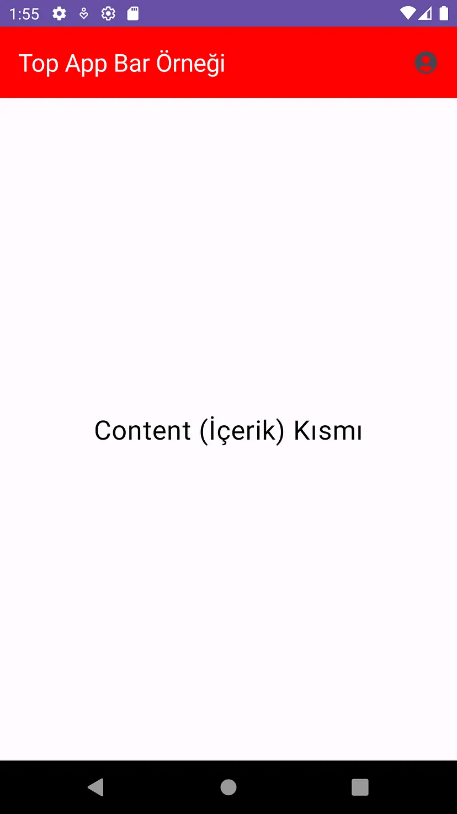

<h1 align="center">
 Jetpack Compose'da Scaffold Kullanımı<a name="article-top"></a>
</h1>

## İçindekiler

- [Scaffold Nedir?](#scaffold-nedir)
- [Scaffold Bileşenleri](#scaffold-bileşenleri)
- [Scaffold Kullanmanın Avantajları](#scaffold-kullanmanın-avantajları)

<br>

<table>
  <tr>
    <th style="font-weight: bold;">Yayınlanma Tarihi</th>
    <td>7 Eylül 2024</td>
  </tr>
  <tr>
    <th style="font-weight: bold;">Son Güncelleme Tarihi</th>
    <td></td>
  </tr>
  <tr>
    <th style="font-weight: bold;">Tahmini Okuma Süresi</th>
    <td>6 dakika</td>
  </tr>
</table>


<div align="center">
  
</div>

## Scaffold Nedir?

`Scaffold` uygulamanızın ana düzenini yönetmenizi sağlar. Bu bileşen çeşitli bölümlerden oluşur ve her bir bölüm belirli bir işlevi
yerine getirir. Scaffold'u `uygulamanın iskeleti` olarak düşünebilirsiniz. Bu iskelet üzerinde farklı bileşenler yerleştirilir.
Scaffold dinamik olarak farklı ekran boyutlarına uyum sağlayabilir, bu da uygulamanızın çeşitli cihazlarda iyi görünmesini sağlar.

**scaffold = bir şeyi sabitlemek**

Jetpack Composeda kullanıcı arayüzü (UI) tasarımı söz konusu olduğunda düzenin ve yerleşimin düzgün bir şekilde yönetilmesi
büyük bir öneme sahiptir. Bu noktada Scaffold bileşeni uygulama düzeninizi **sabitlemenin** anahtarı olarak karşımıza çıkar.
Scaffold, uygulamanızın temel yapısını oluşturarak sabit bir düzen ve işlevsellik sağlar.


## Scaffold Bileşenleri

### 1. TopBar

`TopBar` uygulamanızın en üst kısmında yer alan sabit bir bileşendir. Bu alan genellikle başlıklar, menü ikonları veya geri düğmeleri içerir.
Bu bileşen uygulamanın üst kısmında sabit bir şekilde bulunarak kullanıcıya uygulamanın genel yapısı hakkında bilgi verir ve önemli eylemleri erişilebilir kılar.

```kotlin
@OptIn(ExperimentalMaterial3Api::class)
@Composable
fun ScaffoldKullanimi(){
    Scaffold(
        topBar = {   //Scaffold içerisine topBar parametresi ekleyerek üstteki çubuğu tanımlıyoruz.
        TopAppBar(
            title = { Text("Top App Bar Örneği") },   //Üst çubuğun başlığı olarak "Top App Bar Örneği" metnini tanımlıyoruz.
            colors = TopAppBarDefaults.topAppBarColors(
                containerColor = Color.Red,   //Üst çubuğun arka plan rengini kırmızı olarak ayarlıyoruz.
                titleContentColor = Color.White   //Başlık metninin rengini beyaz olarak ayarlıyoruz.
            ),
            actions = {   // Üst çubukta sağda bulunan eylemler için bir actions tanımlıyoruz.
                IconButton(onClick = {}) {  //Üzerine tıklandığında hiçbir işlem yapmayan bir IconButton oluşturuyoruz.
                    Icon(Icons.Default.AccountCircle, contentDescription = "Kullanici")   //Icon olarak varsayılan AccountCircle simgesini kullanıyoruz.
                }
            }
        )
    },
    )
{ paddingValues ->   //Lambda ifadesi, Scaffold'ın içerik alanına padding değerlerini sağlar.
        Column(modifier = Modifier
            .fillMaxSize()   //Column bileşeninin tüm mevcut alanı kaplamasını sağlar.
            .padding(paddingValues),   //Padding değeri tasarım alanının app bar altında kalmasını engeller. Scaffold'dan alınan padding değerlerini Column bileşenine uygular.
            horizontalAlignment = Alignment.CenterHorizontally,
            verticalArrangement = Arrangement.SpaceEvenly)
        {
            Text(text = "Content (İçerik) Kısmı", fontSize = 24.sp, color = Color.Black)
        }
    }
}
```

<div align="center">
  
</div>


### 2. BottomBar

`BottomBar` uygulama ekranının alt kısmında yer alan ve genellikle uygulamanın navigasyonunu veya önemli eylemlerini
sunan bir bileşendir. Alt menü olarak kullanılabilir. Genellikle ikonlar veya simgeler ile birlikte metin etiketleri içerir
ve bu etiketler her bir simgenin ne işe yaradığını açıkça belirtir.

```kotlin
 bottomBar = {   //Scaffold'ın alt kısmında bir bottomBar tanımlıyoruz.
            BottomAppBar {   //Alt çubuk olarak BottomAppBar bileşenini kullanıyoruz.
                NavigationBarItem(
                    selected = true,   //Bu işlemin bu sayfada seçili olduğunu tanımlıyoruz.
                    onClick = { /*TODO*/ },
                    icon = { Icon(
                    imageVector = Icons.Default.ShoppingCart,
                    contentDescription = "Shopping Cart",)
                    },
                    label = {Text(text = "Sepet")}   // Bu item için etiket olarak "Sepet" metnini kullanıyoruz.
                )
                NavigationBarItem(
                    selected = false,   //Bu işlemin bu sayfada seçili olmadığını tanımlıyoruz.
                    onClick = { /*TODO*/ },
                    icon = { Icon(
                        imageVector = Icons.Default.Favorite,
                        contentDescription = "Favorite",)
                    },
                    label = {Text(text = "Favoriler")}
                )
                NavigationBarItem(selected = false,
                    onClick = { /*TODO*/ },
                    icon = { Icon(
                        imageVector = Icons.Default.Settings,
                        contentDescription = "Settings",)
                    },
                    label = {Text(text = "Ayarlar")}
                )
            }
        },
```

<div align="center">
  
</div>


### 3. FloatingActionButton (FAB)

`FloatingActionButton (FAB)` uygulamada kullanıcı arayüzünde dikkat çekici eylemler sunmak için kullanılan bir bileşendir.
Genellikle ekranın sağ alt köşesinde yer alır ve genellikle yuvarlak bir düğme olarak tasarlanır.
FAB, kullanıcıya hızlı bir şekilde önemli bir eyleme erişim sağlar. Yeni bir öğe eklemek, bir işlemi başlatmak veya bir özelliği tetiklemek gibi...

```kotlin
 floatingActionButton = {   //Scaffold'ın içinde bir FloatingActionButton tanımlıyoruz.
            FloatingActionButton(
                onClick = { /*TODO*/ },
                containerColor = Color(0xFF6200EE),   //FAB'ın arka plan rengini mor olarak ayarlıyoruz.
                contentColor = Color.White,   //FAB üzerindeki ikonun rengini beyaz olarak ayarlıyoruz.
                modifier = Modifier.size(56.dp))   //FAB'ın boyutunu 56 dp olarak ayarlıyoruz.
            {
                Icon(
                    imageVector = Icons.Filled.Add,   //FAB üzerindeki ikonda "Ekle" olarak "Add" simgesini kullanıyoruz.
                    contentDescription = "Add",   //İkonun erişilebilirlik açıklamasını "Add" olarak belirliyoruz.
                )
            }
        },
```

<div align="center">
  
</div>


### 4. Drawer

Uygulamanın kenarından sürüklenerek açılan bir menü alanıdır. Bu alan, kullanıcıların uygulamanın farklı bölümlerine kolayca
geçiş yapmalarını sağlar. Ayrıca ek navigasyon seçenekleri veya menüler sunarak uygulamanın erişilebilirliğini artırır.
`Drawer` genellikle ekranın sol veya sağ kenarında bulunur ve kullanıcıların hızlıca farklı içeriklere ulaşmasını sağlar.

```kotlin
@OptIn(ExperimentalMaterial3Api::class)
@Composable
fun Anasayfa(){
    val drawerState = rememberDrawerState(DrawerValue.Closed)   // Drawer'ın başlangıç durumu kapalı (Closed) olarak ayarlanıyoruz.
    val coroutineScope = rememberCoroutineScope()
    //Coroutine'leri başlatmak ve yönetmek için bir coroutine scope oluşturuyoruz. Bu satır asenkron işlemler yapmamıza olanak tanıyor.

    //Drawer arka plan rengi durumu
    val drawerBackgroundColor by remember {
        derivedStateOf {
            if (drawerState.isClosed) Color.Transparent else Color.Magenta
            //Eğer drawer kapalıysa arka plan rengi şeffaf, açıksa magenta rengi olacak.
        }
    }
    //ModalNavigationDrawer bileşenini kullanarak bir drawer yapısı oluşturuyoruz.
    ModalNavigationDrawer(
        drawerState = drawerState, //Drawer durumunu kontrol ediyoruz.
        drawerContent = {
            //Drawer genişliğini ayarlamak için Box yapısını kullanılıyoruz.
            Box(
                modifier = Modifier
                    .width(250.dp)   //Drawer'ın genişliğini 250 dp olarak ayarlıyoruz.
                    .fillMaxHeight()   //Drawer ekranın tamamını kaplayacak kadar yüksek olacak.
                    .background(Color.Magenta)   //Drawer'ın arka plan rengini magenta olarak ayarlıyoruz.
            ) {
            Column(
                modifier = Modifier
                    .fillMaxSize()   //Column drawer içindeki tüm alanı kaplayacak.
                    .background(drawerBackgroundColor)   //Arka plan rengi başlangıçta şeffaf, açıldığında magenta olacak.
            ) {
                Text(text = "İçerik 1 ",
                    style = TextStyle(fontSize = 24.sp, color = Color.White),
                    modifier = Modifier
                        .clickable {
                            coroutineScope.launch { drawerState.close() }   //Tıklandığında drawer'ı kapatmak için coroutine kullanılıyoruz.
                        }.padding(16.dp)
                )
                Text(text = "İçerik 2",
                    style = TextStyle(fontSize = 24.sp, color = Color.White),
                    modifier = Modifier.clickable { coroutineScope.launch { drawerState.close() } }.padding(16.dp)
                )
            }
            }
        },
                scrimColor = Color.Transparent   //Drawer açıldığında arka planda görünen alan şeffaf olacak.
    ) {
        Scaffold(
            topBar = {
                TopAppBar( title = { Text("Drawer Örneği") },
                    navigationIcon = {
                        IconButton(onClick = {
                            coroutineScope.launch { drawerState.open() }   //Menü simgesine tıklandığında drawer açılacak.
                        }) { Icon(Icons.Filled.Menu, contentDescription = null) }   // Menü simgesi kullanılarak drawer kontrolü sağlanıyor.
                        },
                    colors = TopAppBarDefaults.topAppBarColors(
                        containerColor = Color(0xFF6200EE),   //AppBar yani üst çubuğun arka plan rengini mor yapıyoruz.
                        titleContentColor = Color.White   //Başlık metninin rengini beyaz olarak ayarlıyoruz.
                    ),
                    modifier = Modifier.shadow(8.dp)   //Üst çubuğa 8 dp'lik bir gölge efekti veriyoruz.
                )
            },
            content = { paddingValues ->
                //Scaffold içeriği burada tanımlanır. Padding değerlerini alıp uygular.
                Box(
                    modifier = Modifier
                        .fillMaxSize()
                        .padding(paddingValues)
                        .background(Color.White),
                    contentAlignment = Alignment.Center
                ) {
                    Text("Ana İçerik", fontSize = 24.sp, color = Color.Black)
                }
            }
        )
    }
}
```

<div align="center">
  
</div>

<div align="center">
  
</div>


### 5. Content

Tüm bu bileşenlerin altında yer alan ve uygulamanın ana içeriğini gösteren bölümdür.

<div align="center">
  
</div>


## Scaffold Kullanmanın Avantajları

- **Tutarlılık**
  Scaffold, uygulamanızın farklı ekranlarında tutarlı ve uyumlu bir düzen sağlar. Bu da kullanıcıların arayüzle
  daha rahat etkileşimde bulunmalarını ve uygulamayı kolayca anlamalarını sağlar.

- **Kullanım Kolaylığı**

  Scaffold üst çubuk, alt çubuk ve FAB gibi önemli kullanıcı arayüzü bileşenlerini tek bir yapı içinde toplar.
  Böylece UI tasarımını ve kod yönetimini daha düzenli ve basit hale getirir.

- **Esneklik**

  Scaffold bileşenleri, her bir öğenin bağımsız olarak özelleştirilmesine olanak tanır. Bu esneklik sayesinde uygulamanızın
  gereksinimlerine göre her bir UI bileşenini özgürce tasarlayabilirsiniz.

<br>

<div align="center">
İçeriğim hoşunuza gittiyse bana destek olmak için beni takip edebilir veya bir kahve ısmarlayabilirsiniz.
Desteğiniz daha fazla kaliteli içerik üretmem konusunda motivasyonumu arttırıyor.
</div>

<br>

<div align="center">
  <a href="https://buymeacoffee.com/mustafatoktas"></a>
</div>

<br>

<div align="center">
Jetpack Compose ile ilgili daha fazla makale okumak isterseniz <a href="https://github.com/mustafatoktas/O_Makalelerim?tab=readme-ov-file#jetpack-compose">buraya tıklayarak</a> göz atabilirsiniz.
</div>


## İletişim

<a href="mailto:info@mustafatoktas.com"             ></a>
<a href="https://t.me/mustafatoktas00"              ></a>
<a href="https://www.linkedin.com/in/mustafatoktas/"></a>

<div align="center">
  <a href="#article-top"></a>
</div>