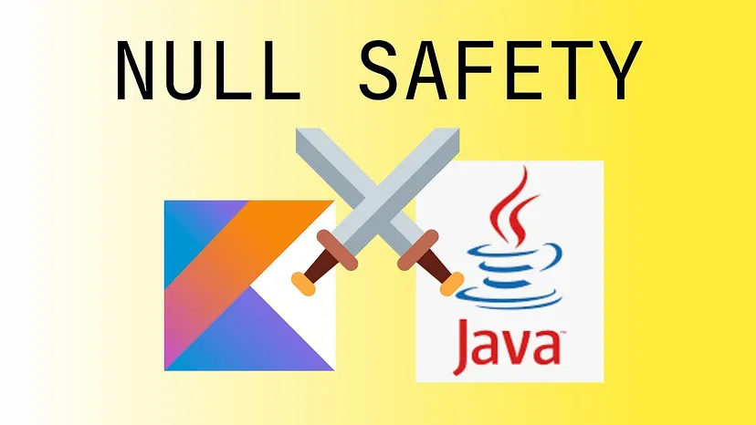

# Kotlin ve Null Safety

## **İçindekiler**

- [Null Nedir ve Neden Sorunlu?](#null-nedir-ve-neden-sorunlu)
- [Kotlin ve Null Safety Meselesi](#kotlin-ve-null-safety-meselesi)
- [Kotlin Null Safety Operatörleri](#kotlin-null-safety-operatörleri)
- [Operatörlerin Kullanım Örnekleri](#operatörlerin-kullanım-örnekleri)
- [Nullability Kontrolü](#nullability-kontrolü)
- [Kotlin'in Artıları](#kotlinin-artıları)

<br>

<table>
  <tr>
    <th style="text-align: left; font-weight: bold;">Yayınlanma Tarihi</th>
    <td style="text-align: left;">31 Ağustos 2024</td>
  </tr>
  <tr>
    <th style="text-align: left; font-weight: bold;">Son Güncelleme Tarihi</th>
    <td style="text-align: left;"></td>
  </tr>
  <tr>
    <th style="text-align: left; font-weight: bold;">Tahmini Okuma Süresi</th>
    <td style="text-align: left;">3 dakika</td>
  </tr>
</table>


<div align="center">
  
</div>

<br>

Kotlin modern bir programlama dili olarak Java'nın yerini almaya aday ve Android uygulama geliştirme sürecinde giderek
daha da fazla tercih edilmeye başladı. Kotlin'in en dikkat çekici özelliklerinden bir tanesinde `null safety` özelliğidir.
Bu özellik kodunuzdaki `null referans` hatalarını azaltmaya yardımcı olur ve kodunuzun daha güvenilir olmasını sağlar.


## Null Nedir ve Neden Sorunlu?

`Null`, bir nesnenin hiçbir şey temsil etmediğini ifade eder. Bir nesnenin null olması onun hiçbir değere sahip olmadığı anlamına gelir.
Java gibi dillerde null referanslar sıklıkla hata kaynağı olabilir. Bir nesnenin null olduğu durumları kontrol etmek ve
`NullPointerException` hatalarını önlemek için ekstra çaba gerekir.

```java
String text = null;
int length = text.length();   // NullPointerException hatası alınır
```

<br>

Yukarıdaki Java kodunda `text` değişkeni null olduğu için `length()` metodunu çağırdığınızda bir `NullPointerException` hatası alırsınız.


## Kotlin ve Null Safety Meselesi

Kotlin null güvenliği konusunda daha iyi bir yaklaşım sunar. Bu bir değişkenin null olup olmayacağını açıkça belirtmenize izin verir.
Bir değişkenin null olabileceğini belirtmek için `type?` kullanabilirsiniz. Bu, değişkenin null olabileceğini belirtirken
hala tip güvenliğini korumaya devam eder.

```kotlin
var text: String? = null
val length = text?.length   // length null olabilir, null hatası alınmaz
```

<br>

Yukarıdaki Kotlin kodunda `text` değişkeni Nullable olarak tanımlanmıştır. Bu nedenle `text?.length` ifadesi null olduğunda `length` değişkeni
de null olacaktır ve null bir referans hatası alınmayacaktır.


## Kotlin Null Safety Operatörleri

Kotlin null güvenliği sağlamak için bir dizi operatör ve fonksiyon sağlar. Bunlar arasında  `?.` `?:` `!!.` gibi operatörler bulunur.

1. `?.` Güvenli çağrı operatörüdür. Eğer değişken null değilse operatörün sağındaki ifadeyi çalıştırır. Null ise null döndürür.

2. `?:` Elvis operatörüdür. Sol taraftaki ifade null ise sağ taraftaki ifadeyi kullanır.

3. `!!.` Güvenli olmayan operatördür. Eğer değişken null ise bir `NullPointerException` hatası fırlatır. Null olmadığından emin olduğumuz durumlarda kullanılması daha doğrudur.

```kotlin
val textLength = text?.length ?: -1   // text null ise -1 döndür
```


## Operatörlerin Kullanım Örnekleri


### ?. (Güvenli Çağrı Operatörü)

Bu operatör bir nesne null değilse o nesnenin özelliklerine veya yöntemlerine güvenle erişmeye olanak sağlar. Eğer nesne null ise null
döner ve `NullPointerException` hatası alınmaz.

```kotlin
val text: String? = null
val length = text?.length   // text null ise length null olur
```


### ?: (Null Elvis Operatörü)

Bu operatör null değeri olan bir ifade yerine başka bir ifade kullanmamızı sağlar.

```kotlin
val text: String? = null
val length = text?.length ?: -1   // text null ise -1 döner
```


### !!. (Güvenli Olmayan Çağrı Operatörü)

Bu operatör bir değişkenin null olmadığını garanti etmenizi sağlar. Eğer değişken null ise `NullPointerException` hatası alırsınız.

```kotlin
val text: String? = null
val length = text!!.length   // text null ise NullPointerException hatası alınır
```

<br>

Bu operatörler Kotlin'in null güvenliği özelliğini kullanırken sıkça karşılaşılan durumlar için önemlidir. Özellikle güvenli
çağrı operatörü `?.`, null elvis operatörü `?:` ve güvenli olmayan çağrı operatörü `!!.` Kotlin kodlarında sıkça kullanılan ve
null referans hatalarını önlemeye yardımcı olan önemli araçlardır.


## Nullability Kontrolü

Kotlin null güvenliği için tür sistemini kullanır ve **compile-time**'da nullability hatalarını tespit eder. Bu, kodunuzun daha güvenli
ve hatasız olmasını sağlar. Örneğin bir değişkenin null olup olmadığını kontrol etmek için `if` ifadesini kullanabilirsiniz.

```kotlin
if (text != null) {
    println(text.length)   // burada text null değil
} else {
    println("Text is null")
}
```


## Kotlin'in Artıları

Kotlin'in null güvenliği kodun daha güvenli ve hatasız olmasını sağlar. Bu özellik geliştiricilerin null referans hatalarını önlemelerine ve daha tutarlı
ve sağlam kodlar yazmalarına yardımcı olur. Ayrıca Kotlin'in ifade edici ve kolay okunabilir sözdizimi geliştirme sürecini hızlandırır ve daha az kod yazmanıza olanak tanır.

<br>

Kotlin'in null güvenliği özelliği, özellikle büyük ve karmaşık projelerde hata ayıklama ve bakım süreçlerini kolaylaştırır ve kod kalitesini artırır.
Bu nedenle Kotlin'in null güvenliği, dilin popülerliğini ve benimsenmesini artıran önemli bir özelliktir.

<br>

Eğer bu makaleden keyif aldıysanız ve faydalı bulduysanız desteğiniz benim için çok değerli. Beni takip ederek veya bir kahve
ısmarlayarak takdirinizi gösterebilirsiniz. Desteğiniz, kaliteli içerik üretmeye devam etmem için beni motive ediyor.


<a href="https://github.com/mustafatoktas/W.BE_RepoVisitorCounterAPI" target="_blank">  </a>

<a href="https://buymeacoffee.com/mustafatoktas" target="_blank">  </a>


## İletişim

<a href="mailto:info@mustafatoktas.com"              target="_blank">  </a>
<a href="https://t.me/mustafatoktas00"               target="_blank">  </a>
<a href="https://www.linkedin.com/in/mustafatoktas/" target="_blank">  </a>