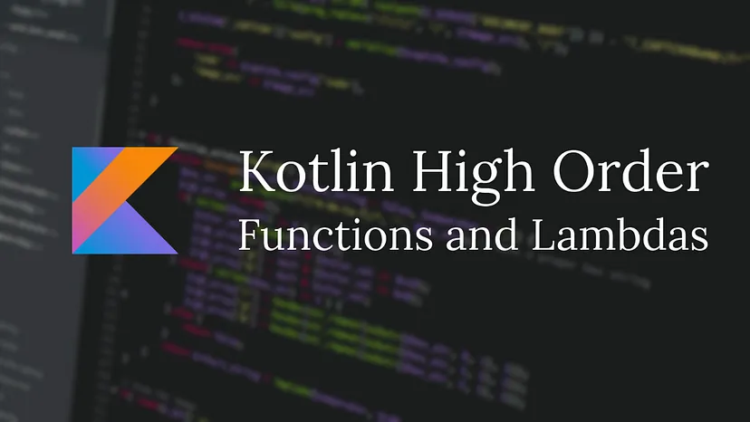

# Kotlin'de Higher-Order Fonksiyonlar Nedir?

## İçindekiler

- [Higher-Order Fonksiyon Nedir?](#higher-order-fonksiyon-nedir)
- [Higher-Order Fonksiyon Tanımlama](#higher-order-fonksiyon-tanımlama)
- [Lambda İfadeleri ile Çalışmak](#lambda-i̇fadeleri-ile-çalışmak)
- [Parametre ve Dönüş Değerleri Olarak Fonksiyonlar](#parametre-ve-dönüş-değerleri-olarak-fonksiyonlar)
- [Pratik Uygulamalar](#pratik-uygulamalar)
- [Higher-Order Fonksiyonları Değişkenlerle Kullanmak](#higher-order-fonksiyonları-değişkenlerle-kullanmak)
- [Gerçek Dünya Uygulamaları](#gerçek-dünya-uygulamaları)
- [Sık Karşılaşılan Sorunlar ve Çözümleri](#sık-karşılaşılan-sorunlar-ve-çözümleri)
- [Sonuç](#sonuç)

<br>

<table>
  <tr>
    <th>Yayınlanma Tarihi</th>
    <td>1 Eylül 2024</td>
  </tr>
  <tr>
    <th>Son Güncelleme Tarihi</th>
    <td></td>
  </tr>
  <tr>
    <th>Tahmini Okuma Süresi</th>
    <td>6 dakika</td>
  </tr>
</table>


<div align="center">
  
</div>

<br>

Kotlin modern programlama dilleri arasında özellikle Android geliştirme ve sunucu tarafı uygulamalar için popüler bir seçim haline geldi.
Bu popülaritenin ardında yatan nedenlerden biri de Kotlin'in fonksiyonel programlama özelliklerini desteklemesi ve özellikle `higher-order` fonksiyonlar
gibi kavramlarla geliştiricilere güçlü araçlar sunmasıdır. Bu yazıda higher-order fonksiyonların ne olduğunu, nasıl kullanıldığını inceleyeceğiz.


## Higher-Order Fonksiyon Nedir?

Higher-order fonksiyonlar, diğer fonksiyonları argüman olarak alabilen veya bir fonksiyon döndürebilen fonksiyonlardır. Bu, Kotlin'in fonksiyonel programlama
özelliklerinden biridir ve dilin esnekliğini artırır. Bu tür fonksiyonlar karmaşık işlemleri daha modüler ve yeniden kullanılabilir hale getirerek
kodun genel bakımını ve anlaşılabilirliğini iyileştirir.


## Higher-Order Fonksiyon Tanımlama

Bir higher-order fonksiyon tanımlamak için fonksiyonunuzun parametre listesinde bir veya daha fazla fonksiyon tipi bulundurmanız gerekir.
Fonksiyon tipleri, fonksiyonun alacağı parametreleri ve döneceği değeri tanımlar.

<br>

Örneğin bir `hesaplama` fonksiyonu oluşturalım ve bu fonksiyona iki sayı ve bir aritmetik işlem fonksiyonu geçirelim.

```kotlin
// Bir fonksiyonu parametre olarak alan ve bir Int döndüren fonksiyon
fun calculate
(x: Int,
y: Int,
operation: (Int, Int) -> Int
): Int {
    return operation(x, y)
}
```

<br>

Bu örnekte calculate fonksiyonu üç parametre alır: **iki Int ve bir işlem**. İşlem, iki Int alıp bir Int döndüren bir fonksiyondur.
Bu, higher-order bir fonksiyonun en basit örneğidir.


## Lambda İfadeleri ile Çalışmak

Kotlin'de higher-order fonksiyonlar genellikle lambda ifadeleri ile birlikte kullanılır. Lambda ifadeleri fonksiyonları
kısa ve öz bir şekilde tanımlamanıza olanak tanır.

```kotlin
val sumResult = calculate(10, 20) { a, b -> a + b }
val multiplyResult = calculate(10, 20) { a, b -> a * b }
println("Sum by lambda: $sumResult")
println("Multiply by lambda: $multiplyResult")
```

<br>

Burada calculate fonksiyonuna lambda ifadesi doğrudan gönderilmiştir. Lambda `{ a, b -> a + b }` `a` `b` parametrelerini alır ve toplamlarını döndürür.


## Parametre ve Dönüş Değerleri Olarak Fonksiyonlar

Higher-order fonksiyonlar hem parametre olarak alınabilen hem de dönüş değeri olarak kullanılabilen fonksiyonları destekler.
Bu fonksiyonel programlamanın önemli bir özelliğidir ve Kotlin'de fonksiyonlarla çalışmayı daha esnek hale getirir.

<br>

Örneğin bir `işlem oluşturucu` fonksiyonu oluşturalım ve bu fonksiyona bir operatör ve iki sayı geçirerek uygun bir işlem fonksiyonunu döndürelim.

```kotlin
fun createOperation(operator: String): (Int, Int) -> Int {
    return when (operator) {
        "+" -> { x, y -> x + y }
        "-" -> { x, y -> x - y }
        "*" -> { x, y -> x * y }
        "/" -> { x, y -> x / y }
        else -> throw IllegalArgumentException("Invalid operator")
    }
}
```

<br>

Bu `createOperation` fonksiyonu bir operatör alır ve operatöre bağlı olarak **toplama**, **çıkarma**, **çarpma** veya **bölme** işlemi yapan bir `lambda ifadesi` döndürür.


## Pratik Uygulamalar


### Koleksiyon İşlemleri (filter, map, fold)

Kotlin'deki koleksiyon işlemleri higher-order fonksiyonların gücünü en iyi şekilde kullanmanın bir yoludur. Bu işlemler koleksiyonlardaki
verileri **dönüştürmek**, **filtrelemek** ve **toplamak** için kullanılır.


#### filter

Bir koleksiyondaki öğeleri belirli bir koşula göre filtrelemek için kullanılır.

```kotlin
val numbers = listOf(1, 2, 3, 4, 5)
val evenNumbers = numbers.filter { it % 2 == 0 }
println("Even numbers: $evenNumbers")

// Çıktı: [2, 4]
```


#### map

Bir koleksiyonun her bir öğesini başka bir değere dönüştürmek için kullanılır.

```kotlin
val numbers = listOf(1, 2, 3, 4, 5)
val squares = numbers.map { it * it }
println("Squared numbers: $squares") 

// Çıktı: [1, 4, 9, 16, 25]
```

<br>

#### fold

Bir başlangıç değeri ile koleksiyonun öğelerini bir araya getirmek için kullanılır.

```kotlin
val sum = numbers.fold(0) { acc, num -> acc + num }
println("Sum: $sum") 

// Çıktı: 15
```


## Higher-Order Fonksiyonları Değişkenlerle Kullanmak


### Değişkene Lambda İfadesi Atamak

Higher-order fonksiyonları değişkenlere atamak Kotlin'de oldukça yaygındır. `Lambda ifadeler` fonksiyonları daha kısa ve daha okunabilir
şekilde tanımlamanıza olanak tanır. **Örneğin:**

```kotlin
// Değişkene lambda ifadesi atama
val sum: (Int, Int) -> Int = { x, y -> x + y }

// Kullanımı
val result = sum(5, 3)
println("Sum: $result")

// Çıktı: 8
```


### Değişkene Fonksiyon Referansı Atamak

Fonksiyon referansları mevcut bir fonksiyonu bir değişkene atamak için kullanılabilir. Bu, özellikle daha büyük ve daha karmaşık fonksiyonları
daha açık bir şekilde tanımlamak istediğinizde faydalıdır. **Örneğin:**

```kotlin
// Değişkene fonksiyon referansı atama
fun multiply(x: Int, y: Int): Int = x * y
val myMultiply: (Int, Int) -> Int = ::multiply

// Kullanımı
val result = myMultiply(4, 2)
println("Result: $result")

// Çıktı: 8
```

<br>

Bu yöntemler higher-order fonksiyonları değişkenlerle kullanmanın iki yaygın yoludur. Lambda ifadeleri ve fonksiyon referansları
kodunuzu daha esnek ve daha okunabilir hale getirir. Özellikle dinamik olarak fonksiyonlarla çalışmanız gerektiğinde kullanışlıdır.


## Gerçek Dünya Uygulamaları

Kotlin'deki higher-order fonksiyonlar Android uygulama geliştirme sürecinde güçlü bir araçtır. Birçok Android geliştiricisi arayüz işlemlerinden veri
işlemeye kadar birçok alanda higher-order fonksiyonları kullanır.

- **RecyclerView İşlemleri**
  RecyclerView'ların esnekliği, verileri görüntülerken higher-order fonksiyonları kullanmayı gerektirir.
  Örneğin bir adapter sınıfında lambda ifadeleri ile tıklayabilir öğeleri işlemek için `onClickListener` tanımlayabilirsiniz.

- **Asenkron İşlemler**
  Asenkron işlemler sırasında higher-order fonksiyonlar, `callback` fonksiyonları yönetmek için yaygın olarak kullanılır.
  Örneğin `Retrofit` veya `Room` gibi kütüphaneler network isteklerinin sonuçlarını dinamik olarak işlemek için lambda ifadeleri kullanır.

**Örnek Senaryo:**

Bir uygulamada kullanıcının bir liste öğesine tıklaması durumunda belirli bir işlevi tetiklemek isteyebiliriz. Bu işlev, öğenin detaylarını göstermek,
bir sonraki ekrana geçiş yapmak ya da basit bir bilgi mesajı göstermek olabilir. Higher-order fonksiyonlar bu tür dinamik etkileşimleri yönetmek için idealdir.

Kotlin'de bir `RecyclerView adapter` sınıfı oluşturalım ve tıklanabilir öğeleri işlemek için bir higher-order fonksiyon kullanalım.

```kotlin
import android.view.LayoutInflater
import android.view.View
import android.view.ViewGroup
import android.widget.TextView
import androidx.recyclerview.widget.RecyclerView

class ItemAdapter(private val items: List<String>, private val onItemClick: (String) -> Unit) :
    RecyclerView.Adapter<ItemAdapter.ItemViewHolder>() {

    override fun onCreateViewHolder(parent: ViewGroup, viewType: Int): ItemViewHolder {
        val itemView = LayoutInflater.from(parent.context).inflate(R.layout.item_view, parent, false)
        return ItemViewHolder(itemView, onItemClick)
    }

    override fun onBindViewHolder(holder: ItemViewHolder, position: Int) {
        val item = items[position]
        holder.bind(item)
    }

    override fun getItemCount() = items.size

    class ItemViewHolder(itemView: View, private val onItemClick: (String) -> Unit) : RecyclerView.ViewHolder(itemView) {
        private val textView: TextView = itemView.findViewById(R.id.textViewItem)

        fun bind(item: String) {
            textView.text = item
            itemView.setOnClickListener {
                onItemClick(item)  // Higher-order fonksiyonu tetikleme
            }
        }
    }
}
```

- **Adapter Tanımı**
  `ItemAdapter` sınıfı, `RecyclerView.Adapter` sınıfından türetilmiştir ve `ItemViewHolder` sınıfını kullanır.
  Higher-order fonksiyon `onItemClick` parametresi olarak alınır. Bu fonksiyon bir liste öğesine tıklandığında çağrılacak işlevi temsil eder.

- **ViewHolder Tanımı**
  Her ItemViewHolder nesnesi bir liste öğesini temsil eder. `bind `metodu içinde öğenin görsel temsili ayarlanır ve `setOnClickListener` ile tıklama olayı yönetilir.

- **Higher-Order Fonksiyonun Kullanımı**
  `onItemClick` fonksiyonu bind metodunda tetiklenir. Bu sayede tıklama olayı esnasında bu fonksiyon aktive edilir ve öğe içeriği ile birlikte çalıştırılır.


Bu örnekte görüldüğü gibi higher-order fonksiyonlar `RecyclerView` içindeki öğelerin tıklanabilir olmasını sağlayarak kodu daha modüler ve
yeniden kullanılabilir hale getirir. Ayrıca farklı tıklama davranışlarını tek bir adapter üzerinden yönetmeyi basitleştirir.
Bu yapı Android geliştirmede esneklik ve etkinlik açısından büyük avantajlar sunar.


## Sık Karşılaşılan Sorunlar ve Çözümleri

### Inline ve No-Inline Fonksiyonlar

Kotlin'de higher-order fonksiyonlar oldukça güçlüdür fakat performans üzerinde olumsuz etkileri olabilir. Kotlin'in
inline fonksiyonları bu performans maliyetini azaltma konusunda bize yardımcı olur. `inline` ve `noinline` kullanımlarını
daha iyi anlamak için öncelikle temel kavramları ve farklarını inceleyelim.

- **Inline Fonksiyonlar**
  Kotlin'de bir higher-order fonksiyonun `inline` olarak işaretlenmesi fonksiyonun çağrıldığı yere kodunun derleme
  zamanında eklenmesi anlamına gelir. Bu işlem lambda ifadeleri gibi fonksiyon parametrelerinin yeni bir nesne olarak
  oluşturulmasını engeller. Böylece bellek kullanımı ve çağrı maliyetleri azalır.

  **Inline Fonksiyon Örneği:**

  ```kotlin
  inline fun applyOperation(x: Int, operation: (Int) -> Int): Int {
      return operation(x)
  }

  fun main() {
      val result = applyOperation(5) { it * 2 }
      println(result)  // Çıktı: 10
  }
  ```

<br>

Bu örnekte `applyOperation` fonksiyonu inline olarak tanımlanmıştır. Bu, `operation` parametresinin `applyOperation` çağrıldığı her yerde kodunun direkt
olarak yerleştirilmesi demektir. Bu, lambda ifadesi için ek bir nesne yaratılmasını engeller ve fonksiyon çağrısı maliyetini azaltır.

- **No-Inline Fonksiyonlar**
  Bazen tüm parametrelerin inline edilmesi istenmeyebilir. inline fonksiyonlarda, belirli parametreleri noinline anahtar kelimesi ile işaretleyerek
  bu parametrelerin inline edilmemesini sağlayabiliriz. Bu durum bazı lambda ifadelerinin inline edilmesini istemediğimiz zamanlarda kullanışlıdır.

  ```kotlin
  inline fun operations(firstOp: (Int) -> Int, noinline secondOp: (Int) -> Int): Int {
      val result = firstOp(10)
      return secondOp(result)
  }

  fun main() {
      val multiply = { num: Int -> num * 2 }
      val add = { num: Int -> num + 3 }
      val finalResult = operations(multiply, add)
      println(finalResult)  // Çıktı: 23
  }
  ```

<br>

Bu örnekte `firstOp` lambda ifadesi inline olarak işlenirken `secondOp` lambda ifadesi noinline anahtar kelimesi ile işaretlenmiştir.
Bu da onun inline edilmeyeceği anlamına gelir. secondOp'un noinline olarak işaretlenmesi özellikle lambda ifadesinin büyük olduğu veya
dışa aktarılması gerektiği durumlar için faydalıdır.

Bu örnekler ve açıklamalar Kotlin'de `inline` ve `noinline` kullanımlarının temellerini ve bunların ne zaman kullanılması gerektiğini göstermektedir.


## Sonuç

Higher-order fonksiyonlar Kotlin'de güçlü bir programlama aracıdır ve fonksiyonel programlamanın temel bir özelliğini oluşturur.
Bu yazıda higher-order fonksiyonların tanımını, temel kavramlarını ve kullanımını öğrendik. Ayrıca bu fonksiyonların pratik uygulamalarını
Android geliştirme ve sunucu tarafı uygulamaları gibi alanlarda gördük.

<br>

Higher-order fonksiyonlar kodunuzu daha modüler, daha temiz ve daha esnek hale getirmenin bir yoludur. Lambda ifadeleri ve fonksiyon referansları
gibi araçlarla kodunuzu daha okunabilir hale getirebilir ve tekrar eden işlemleri azaltabilirsiniz.

<br>

Ancak higher-order fonksiyonlarla çalışırken bazı performans endişeleri ve kodun karmaşık hale gelme riski vardır. Bu sorunları çözmek için performans
ipuçlarına ve kod karışıklığını önleme yöntemlerine başvurabilirsiniz.

<br>

Kotlin öğrenirken ve uygulamalar geliştirirken higher-order fonksiyonları kullanmaya çalışın.


## İletişim

<a href="mailto:info@mustafatoktas.com"             ></a>
<a href="https://t.me/mustafatoktas00"              ></a>
<a href="https://www.linkedin.com/in/mustafatoktas/"></a>

<div align="center">
  <a href="#kotlinde-higher-order-fonksiyonlar-nedir"></a>
</div>
