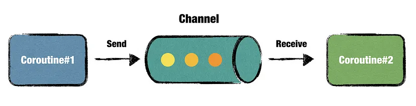

<h1 align="center">
Kotlin'de Kanal<a name="article-top"></a>
</h1>

## İçindekiler

- [Channel Türleri](#channel-türleri)
- [1. Rendezvous Channel (Varsayılan)](#1-rendezvous-channel-varsayılan)
- [2. Buffered Channel](#2-buffered-channel)
- [3. Conflated Channel](#3-conflated-channel)
- [4. Unlimited Channel](#4-unlimited-channel)
- [Kanalın Kapanması](#kanalın-kapanması)
- [Kanalın Buffer Tipini Seçmek](#kanalın-buffer-tipini-seçmek)
- [Faydalar](#faydalar)
- [Proje Üzerinde İnceleme](#proje-üzerinde-i̇nceleme)

<br>

<table>
  <tr>
    <th style="text-align: left; font-weight: bold;">Yayınlanma Tarihi</th>
    <td style="text-align: left;">17 Eylül 2024</td>
  </tr>
  <tr>
    <th style="text-align: left; font-weight: bold;">Son Güncelleme Tarihi</th>
    <td style="text-align: left;"></td>
  </tr>
  <tr>
    <th style="text-align: left; font-weight: bold;">Tahmini Okuma Süresi</th>
    <td style="text-align: left;">4 dakika</td>
  </tr>
</table>


<div align="center">
  
</div>

<br>

Channel, Coroutine'ler arasında veri iletmek için kullanılan bir yapı olup `producer-consumer` **(üretici-tüketici)** modelini kolaylaştırır.
Channel'lar, coroutine'lerin birbirleriyle asenkron bir şekilde veri alışverişi yapmalarını sağlar.

<br>

Bir Channel, iki coroutine arasında veri alışverişini sağlayan bir veri boru hattıdır. Bir coroutine kanala veri gönderir `send`, diğeri bu veriyi alır `receive`.
Channel'lar birden fazla gönderici ve alıcıyı destekler. Bu sayede karmaşık veri iletişim senaryoları oluşturulabilir.

<br>

Kanalı bir nehir gibi düşünebilirsiniz. Veri sürekli akar ve alıcılar (tüketiciler) bu veriyi çekip kullanır.
Kanalda veri varsa alıcı bu veriyi hemen alır, veri yoksa yeni veri gelene kadar bekler.


## Channel Türleri

Kotlin'de 4 ana Channel türü bulunur.

1. Rendezvous Channel
2. Buffered Channel
3. Conflated Channel
4. Unlimited Channel

`Buffer` **(tampon)** veri akışını yönetmek, depolamak ve geçici olarak saklamak için kullanılan bir bellek alanıdır.
Buffer genellikle iki sistem veya süreç arasında veri aktarımını optimize etmek için kullanılır.
Bu sistemler veya süreçler veri üretimi ve tüketimi hızlarının farklı olduğu durumlarda bir tampon alanı kullanarak veri akışını dengeleyebilirler.


## 1. Rendezvous Channel (Varsayılan)

Bu kanal türü, buffer'a sahip değildir, yani veriler hemen tüketilmelidir. Gönderici, alıcının veriyi almasını bekler; alıcı yoksa gönderici askıya alınır.


```kotlin
fun main() = runBlocking {
    val channel = Channel<Int>()   // Rendezvous channel

    // Gönderici coroutine
    launch {
        println("Sending: 1")
        channel.send(1)   // Alıcı olana kadar askıya alınır
        println("Sent: 1")
    }

    // Alıcı coroutine
    launch {
        delay(1000)   // Alıcıyı geciktiriyoruz
        println("Received: ${channel.receive()}")
    }
}
```

- Burada kanal bir Rendezvous Channel olduğu için gönderici veri göndermeye çalıştığında alıcı hazır değilse askıya alınır.

- Alıcı gecikmeli olarak başlatıldığında gönderici bekler ve alıcı veriyi aldıktan sonra çalışmaya devam eder.


## 2. Buffered Channel

Buffered Channel, belirli bir tampon (buffer) kapasitesine sahiptir.
Göndericiler, alıcılar veriyi almadan önce bile kanala veri gönderebilir. Ancak buffer dolduğunda gönderici beklemek zorunda kalır.

```kotlin
fun main() = runBlocking {
    val channel = Channel<Int>(2)   // Buffer kapasitesi: 2

    // Gönderici coroutine
    launch {
        println("Sending: 1")
        channel.send(1)   // Hemen gönderilir
        println("Sending: 2")
        channel.send(2)   // Buffer'a alınır
        println("Sending: 3")
        channel.send(3)   // Buffer dolu, bu yüzden alıcı beklenir
        println("Sent: 3")
    }

    // Alıcı coroutine
    launch {
        delay(2000)
        repeat(3) {
            println("Received: ${channel.receive()}")
        }
    }
}
```

- Burada buffer kapasitesi 2 olduğu için ilk iki veri hemen gönderilir. Üçüncü veri için buffer dolmuş olur. Bu yüzden gönderici alıcının veriyi almasını bekler.


## 3. Conflated Channel

Bu tür kanal, sadece en son gönderilen veriyi saklar. Eski veriler alıcı tarafından alınmadan üzerine yazılır ve kaybolur.
Bu sürekli değişen durumlar için faydalıdır. Örneğin bir UI'da sadece en son durumu göstermek istediğinde.

```kotlin
fun main() = runBlocking {
    val channel = Channel<Int>(Channel.CONFLATED)

    // Gönderici coroutine
    launch {
        channel.send(1)   // Alınmadan kaybolur
        channel.send(2)   // Alınmadan kaybolur
        channel.send(3)   // Alıcı bu veriyi alacak
        println("Sent: 3")
    }

    // Alıcı coroutine
    launch {
        delay(1000)
        println("Received: ${channel.receive()}")   // Sadece 3'ü alır
    }
}
```

- Burada yalnızca en son gönderilen veri `3` alıcıya ulaşır. Önceki gönderiler kaybolur.


## 4. Unlimited Channel

Bu kanal sınırsız bir buffer'a sahiptir ve gönderici her zaman kanala veri gönderebilir.
Alıcı da bu verileri alana kadar bekleyebilir. Buffer kapasitesi sınırsız olduğundan bellek sınırlarına dikkat edilmelidir.

```kotlin
fun main() = runBlocking {
    val channel = Channel<Int>(Channel.UNLIMITED)

    // Gönderici coroutine
    launch {
        repeat(5) {
            println("Sending: $it")
            channel.send(it)
        }
        channel.close()
    }

    // Alıcı coroutine
    launch {
        for (y in channel) {
            println("Received: $y")
        }
    }
}
```

- Bu örnekte sınırsız bir buffer'a sahip olduğumuz için göndericiler hiç beklemeden kanala veri gönderebilir. Alıcı zamanında verileri alır.


## Kanalın Kapanması

Bir kanal tüm gönderimleri aldıktan sonra kapatılmalıdır. Aksi takdirde alıcı (receiver) kanalın kapanmadığını varsayarak
sonsuza kadar veri bekleyebilir. Kanal kapatıldığında alıcılar kanalın boş olduğunu anlayabilir.


```kotlin
fun main() = runBlocking {
    val channel = Channel<Int>()

    launch {
        for (x in 1..5) {
            channel.send(x)
        }
        channel.close()   // Kanalı kapatıyoruz
    }

    // Alıcı kapanana kadar verileri toplar
    for (y in channel) {
        println("Received: $y")
    }

    println("Channel is closed, no more data.")
}
```

- `close()` metodu kanalın daha fazla veri almayacağını belirtir.
- `for` döngüsü kanal kapandıktan sonra otomatik olarak durur.


## Kanalın Buffer Tipini Seçmek

Kanalın hangi tipte olacağını seçerken senaryoya uygun kapasiteyi belirlemek gerekir. Bazı önemli noktalar şunlardır:

- **Rendezvous Channel**
  Üretici ve tüketici aynı hızda çalışıyorsa bu tip uygun olur. İki taraf da birbirini bekler.

- **Buffered Channel**
  Üretici daha hızlıysa ve tüketici biraz yavaş kalıyorsa buffer kapasitesini artırarak veri kaybı yaşamadan işlem yapabilirsin.

- **Conflated Channel**
  Durum verisi gibi sadece en son bilginin önemli olduğu durumlarda kullanılır. Örneğin bir ekranda en son durumu göstermek için.

- **Unlimited Channel**
  Buffer kapasitesinin sınırını belirlemek zorunda kalmadan veri göndermek gerektiğinde kullanılır. Ancak bellek yönetimine dikkat edilmelidir.


## Faydalar

- Channel'lar, coroutines arasında veri iletimi için güçlü ve esnek bir yapı sağlar.

- Farklı kanal türleri (`Rendezvous` `Buffered` `Conflated` `Unlimited`) farklı veri akış senaryolarına uyarlanabilir.

- İki coroutine arasında veri paylaşımını yönetmek ve asenkron veri aktarımı sağlamak için idealdirler.


## Proje Üzerinde İnceleme

Şimdi bütün channel türlerini bi proje üzerinde inceleyelim.

```kotlin
class MainActivity : AppCompatActivity() {

    private val scope = CoroutineScope(Dispatchers.Main)

    override fun onCreate(savedInstanceState: Bundle?) {
        super.onCreate(savedInstanceState)
        setContentView(R.layout.activity_main)

        val button1: Button = findViewById(R.id.button)
        val textView1: TextView = findViewById(R.id.textView2)

        val button2: Button = findViewById(R.id.button2)
        val textView2: TextView = findViewById(R.id.textView)

        val button3: Button = findViewById(R.id.button3)
        val textView3: TextView = findViewById(R.id.textView3)

        val button4: Button = findViewById(R.id.button4)
        val textView4: TextView = findViewById(R.id.textView4)

        // 1. Rendezvous Channel Örneği
        button1.setOnClickListener {
            val channel = Channel<String>(Channel.RENDEZVOUS)
            scope.launch {
                channel.send("Rendezvous Channel: Message sent!")
            }

            scope.launch {
                delay(3000)
                val result1 = channel.receive()
                textView1.text = result1
            }
        }


        // 2. CONFLATED Channel Örneği
        button2.setOnClickListener {
            val channel = Channel<String>(Channel.CONFLATED)
            scope.launch {
                channel.send("Conflated (Broadcast) Channel: Message sent!")
                channel.send("Conflated (Broadcast) Channel: Message2 sent!")
                channel.send("Conflated (Broadcast) Channel: Message3 sent!")

            }
            scope.launch {
                val result = channel.receive()
                textView2.text = result
                delay(1500)
            }
        }
        // 3. Unlimited Channel Örneği
        button3.setOnClickListener {
            val channel = Channel<String>(Channel.UNLIMITED)
            scope.launch {
                channel.send("Unlimited Channel: Message sent!")
                channel.send("Unlimited Channel: Message2 sent!")
                channel.send("Unlimited Channel: Message3 sent!")
                channel.send("Unlimited Channel: Message4 sent!")
                repeat(4) {
                    val result = channel.receive()
                    textView3.text = result
                    delay(1500)
                }
            }
        }

        // 4. Buffer Channel Örneği (Buffer)
        button4.setOnClickListener {
            val channel = Channel<String>(3) // Buffer kapasitesi 3
            scope.launch {
                // 4 mesaj gönderiyoruz, 3'ü buffer'a sığacak, 4. mesaj bekleyecek
                channel.send("Buffered Channel: Message1 sent!")
                channel.send("Buffered Channel: Message2 sent!")
                channel.send("Buffered Channel: Message3 sent!")
                channel.send("Buffered Channel: Message4 sent!")

            }
            scope.launch {
                repeat(3) {
                    val result = channel.receive()
                    textView4.append("\n" + result)
                    delay(1500)
                }
            }
        }


    }

    // Aktivite yok edilirken coroutine'leri iptal ediyoruz
    override fun onDestroy() {
        super.onDestroy()
        scope.cancel()
    }
}
```

<br>

Yukarıdaki rendezvous channel'a ait `channel.send()` işlemi, `channel.receive()` işlemi yapılana kadar bekler
yani bir alıcı gelene kadar bu gönderme işlemi askıda bekler. Bu örnekte 3 saniye sonra receive çağrısı yapılıyor
yani bir alıcı ekleniyor ve mesaj UI'ye yazılıyor.

<br>

Conflated channel sadece en son gönderilen mesajı saklar ve dağıtır. `send()` ile üç farklı mesaj gönderiliyor
ancak yalnızca son mesaj (message 3 sent) saklanıyor ve `receive()` çağrıldığında bu mesaj alınıyor.

<br>

Unlimited channel sınırsız buffer kapasitesine sahiptir yani istediğin kadar mesaj gönderip alabilirsin.
Bu örnekte dört mesaj gönderiliyor ve kanal bunların hepsini saklıyor. Sonrasında `receive()` ile sırayla tüm mesajlar alınıyor.

<br>

Buffered channel'da buffer kapasitesi kadar mesaj kanala gönderilir, fazlası askıda bekler ve kanaldan veri alındıkça yenisi oraya eklenir.
Örnekte buffer kapasitesi 3 olarak ayarlandı. Bu durumda ilk üç mesaj buffer'a girer. Ancak 4. mesaj, buffer'da yer olmadığı için bekler.
Alıcı taraf (yani receive()), buffer'daki mesajları alır ve buffer'da yer açılır açılmaz 4. mesaj gönderilir.

<br>

<div align="center">
İçeriğim hoşunuza gittiyse bana destek olmak için beni takip edebilir veya bir kahve ısmarlayabilirsiniz.
Desteğiniz daha fazla kaliteli içerik üretmem konusunda motivasyonumu arttırıyor.
</div>

<br>

<div align="center">
  <a href="https://buymeacoffee.com/mustafatoktas" target="_blank">  </a>
</div>

<br>

<div align="center">
Kotlin ile ilgili daha fazla makale okumak isterseniz <a href="https://github.com/mustafatoktas/O_Makalelerim?tab=readme-ov-file#kotlin">buraya tıklayarak</a> göz atabilirsiniz.
</div>


<div align="center">
  <a href="https://github.com/mustafatoktas/W.BE_RepoVisitorCounterAPI" target="_blank">  </a>
</div>


## İletişim

<a href="mailto:info@mustafatoktas.com"              target="_blank">  </a>
<a href="https://t.me/mustafatoktas00"               target="_blank">  </a>
<a href="https://www.linkedin.com/in/mustafatoktas/" target="_blank">  </a>

<p align="center">
  <a href="#article-top">  </a>
</p>