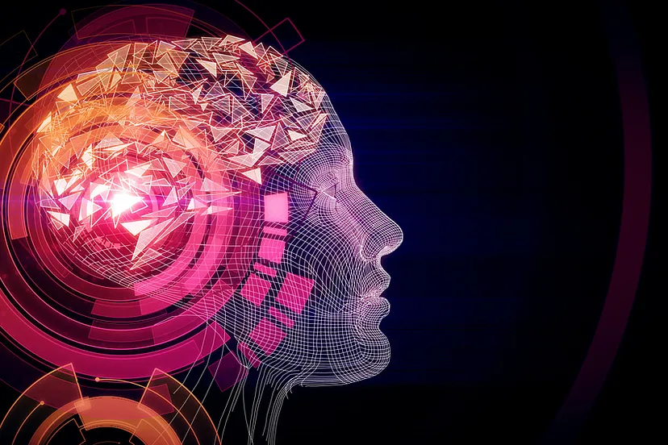

# Toplum 5.0 ve Yeni Dünya Düzeni

## **İçindekiler**

- [Toplum 5.0 ve Yeni Dünya Düzeni](#toplum-50-ve-yeni-dünya-düzeni)
- [Kaynakça](#kaynakça)

 

<table>
  <tr>
    <th style="text-align: left; font-weight: bold;">Yayınlanma Tarihi</th>
    <td style="text-align: left;">26 Ağustos 2024</td>
  </tr>
  <tr>
    <th style="text-align: left; font-weight: bold;">Son Güncelleme Tarihi</th>
    <td style="text-align: left;"></td>
  </tr>
  <tr>
    <th style="text-align: left; font-weight: bold;">Tahmini Okuma Süresi</th>
    <td style="text-align: left;">5 dakika</td>
  </tr>
</table>

  

 

İnsan tek başına güçsüz ve kırılgandır. İlk insanlar da doğanın karşısında böyleydi ancak birlik oluşturarak
iş birliği yaparak bu güçsüzlüğünün üstesinden gelmişler ve doğa üzerinde hakimiyet kurmaya başlamışlardır.
Tarım ve hayvancılıkla uğraşmaya başlayan insanlar zamanla topraklarda mülkiyet kurmaya başlamışlardır. Mülkiyetlerin
kurulması ile başlayan kapitalizm zaman içerisinde aslında endüstri devriminin oluşmasına sebebiyet vermiştir. Kurdukları
bu mülkiyetlerde üretim yapan insanlar ürünlerini depolamak, iletmek ve dağıtmak için kentleri kullanmaya başlamışlardır.
Böylelikle kentlerde geniş imkanlar sunmaya başlamıştır. Kentlerin bu imkanları ve sanatsal
faaliyetlerinin de olması insanların köyden kente göç etmelerine sebep olmuştur. Böylelikle kentler üretim değil
yönetim merkezi haline gelmiştir. Kentleşme artsa da 18. yüzyıldaki ilk sanayi devrimine kadar insanlar vakitlerinin
büyük bir çoğunluğunu ihtiyaç duyduklarını üretmek için harcamaktadır. İlk sanayi devrimi olarak bahsedilmesinin sebebi
günümüze kadar 4 kez sanayi devriminin gerçekleşmesidir. Bu devrimler dünyanın her yerinde aynı hızda olmamaktadır.
Bu yazıda gerçekleşen 4 sanayi devriminden sırası ile bahsedilerek bu devrimlerin toplumlara etkilerinin üzerinden
geçilmiştir. Son olarak son yıllarda daha çok bahsedilen `Toplum 5.0` kavramına değinilerek olası etkileri üzerinde
tartışılmıştır.

 

18.yüzyıldaki `Endüstri 1.0` olarak isimlendirilen ilk sanayi devrimi İngiltere'de meydana gelmiştir. İngiltere'de
meydana gelmesinin ana sebepleri teknik yenilikleri, yeni enerji kaynakları, ulaşım ve haberleşme ağıdır. O dönemde
ilk dokuma tezgâhları oluşturulmuştur ve dokuma fabrikalarının kurulması ile emek azaltılarak üretimi arttırmışlardır.
Aynı zamanda gazetelerin basılmasını sağlayan makinelerde gelişmeler yaşanmış, gazeteler aynı zamanda reklamların daha
çok yayımlanmaya başladığı malzemeler haline gelmiştir. Bu teknolojik gelişmeler kendisini askeri olarak da geliştirmiş
ve tüfekler üretilmeye başlamıştır. Aynı zamanda madenlerde su altında kalan kömürleri çıkartmak için su buharı makinelerinin
üretilmesi taşımacılık alanında İngiltere'nin gelişmesine sebep olmuştur. Taşımacılığın artması buhar gücüyle çalışan makinelerin
oluşmasını sağlayarak gemiler, trenler ortaya çıkmıştır. Bu dönemde iletişim amacıyla telgraf ve telefonun icat edilmiş olması
haberlerin hızla yayılmasını sağlamıştır.

 

`Endüstri 1.0` devriminden sonra ikinci dalga 1880'li yıllardan ikinci dünya savaşının sonuna kadar olan dönemde
`Endüstri 2.0` devrimi yaşanmıştır. 1903 yılında Henry Ford'un seri üretime geçmeye başlaması araçların hızla üretilmesini
sağlamıştır. Seri üretimin artması imalatın verimliliği hakkında çalışmaların yapılmasını sağlamıştır. Bu çalışmaların başında
Taylor bulunmaktadır ve Taylor Endüstri Mühendisliği mesleğinin oluşmasını sağlamıştır. Seri üretimin artması verimlilik ve
kaliteli üretimde de artışa sebep olmuştur. Bu artışlar üretim ve tüketime bağlı olan kapitalist düzende pazarlamanın da gelişmesini
sağlamıştır ve böylelikle üretim ve tüketime dayalı politikalar uygulanmaya başlamıştır.

 

Seri üretimin makine ve bilgisayarlar ile birleşerek otomasyon ile üretimin sağlanmaya başladığı `Endüstri 3.0` 1970'li yıllarda ortaya
çıkmıştır. Üretim sisteminin otomasyon ile yapılmasının yaygınlaşması insanları üretim sisteminden daha da uzaklaştırmış yeni tüketim
fırsatları oluşturmuştur. Bu dönemin en önemli etkilerinden biri de doğal kaynakların hızla tüketilmesi ve bu sebeple sürdürülebilirlik
kavramlarının daha çok kullanılmaya başlamasıdır.

 

Almanya öncülüğünde başlatılan `Endüstri 4.0` ile insan emeğinin azaltıldığı üretimin makineler aracılığıyla yapıldığı ve makinelerin
kendi aralarında haberleştikleri bir dönem olarak başlamıştır. Makinelerin ve nesnelerin kendi aralarında haberleşmesi, oluşan veri
fazlalığının depolanması için bulut sistemlerinin kullanılması, verinin işlenmesi için veri madenciliği alanının oluşması ve
makine öğrenmesi, yapay zeka gibi sistemlerin oluşturularak makinenin saf komut dışında aldığı verileri işleyerek öğrenerek
öneriler sunması üretimin tamamen makineleştirilmesine sebep olmuştur. Bu durum yalnızca üretim değil aynı zamanda beyaz yakalıların
bulunduğu insan kaynakları, finans, denetim gibi departmanlarında çalışan insanların da işlerinin artık makineler tarafından yapılabileceğine
olanak sağlamaktadır. Yakın tarihte Amazon firmasında insan kaynakları departmanındaki CV inceleme ve olası kişilerin görüşmeye çağrılması
için yapay zekadan faydalanılmıştır. Hindistan'daki sel felaketlerinde, Japonya’daki depremlerde erken uyarı sisteminin oluşturularak önlemlerin
arttırılması, can ve mal kaybının azaltılması için kablosuz sensörlerden faydalanılmıştır. Covid-19 virüsünün temas ile artması bazı süreçlerin
robotlar aracılığı ile yapılmasına sebebiyet vermiştir. Örneğin Çin ve Japonya gibi toplumlarda kan tahlilleri, odaların temizlenmeleri ve
yemek dağıtımları hastanelerde robotlar tarafından yapılmaya başlanmış; marketlerde kafelerde robotlar çalışmaya başlamıştır.

 

Robotların, yapay zekaların, makine öğrenmesinin ve nesnelerin internetinin artması hayatımızda teknolojinin daha çok yer olması ve iş
ağlarının teknolojik hale getirilmes, sosyal hayatlarımızı değiştirmeye başlamıştır. Teknolojik olarak gelişmişliği çoğu ülkeye göre
üst seviyede olan Japonya’nın başbakanı 2017 yılındaki teknoloji fuarında `Toplum 5.0` felsefesini ortaya koymuştur. `Toplum 5.0`
teknolojinin insanların hayatlarını tehdit eden bir unsur değil insanların hayatlarını kolaylaştıran bir unsur olduğunu dile getirmektedir.
Aslında endüstrinin gelişmesi refah seviyesi daha yüksek olan toplumların kişilerin refah seviyesini daha da yükseltmekte,
refah seviyesi düşük olan toplumların da daha da düşürmesine sebep olmaktadır. Bir bakıma Harari'nin kitabında Dataizm misyonerlerinin
dine uyum sağlamayanları yok etmelerine benzetilebilir. Ayrıca oluşan teknolojik gelişim ve insanların daha az çalışmaya başlaması,
daha çok kendileri ile vakit geçirmelerine amaçsızlaşmasına ve hayattan beklentilerinin azalarak intiharların artmasına sebep olabilir.
Toplumun daha çok ekranlara bağımlı hale gelmesi, telefon tablet ya da bilgisayar gibi ekranlarla aradıkları soruların cevaplarına hızlıca
ulaşabilmeleri, bireylerin birbirleri arasındaki iletişimlerinde benzer şekilde hızlı cevaplar almak istemeleri, alamadıklarında sıkılmaları
insanlar arasındaki etkileşimleri de azaltmaktadır. Son dönemlerde daha çok bahsedilen arttırılmış gerçeklik yeni bir dünya olan `metaverse`
kavramını da düşündüğümüzde bireyler arasında gerçek olan iletişimin daha çok azalmasına sebebiyet vermektedir. Toplumun sanal bir dünyada
yaşayarak herhangi bir yere gitmeden alışveriş yapabilmesi, başkaları ile buluşabilmesi, arsa alabilmesi yeni bir yapının oluşmasını sağlayacaktır.
`Ready Player One` isimli filmde kişilerin gözlük takarak yeni bir oyun dünyasına giriş yapması, dolaşarak alışveriş yapması, eğlence ortamlarında
kütüphanelere gitmesi, yarışlar yapması, oyun içinde oyun oynayabilmeleri ve oyun içerisindeki fiziksel hissiyatlarının artması için yine elektrikli
kıyafetlerin satılması yeni dünyanın nasıl olacağına dair ipuçları vermektedir. Belki de insan zihni kopyalanabilecek ve kişinin fiziksel olarak yaşamı
son bulsa da zihinsel olarak hayatta olmaya devam edebilecektir. Belki de insanların insanlığın zihinsel kabiliyetleri geliştirilebilecek, hastalık
yaşlanma gibi durumların önüne geçebilecektir. Ayrıca teknolojinin bu şekilde hayatımıza yerleşmesi verilerin sonsuz sayıda üretilmesini sağlayacak
ve verilerin erişilmesi kullanılması hakkında insanları verilere daha çok köle hale getirecektir. Ancak teknolojinin gelişiminin tüm insanlık adına
fayda sağlayabilme ihtimali de umut edicidir. Bir önceki paragrafta bahsedildiği gibi doğal afetlerin önceden tahmin edilebilmesi teknolojinin insanlık
için sağladığı yararı da göstermektedir. Bu noktada aslında teknolojinin ne için nasıl kullanıldığını, hayatımıza girmesine ne kadar müsaade ettiğimizi
edeceğimizi netleştirmek önem arz etmektedir.

## Kaynakça

- NO4GO Software Solutions. Endüstri 3.0 — Dijital Devrim. (2022, 1 Şubat)
- Aktif Group of Companies. Endüstri 4.0’I Daha İyi Anlamak — Endüstri 3.0 Nedir? (2022, 1 Şubat)
- Türkiye’nin Endüstri 4.0 Platformu. Endüstri 4.0’dan Toplum 5.0’a. (2022, 1. Şubat)
- Türkiye’nin Endüstri 4.0 Platformu. Endüstri Tarihine Kısa Bir Yolculuk (2022, 1. Şubat)
- Yılmazer Hitit, Dr. Zeynep; Sert, D; Ertunç Doç. Dr. Suna (2019). “Endüstri 4.0 Uygulamaları, Mevcuttaki Yeri ve Kimya Mühendisliğindeki Yeri”, 4. Tehlikeli Kimyasalların Yönetimi ve Proses Güvenliği
- upta, Dr. Sachin; Rashid, Mamoon; Mohammed, Younus Talha (2020). “Flood Monitoring and Warning System: Het-Sens a Proposed Model”, 2020 2nd International Conference on Computer and Information Sciences
- Wikipedia. Earthquake Early Warning (Japan). (2020, 2 Şubat)
- Şahin, A. “İnsansız Dünya: Transhümanizm”. 2021 Medeniyet ve Toplum Dergisi, 5(2), 191–194

## İletişim

