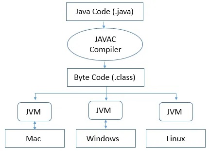

# JVM, JRE ve JDK Nedir?

## **İçindekiler**

- [JVM, JRE ve JDK Nedir?](#jvm-jre-ve-jdk-nedir)

 

<table>
  <tr>
    <th style="text-align: left; font-weight: bold;">Yayınlanma Tarihi</th>
    <td style="text-align: left;">27 Ağustos 2024</td>
  </tr>
  <tr>
    <th style="text-align: left; font-weight: bold;">Son Güncelleme Tarihi</th>
    <td style="text-align: left;"></td>
  </tr>
  <tr>
    <th style="text-align: left; font-weight: bold;">Tahmini Okuma Süresi</th>
    <td style="text-align: left;">2 dakika</td>
  </tr>
</table>

Bu yazıda Java ile geliştirme yapan herkesin bilmesi gereken en basit kavramlardan olan JVM, JRE ve JDK kavramları üzerinde duracağız.

 

`JVM` **(Java Virtual Machine)** için java programının çalıştığı platform ile java programı arasında soyut bir ara katman diyebiliriz.
JVM, platforma bağımlı olarak çalışır. Yani geliştirme yapacağınız platforma (Windows,Linux,Mac) göre farklı implementasyonları mevcuttur.
JVM, yazdığımız .java uzantılı dosyaları anlamaz onun yerine derlenmiş .class uzantılı dosyaları anlar. Çünkü .class uzantılı dosyalar
içlerinde `bytecode`'lar içerirler. Bu özelik sayesinde Java'da `Write once, run everywhere` özeliğini kullanabiliyoruz. Yani bu şu demek oluyor,
bizim windows bir makinede yazmış olduğumuz uygulama önce compiler tarafından bytecode'lara çevriliyor daha sonra bu bytecode'lar diğer platformlarda
kurulu olan JVM'ler aracılığıyla tüm platformlarda çalışıyor.

 

`JRE` **(Java Runtime Enviroment)** ise java programlama dili ile yazılmış olan uygulama ve `applet`'lerin çalışmasını sağlayan bileşenler ile JVM'e kütüphaneler sağlar.
Derlenmiş bytecode'lar direk olarak CPU üzerinde çalışmazlar. CPU tarafından anlaşılması için aradaki JVM bytecode'ları okunabilir makine kodları olarak yorumlar.
Aslında java bytecode'ların bütün platformalarda çalışması JRE sayesindedir. İçerisinde JVM, Core kitaplıkları ve Java yazılımında yazılan uygulamaları
ve küçük uygulamaları çalıştırmak için diğer ek bileşenleri içerir. JRE'nin görevi Java kodları derlendikten sonra bir ara dil olarak kabul edilen
Java baytcode'larını oluşturmaktır. Bu baytcode'lar bütün işletim sistemleri için aynıdır.

 

`JDK` **(Java Development Kit)** ise java da geliştirme yapmak isteyen her developer'ın mutlaka indirmesi gereken bir bileşendir.
Kısaca java için `SDK` (Software Development Kit) diyebiliriz. Hem yorumlayıcı hem de derleyici görevini üstlenmektedir
JRE ile birlikte appletleri ve uygulamaları geliştirirken zorunlu olan `debuggers` ve `compilers` gibi geliştirme araçlarını da bünyesinde bulundurur.

O zaman Özetle şu şekilde düşünebiliriz:

`JRE` = `JVM` + `Java Kütüphaneleri`

`JDK` = `JRE` + `compiler` + `debugger`

 

Eğer bu makaleden keyif aldıysanız ve faydalı bulduysanız desteğiniz benim için çok değerli. Beni takip ederek veya bir kahve
ısmarlayarak takdirinizi gösterebilirsiniz. Desteğiniz, kaliteli içerik üretmeye devam etmem için beni motive ediyor.

## İletişim

