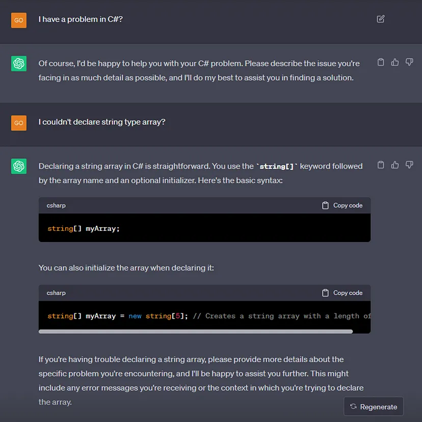

# Prompt Engineering nedir?

## **İçindekiler**

- [Prompt Engineering nedir?](#prompt-engineering-nedir)
- [Kaynakça](#kaynakça)

 

<table>
  <tr>
    <th style="text-align: left; font-weight: bold;">Yayınlanma Tarihi</th>
    <td style="text-align: left;">27 Ağustos 2024</td>
  </tr>
  <tr>
    <th style="text-align: left; font-weight: bold;">Son Güncelleme Tarihi</th>
    <td style="text-align: left;"></td>
  </tr>
  <tr>
    <th style="text-align: left; font-weight: bold;">Tahmini Okuma Süresi</th>
    <td style="text-align: left;">7 dakika</td>
  </tr>
</table>

  

 

Bu yazıda Prompt engineering nedir bundan bahsedeceğim fakat konuya giriş yapmadan
önce bazı kavramlardan biraz bahsetmek istiyorum.

### Generative AI

Bildiğiniz gibi standart bir yapay zeka belirli görevleri otomatize etmek, verileri analiz etmek veya karmaşık sorunları
çözmek gibi birçok amaç için kullanılıyor, ancak insan yaratacılığını taklit etme noktasında yetersiz kalıyordu.
Tam da bu noktada karşımıza Generative AI kavramı çıkmış oldu.

Generative AI veya üretken yapay zeka olarak çevirebileceğimiz bu kavram, bir tür yapay zeka alt dalı olup
tam da yaratıcılık noktasındaki bu eksikliğe getirilen bir çözümdür.

Generative AI, metin, görüntü, müzik ve çeşitli veri türlerini üretebilme yeteneğine sahip yapay zeka sistemlerini ifade eder.
Bu sistemler önceden belirlenmiş bir pattern'e veya örneğe dayalı olarak bir öğrenme modellemesi kullanarak yeni içerikler oluşturabilirler.

### ChatGPT

Hepinizin bildiği gibi son dönemde hayatımıza ChatGPT gibi bir chatbot uygulaması girdi. Bu zamana kadar kullandığımız
chatbot'lardan oldukça farklı olan bu uygulamaya bir soru yönelttiğimizde karşımızda bir insan varmışçasına yanıtlar alabiliyoruz.
Sıfırdan verdiğimiz bir girdiye göre bize bir içerik üretebiliyor. **Cover letter** yazdırabiliyoruz, **kod düzenlemeleri** yaptırabiliyoruz,
**bir yazının özetini** alabiliyoruz ve çok daha fazlası...

ChatGPT, bir tür generative AI modeli olduğu için bu yeteneklere sahip aslında. Bu tür modeller metin tabanlı verileri üretebilen yapay zeka sistemleridir
ve genellikle `NLP` **(doğal dil işleme)** yeteneklerine sahiptirler.

### NLP (Natural Language Processing)

`NLP`, Türkçe'siyle `doğal dil işleme` yapay zekanın bir alt dalıdır. Doğal insan dilinin bilgisayarlar
tarafından anlaşılması ve işlenmesi anlamına gelir. Bu teknoloji metin verileri üzerinde çalışarak metinlerin analiz edilmesi, çeviri yapılması,
metinlerden anlam çıkarılması ve metin tabanlı soruların yanıtlanması gibi birçok uygulama alanında kullanılır.

### LLM (Large Language Model)

`LLM`, **büyük boyutlu ve karmaşık yapılı NLP** modellerini ifade etmek için kullanılan bir terimdir.
NLP, doğal dilin işlenmesi ve anlaşılması alanına odaklanırken LLM'ler de bu alanın güncel teknolojik gelişmelerini
temsil ederler aslında. Bu modeller büyük miktarda metin verisini train eden ve işleyen doğal dil anlama ve üretme
yeteneklerine sahip yapay zeka sistemleridir. Metin tabanlı görevlerde **(örneğin, metin üretme, çeviri, özetleme, duygu analizi gibi)**
çok başarılı olabilirler.

### Prompt kavramı

Bizim bu tür modellere girdi olarak vereceğimiz herşey prompt olarak isimlendirilir. Prompt, bir modelin nasıl çalışacağını veya nasıl
yanıt vereceğini belirleyen bir başlatıcı input'tur aslında. Özellikle generative AI gibi modeller, verilen bir prompt'a göre bir içerik
üretmeye çalışır. Örneğin, `Bana X okulunda X bölümüne başvuru yapmam için bir cover letter yazar mısın?` gibi bir prompt, modelin ilgili
bölüm ve okul hakkında hakkında bir yazı oluşturmasını tetikleyecektir.

Doğru ve etkili bir prompt yazdığınızda modelin istediğiniz sonuçları üretmesine daha fazla yardımcı olursunuz. Bu nedenle prompt'ların
tasarımı ve kullanımı AI tabanlı uygulamalarda önemli bir konu haline geldi ve karşımıza `Prompt Engineering` dediğimiz yeni bir meslek kolu çıkmış oldu.

## Prompt engineering nedir?

`Prompt engineering`, Türkçe'siyle istem mühendisliği, modelden istenen yanıtları veya davranışları ortaya çıkarmak için bir NLP
modelinin girdi talimatlarını veya istemlerini yani prompt'larını dikkatli bir şekilde hazırlama ve tasarlama sürecidir.
Modelin doğru, anlamlı veya daha spesifik çıktılar üretmesine yardımcı olacak şekilde prompt'ların formüle edilmesini içerir.

Amaç, modele açık veya bir takım düzenlenmiş direktifler sağlayarak modelin çıktısını etkilemektir. Bu düzenleme, giriş prompt'unun ifade ediliş şeklini,
içeriğini veya biçimini ayarlayarak yapılabilir.

Şimdi bir kaç maddeyle prompt engineering yaparken ya da en azından ChatGPT gibi bir tool'u kullanırken ne gibi kurallara dikkat edebiliriz, bunları inceleyelim.

`Clarity and Specificity`: Açık, spesifik ve net bilgi içeren prompt’lar oluşturmak, modelin kullanıcının amacını doğru bir şekilde anlamasını
sağlamaya yardımcı olabilir. Daha net ve detaylı talimatlar, modele daha alakalı yanıtlar vermesi için yol gösterebilir.

 

Yukaridaki konuşma çok basit bir örnek oldu farkındayım, ancak açık ve net sorular sormak anlamında iyi bir örnek olabilir.
Karşımızda bir insan varmış gibi yanıtlar alıyoruz evet ama karşımızdaki bir insan değil, bunu unutmamamız lazım. En nihayetinde bu model bizim
verdiğimiz inputları arka tarafta bir takım sayısal değerlerle tutup yine bu sayısal değerlere göre bir tahminleme yapıp bize bir yanıt dönüyor.
Dolayısıyla random bir şeyler yazmak, detay vermemek daha iyi sonuçlar almamızın önünde bir engel oluşturuyor. Bu noktada `tokenization` kavramı giriyor
aslında devreye, yazının sonuna doğru bu kavramdan bahsediyor olacağım.

`Contextual Information`: Prompt içerisine bağlamsal bilgiler eklemek, bir ön bilgi, veri seti ya da küçük bir veri parçası ile sorumuzu desteklemek oldukça önemli olabilir.
Bu bilgiler, modelin bağlamsal olarak daha ilgili çıktılar oluşturmasına yardımcı olabilir.

 

Burada bir line grafiği istediğimi, koordinatlarımın ne olacağını söyledim ve prompt'umu küçük bir veri setiyle destekledim.
Sonrasında aldığım kod çıktısını bir Jupyter notebook'da çalıştırdığımda grafiğim görselde gördüğünüz gibi oldu.

`Multi-Turn Conversations`: Çok yönlü konuşmalar yapmak kullanıcı ve yapay zeka modeli arasında bir sohbetin birden fazla dönüşü (turn) içerdiği bir etkileşim biçimidir.
Bu tür etkileşimlerde kullanıcı tipik olarak konuşmayı bir ilk mesaj veya soruyla başlatır ve ardından yapay zeka modeli bir yanıt verir.
Sonrasında kullanıcı bir soru daha sorar ve yeni bir yanıt alır ve bu şekilde devam eder. Dolayısıyla modelle konuşurken daha kümülatif
çıktılar alma şansınız olur. Örneğin bir soru sordunuz ve bir yanıt aldınız. Sonra bu eklemeyi de yapabilir misin ya da son cümlede söylediğin x kavramını
anlamadım gibi bir takım geri dönüşlerle alacağınız yanıtı iyileştirebilir ya da bağlamsal yeni sorular sorabilirsiniz.

 

Yukarıdaki örnekte önce bir kod inputu verdim ve bunu `StringBuilder` kullanacak şekilde düzenlemesini istedim. Ardından bu iki `syntax`
örneği için bir performans karşılaştırması yapmasını istedim. Burada ben aynı `session` özelinde yeni bir soru sordum ve model karşılaştırması
gereken şeylerin ne olduğunu bir önceki prompt’uma göre biliyor hale geldi ve benim için ilk yazdığım kod ile StringBuilder'lı kod arasında
bir performans karşılaştırması yaptı.

`Chain of Thought (CoT)`: Bu yaklaşımda modele bir takım direktifler verilerek ve nasıl düşünmesi gerektiği söylenerek mantıklı bir yanıt zinciri
oluşturması gerektiği konusunda rehberlik edilmeye çalışılır.

CoT'nin temel mantığı bir takım talimatlar veya direktifler kullanarak modelin düşünme sürecini şekillendirmektir.
Dolayısıyla her bir talimat, modelin bir önceki direktife dayalı olarak mantıklı bir yanıt üretmesi için tasarlanmalıdır.
Bu şekilde, model, bir düşünce akışı oluşturur ve bir konu veya görev hakkında tutarlı ve mantıklı yanıtlar üretebilir.

 

Burada modele bir soru yönelttim ve sorumu adım adım düşünerek yanıtlamasını istedim. Yani modele adım adım düşünmesi ve açıklama yapması için bir direktif verdim.

 

Burada ise tamamen başka bir `session` açıp bir önceki session’da modelden aldığım adımları kullanmasını söyledim. Yani yine modelden aldığım bilgiyi 
modele göndereceğim başka bir prompt içerisinde kullandım ve bu adımları takip etmesi gerektiğini söyledim.

`Prompt Chunking`: Karmaşık prompt'ları daha küçük, daha yönetilebilir `chunk`'lara yani parçalara bölmek için kullanılan bir yöntemdir.
Bu daha küçük `chunk`lar sayesinde daha odaklı ve bağlama duyarlı bir etkileşim sağlamış oluruz aslında. Bu yaklaşım model tarafından oluşturulan
yanıtların kalitesini arttırmaya ve yapay zekanın sorgunun her yönünü etkili bir şekilde anlamasına yardımcı olabilir.
Tek seferde de bu sorguyu modele verebilirsiniz ancak burada token size limitinden dolayı bunu yapmaya ihtiyaç duyarız.

### Token & Tokenization

Bu noktada biraz token kavramından bahsetmek istiyorum. Token bir metin verisinin veya dilin işlenmesi sırasında elde edilen anlamlı olabilecek en küçük birimdir.
Bu bir kelime, bir rakam, bir noktalama işareti veya birkaç karakter bile olabilir.

 

`Tokenization` ise bir metni veya cümleyi bu anlamlı bileşenlere yani token’lara ayırmak için yapılan işlemdir.

Metin tokenlara ayrılırken boşluklar, noktalama işaretleri ve dilbilgisel kurallar gibi faktörlere göre bir takım ayrımlar yapılır.
Tokenization sırasında her token'a ayrı bir `weight` (ağırlık) değeri atanır. Bu ağırlık değeri metinde o token'ın ne kadar sık görüldüğüne dayalı olarak belirlenir.
Bu tip modellerde amaç sizin vereceğiniz inputa göre bir sonraki çıktıdaki token'ları tahmin etmeye çalışmaktır. Bu tahminleme yapılırken de bu token'lara verilen
weight değerleri üzerinden bir hesaplama yapılır.

Verdiğiniz prompt içerisindeki token'lar modelde ne kadar çok görülmüşse ona o kadar büyük bir weight değeri verildiği için modelin bu token’ı ya da ilişkili
token'ları yanıt verirken kullanma olasılığı da o kadar artıyor. Token ağırlığının büyük olması modelin o token'a daha fazla dikkat etmesi gerektiği anlamına gelir.
Özellikle bir token `train` verilerinde sıkça görülüyorsa model bu token'ı daha fazla kullanmaya eğilimli olacaktır.

Yakın anlamlı kelimeler ve bağlamsal olarak ilgili diğer token'lar da model tarafından göz önünde bulundurulabilir ve yanıtlarda kullanılabilir.
Model, verilen bir bağlam içinde anlamlı ve mantıklı yanıtlar üretme yeteneğine sahip olduğu için yüksek ağırlığa sahip bir token'ın yanı sıra bu token'la bağlamsal
olarak uygun diğer token'ları da kullanma eğiliminde olacaktır.

Örneğin `güzel` kelimesi yüksek bir ağırlığa sahipse ve modelin eğitim verilerinde sıkça görülüyorsa modelin yanıt verirken `hava bugün çok güzel` ifadesinde
`güzel` kelimesini kullanma olasılığı daha yüksektir. Ancak model aynı zamanda bağlamı dikkate alarak diğer kelimeleri ve ifadeleri de kullanabilir.
Örneğin `hava harika` veya `hava mükemmel` gibi benzer anlamlı ifadeler de üretebilir.

Özetle daha yüksek ağırlığa sahip token'lar modelin yanıtını belirlemede daha fazla etkiye sahip olacaktır.

Yukarıda bahsettiğimiz `prompt chunking` maddesine tekrar bakacak olursak biz prompt'umuzu ne kadar uzun tutarsak oradaki token sayısı
o kadar artacak ve modelin yanıtını belirleme sırasında her bir token için ayrılan ağırlık değeri daha küçük olacak. Dolayısıyla model
bize daha az doğru ya da daha az mantıklı bir tahminleme yapacak. Bu da uzun prompt'ların yanıtlarda daha az etkili olabileceği anlamına gelir.

Umarım faydalı bir içerik olmuştur.

## Kaynakça

- <a href="https://www.youtube.com/watch?v=J09R0Z5cjA8"  target="_blank">https://www.youtube.com/watch?v=J09R0Z5cjA8</a>
- <a href="https://docs.cohere.com/docs/model-prompting" target="_blank">https://docs.cohere.com/docs/model-prompting</a>
- <a href="https://www.promptingguide.ai/techniques/cot" target="_blank">https://www.promptingguide.ai/techniques/cot</a>

## İletişim

