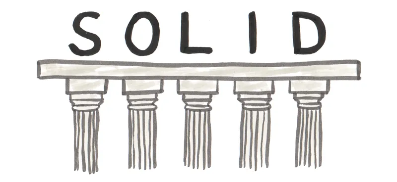
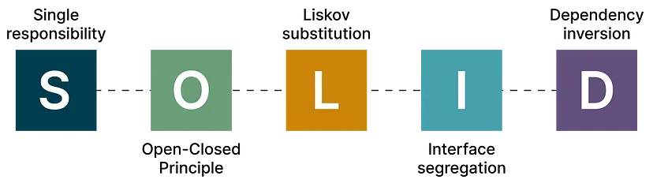

<h1 align="center">
  Solid Prensipleri 
</h1>

## İçindekiler

- [1. **S**ingle Responsibility Principle](#1-single-responsibility-principle)
- [2. **O**pen / Closed Principle](#2-open--closed-principle)
- [3. **L**iskov's Substitution Principle](#3-liskovs-substitution-principle)
- [4. **I**nterface Segregation Principle](#4-interface-segregation-principle)
- [5. **D**ependency Inversion Principle](#5-dependency-inversion-principle)
- [Özet](#özet)

 

<table>
  <tr>
    <th style="text-align: left; font-weight: bold;">Yayınlanma Tarihi</th>
    <td style="text-align: left;">11 Eylül 2024</td>
  </tr>
  <tr>
    <th style="text-align: left; font-weight: bold;">Son Güncelleme Tarihi</th>
    <td style="text-align: left;"></td>
  </tr>
  <tr>
    <th style="text-align: left; font-weight: bold;">Tahmini Okuma Süresi</th>
    <td style="text-align: left;">4 dakika</td>
  </tr>
</table>

  

 

Büyük ölçekli projelerde yazılım geliştirilirken sıklıkla karşılaşılan ve geliştiricileri
yoran bir takım problemler meydana gelmekteydi. Bu problemleri önlemek amacıyla farklı `desing pattern` **(tasarım kalıpları)**
dediğimiz çözümler sunulmuştur. Bu tasarım kalıplarının amacı yazılımcılar tarafından sürekli karşılaşılan bu problemleri
önlemektir. Solid prensipleri de bu çözümlerin en temelinde yer almaktadır.
İşe alım mülakatlarında ve şirketlerin iş ilanlarında sıkça aranılan özellik olarak bizleri karşılamaktadır.

 

Solid Prensipleri, yazılım geliştirme süreçlerinde karşılaşılan temel sorunlara getirilen
ve içerisinde 5 temel prensibi barındıran prensipler bütünüdür. Solid ismi de bu 5 temel
prensibin baş harfleriyle adlandırılmıştır.

  

 

**Solid Prensipleri şu şekildedir:**

1. Single Responsibility Principle

2. Open/Closed Principle

3. Liskov's Substitution Principle

4. Interface Segregation Principle

5. Dependency Inversion Principle

## 1. Single Responsibility Principle

Adından da anlaşılacağı üzere bir sınıfın veya metodun sadece bir sorumluluğu olmalıdır.
Aynı zamanda o sorumluluğu en iyi şekilde yerine getirmelidir. Sınıf içerisinde birbirinden
alakasız kod ve metotlar olmamalı tek bir amaç doğrultusunda sınıflar dizayn edilmelidir.

 

Peki neden böyle bir amacımız olmalı? Neden olabildiğince az sorumluluk yüklüyoruz veya
sadece bir sorumluluğu olması gerektiğini belirtiyoruz. Gereksinimler doğrultusunda kodlarımız
değişebilir veya ekleme yapmamız gereken kısımlar olabilir. İşte bu gibi değişken durumlarda
kodlarımız olabildiğince az şekilde etkilenmeli, minimum miktarda değişim yapmalıyız.
Kolay ekleme, çıkarma ve güncelleme yapılmalıdır.

- **Karmaşık kod yapısını önler**

  Sınıf içerisinde sadece belirli amaçlara hizmet eden kodlar sayesinde karmaşıklığı önler.

- **Kod bakımı**

  Gereksinimler doğrultusunda kod yapımız değişebilir ve bu kod yapısı değişirken diğer
  sınıflar mümkün olduğunca az etkilenir, esnek bir yapı sağlar.

- **Modülerlik**

  Amaçlar doğrultusunda ayrışan ve amaçlarını en iyi şekilde yerine getirebilen yapı daha
  modüler sınıflar yazılmasını sağlar.

## 2. Open / Closed Principle

**OPEN:** Yeni gereksinimler doğrultusunda sınıflarımıza davranışlar ekleyebiliriz.

**CLOSE:** Sınıflarımızın temel özellikleri değişmemelidir.

Bu prensibimizin temel kuralı `Sınıflarımız temel değişikliklere kapalı ancak gelişmelere açıktır`. Gelecekteki
gereksinimlere göre kodumuzdaki temel yapıyı bozmamız gerekirse bu prensibi ihlal etmiş oluruz.

 

Bu prensip olmasaydı kodumuzu gereksinimlere göre sürekli değiştirerek hataların oluşmasına
zemin hazırlardık. Bu prensibin sağladığı fayda ile gelecek gereksinimlere göre esnek bir yapı
kurmak daha kolay şekil alabilen daha kolay adapte olabilen yapılar oluşturmamızı destekler.

- **Sürdürebilirlik ve tekrar kullanılabilirlik**

  Temel kod yapısının değişmezliği ile sürdürebilir bir yapı oluşturduk. Bu yapının üzerine
  gereksinimler doğrultusunda yeni özellikler ekleyerek tekrar kullanılabilirliği sağlarız.

- **Hataların önlenmesi**

  Sürekli bir yapıyı silip en temelinden oluşturmak hatalara yol açmaya sebep olabilir.
  Temel bir yapı oluşturup bunu tekrardan ihtiyacımıza göre kullanmak daha sağlıklı olacaktır.
  

## 3. Liskov's Substitution Principle

Alt sınıfların nesneleri kalıtıldığı üst sınıfın nesneleri ile yer değiştirdiği halde
herhangi bir değişikliğin olmaması, aynı davranışları sergilemesi prensibidir. Mevcut
kodu değiştirmeden sisteme yeni kodlar eklemeyi kolaylaştırır.

 

Bu ilke kodun yeniden kullanılabilirliğini arttırır, daha esnek olmasını sağlar ve daha sade
bir kod yapısı ortaya çıkar.

- **Yeniden kullanılabilirlik**

  Kodun temelini değiştirmeden daha esnek bir şekilde yazmak yeniden kullanılabilirliğini arttırır.

- **Kod bakımı**

  Bu prensibi takip ettiğimizde diğer sınıfların davranışlarını etkilemeden değişiklik yapabiliriz.
  Bunun nedeni alt sınıfların üst sınıf gibi davranmaya başlaması ve üst sınıftaki değişikliklerin
  alt sınıfı etkilemeyecek olmasıdır.

- **Kod kalitesi**

  Kodların birbirini etkilemeden esnek bir şekilde yazılması esnek bir yapı sunacağı gibi test
  edilmesine de fayda sağlar. Bu sayede kod kalitemiz artar.

## 4. Interface Segregation Principle

Bir İnterface sınıfı oluştururken gereksiz metotlardan kaçınarak gereksinimler doğrultusunda
yapılar kurmayı amaçlar. Farklı amaçlar için çalışan interface'leri bölmeyi tavsiye eder.

 

Bu şekilde yapmamızın nedeni İnterface sınıflarımızı bir sınıfa implemente ettiğimizde o sınıfta
bulunan bütün metotları kullanmak zorunda kalırız zaten aksi halde kodumuz hata verecektir.
Kullanılması daha kolay olması açısından fazladan gereksiz metot eklemekten kaçınmalıyız.

- **Kod karmaşıklığı**

  Gereksiz metot kullanımı sayesinde kod karmaşıklığı azalır.

- **Modülerlik**
  
  İnterface sınıfının sadece aynı doğrultuda olan metotlar barınmasını sağlar.

- **Yeniden kullanılabilirlik**
  
 Bir interface implemente ettiğimizde hata almadan kullanmamızı destekler.

## 5. Dependency Inversion Principle

Yazılım sistemleri tasarlanırken yüksek seviyeli modüllerin doğrudan düşük seviyeli modüllere
bağlı olmaması gerektiğini öne sürer. Bunun yerine hem yüksek hem de düşük seviyeli modüller
abstract'lara veya interface'lere bağlı olmalıdır.

 

Abstraction'lar, yüksek seviyeli modülleri düşük seviyeli modüllerden ayırarak esnek ve modüler
bir yazılım sistemi oluşturmaya yardımcı olan Dependency Inversion Principle ilkesinde önemli
bir rol oynar.

 

Yüksek seviyeli katman ile düşük seviyeli katman birbirinden bağımsız olmalı, işlerin nasıl
yürüdüğünü bilmemeli ve ilgilenmemelilerdir. Birbiri ile veri alışverişlerinde verilerin nereden
nasıl geldikleriyle ilgilenmeden sadece görevlerini tamamlayıp ilgili yerlere teslim etmelidirler.

- **Esneklik**

  Birbirinden bağımsız şekilde kod yazmak kolay ekleme çıkarmalara karşı daha esnek olur.

- **Kolay test edilebilirlik**

  Daha modüler katmanlı bir yapı sayesinde kolay test edilebilirliği sağlar.

- **Modülerlik**

  Anlaşılması, yeniden kullanılması ve genişletilmesi daha kolay olan modüler kod tasarımını teşvik eder.

## Özet

Aslında bu temel beş prensibin birbirine benzer amaçlarla projemizin farklı yönlerini düzenlediğinin çıkarımını yaptık.

Bu beş prensibin temel amaçları:

- Birbirinden bağımsız kodlar
- Kolay ekleme çıkarma yapılabilirlik
- Yeniden kullanılabilirlik
- Az hata
- Temiz kod yapısı
- Kolay test edilebilirlik

 

İçeriğim hoşunuza gittiyse bana destek olmak için beni takip edebilir veya bir kahve ısmarlayabilirsiniz.
Desteğiniz daha fazla kaliteli içerik üretmem konusunda motivasyonumu arttırıyor.

 

  

 

Yazılım ile ilgili daha fazla makale okumak isterseniz <a href="https://github.com/mustafatoktas/O_Makalelerim?tab=readme-ov-file#yazılım">buraya tıklayarak</a> göz atabilirsiniz.

  

## İletişim

  

