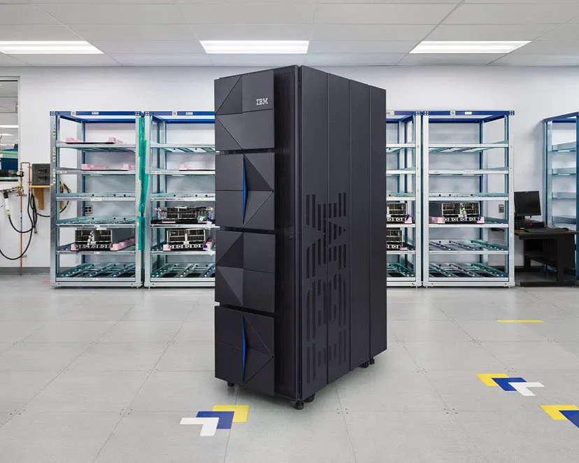
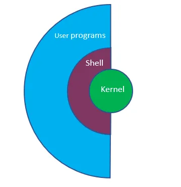
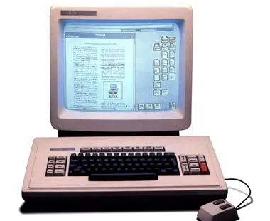
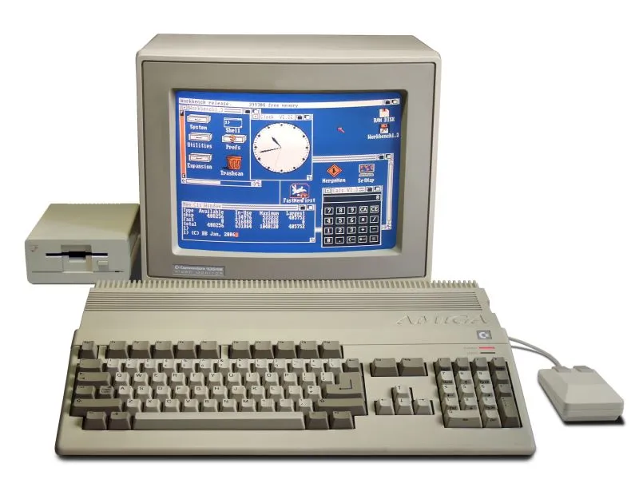

# İşletim Sistemlerine Giriş

## İçindekiler

- [İşletim Sistemi Nedir?](#i̇şletim-sistemi-nedir)
- [İşletim Sisteminin Bilgisayar Mimarisindeki Yeri](#i̇şletim-sisteminin-bilgisayar-mimarisindeki-yeri)
- [İşletim Sistemi Çeşitleri](#i̇şletim-sistemi-çeşitleri)
- [İşletim Sistemi Bileşenleri ve Fonksiyonları](#i̇şletim-sistemi-bileşenleri-ve-fonksiyonları)
- [Grafik Tabanlı İşletim Sistemleri](#grafik-tabanlı-i̇şletim-sistemleri)
- [Türlerine Göre İşletim Sistemleri](#türlerine-göre-i̇şletim-sistemleri)
- [Kaynakça](#kaynakça)

 

<table>
  <tr>
    <th>Yayınlanma Tarihi</th>
    <td>24 Ağustos 2024</td>
  </tr>
  <tr>
    <th>Son Güncelleme Tarihi</th>
    <td></td>
  </tr>
  <tr>
    <th>Tahmini Okuma Süresi</th>
    <td>8 dakika</td>
  </tr>
</table>

## İşletim Sistemi Nedir ?

Son kullanıcı ve bilgisayar donanımı arasında iletişim sağlayan programdır.

Donanım ve yazılım arasında arayüz görevini üstlenir. Her bir donanım birimi tüm kaynaklara erişip yönetebilmektedir.
Bu sayede donanım kaynaklarının kullanım oranı ve verimi artacaktır. (`Utilization`)

Çoklu kullanıcılı sistemlerde donanım kaynaklarının elverişli kullanılması önemli bir faktördür.

Bilgisayar sisteminin kullanılabilirliğinin arttırılması için ve kullanıcı problemlerinin çözümü için çalışır.
Amaç, bilgisayar üzerindeki programların kullanıcılar tarafından çalıştırılmasına ve sistemlerin verimli
kullanılmasına ortam hazırlar. (`Availability`)

## İşletim Sisteminin Bilgisayar Mimarisindeki Yeri

Bilgisayar sistemi 4 kısımdan oluşur.

1. **Hardware (Donanım)**

   Bilgisayarın fiziksel parçaları. Bellek, işlemci, anakart, HDD...

2. **Operating System (İşletim Sistemi)**

   Kullanıcıların yükleyeceği, kullanacağı programların donanım üzerinde köprü yaparak anlamlı hale gelmesini
   sağlayan yapı. Arayüzler ile bağlantı desteği verirler. Kullanıcılar bu müthiş işletim sistemi arayüzleri
   sayesinde donanıma hükmeder.

3. **Application and Softwares (Uygulama ve Yazılımlar)**

   Sistem üzerinde kullanıcıların yükleyeceği programlarını belirtildiği bölüm.

4. **End User (Son Kullanıcı)**

   Multi-User, insan veya makine olabilir.

## İşletim Sistemi Çeşitleri

1. MainFrame (Ana Bilgisayar) İşletim Sistemleri

2. Server(Sunucu) İşletim Sistemleri

3. Multi-Processor (Çok işlemcili) İşletim Sistemleri

4. Personal Computer (Kişisel Bilgisayar) İşletim Sistemleri

5. Embedded (Gömülü) İşletim Sistemleri

6. Handheld (El Bilgisayarı) İşletim Sistemleri

7. Sensor-Node (Sensör-Düğüm) İşletim Sistemleri

8. Real-Time (Gerçek Zamanlı) İşletim Sistemleri

9. Smart Card (Akıllı Kart) İşletim Sistemleri

### MainFrame (Ana Bilgisayar) İşletim Sistemleri

Çok büyük ölçekli verileri hızlıca, yüzlerce küçük parçalı işleri ise sorunsuz bir şekilde işlerler.
Binlerce kullanıcı tarafından eş zamanlı olarak kullanılırlar. Yüksek input/output (giriş/çıkış) kapasiteleri vardır.

### Server (Sunucu) İşletim Sistemleri

Sunucuların işletimi için kullanılır. Aynı anda birçok kullanıcı ve programa hizmet eder.

**Örnek:** `Solaris`, `CentOS`, `Windows Server`, `RedHat Linux`

### Multi-Processor (Çok işlemcili) İşletim Sistemleri

Multi-Processing birçok görevi aynı anda yürütebilme demektir. Bu işletim sistemi çeşidi
çok işlemcili bilgisayarlarda kullanılır. Sunucu işletim sistemi özelliklerini destekler. Birden fazla bilgisayarın
birbirine bağlanarak oluşturduğu ortak bir ağ sisteminde de kullanılırlar. Günümüz kişisel bilgisayarlar çok işlemcili
işletim sistemini kullanır.

**Örnek:** `Windows XP-7–10-11`, `Windows Server`, `Linux`, `MacOS`

### Personal Computer (Kişisel Bilgisayar) İşletim Sistemleri

Günlük hayatta evde, ofiste kullandığımız bilgisayarlarımızda bulunan işletim sistemidir.
Multi-tasking (çoklu görev) ve Multi-programming (çoklu programlamayı) desteklerler.

**Örnek:** `Windows 7–11`, `Apple OS X`, `Linux`, `FreeBSD`

### Handheld (El Bilgisayarı) İşletim Sistemleri

PDA (Personal Digital Assistant - Kişisel Dijital Asistan) olarak bilinen cihazlardır.
Kafe türevi yerlerde kullanılan tablet veya telefona benzer büyüklükteki sistemlerdir. Telefon ve tabletlerde kullanılan işletim sistemi de Handheld İşletim Sistemidir.

**Örnek:** `Android`, `IOS`, `Windows`

### Embedded (Gömülü) İşletim Sistemleri

İçlerinde ROM (Read Only Memory) denilen belirli sistemler için üretilmiş entegre bir çip bulunur.
Bu çipler içinde ise sistemlerin ne yapacağı, nasıl davranacağının belirlendiği program yazılmış ve yüklenmiştir
Asansör, beyaz eşyalar,uçaklar, otomobiller, tıbbi cihazlar, akıllı televizyonlar, küçük mutfak aletleri gibi cihazlarda
bu entegre işletim sistemi kullanılır. Kullanıcı arayüzü yoktur. Sistem özel bir amaç için tasarlanmıştır.

Savunma sanayi ve askeri projelerde de embedded sistemler sıkça kullanılır.

**Örnek:** `SymbOS`, `Android`, `OpenCL`, `Embedded Linux`

### Sensor-Node (Sensör-Düğüm) İşletim Sistemleri

Verileri arabellek gecikmesi olmaksızın anında işlemeyi ve gerçek zamanlı uygulamalara hizmet vermeyi amaçlar.
Alarm ve parametre bazlı çalışır. Olayların gelişim durumuna göre karar vererek etkisini gösterir.

SCADA Sistemleri, baz istasyonları, petro kimya rafinerileri, elektrik üretim santralleri, tarım arazileri,
IoT (Internet of Things) gibi kritik alt yapı sistemlerinde kullanılır.

Her düğümün birbiriyle ve ana sistemle iletişimini sağlayan bileşenleri vardır. Üzerlerinde barınan
bellek ve pil kapasiteleri küçük olduğundan işletim sistemleri basite indirgenmiştir.

**Örnek:** `TinyOS`, `SensorOS`, `RIOT`

### Real-Time (Gerçek Zamanlı) İşletim Sistemleri

Zamanın kritik önem arz ettiği durumlarda kullanılır. Anında cevap verebilen sistemler örnek olarak verilebilir.
Kararlıdır ve doğrulukları yüksektir. Tanımlanan bir çıktıya her zaman aynı değeri döndürürler. Hızlı yanıt süreleri
ve az kaynak tüketimi ile tercih edilirler. Gömülü sistemleri geliştirmek için kullanılırlar. Aynı anda çoklu görev yapmaktadırlar.

3 türü vardır.

1. **Hard RTOS(Zor Gerçek Zamanlı İşletim Sistemleri)**

   İşlem bitiş tarihi kesin bir şekilde belirlenmiştir. Görevlerin belirlenen sürede bitirilmesi gerekir.
   En ufak bir gecikme olsa bile sistem akışı bozulur, kritik sistemlerdir.

   Havacılık ve uzay sanayi, uçak sensörleri, uzay araçları...

2. **Firm RTOS (Sağlam Gerçek Zamanlı İşletim Sistemleri)**

   Görevlerin bitiş tarihinden önce tamamlanmaması çok fazla sorun çıkartmaz ancak işleyiş bozulacağından
   gecikme olması istenmez. Buradaki işlemler de kritiktir ancak tolere edilebilir ufak hata payları vardır.

   Televizyon ve yayıncılık sektörü...

3. **Soft RTOS (Yumuşak Gerçek Zamanlı İşletim Sistemleri)**

   İşlerin tamamlanması istenir ancak Hard RTOS gibi katı bir durum söz konusu değildir.

#### Real-Time (Gerçek Zamanlı) İşletim Sistemlerinın ortak özellikleri:

- Birden fazla görevin aynı anda yürütülüyor olması

- Görevler arası iletişim mekanizması

- Veri bütünlüğü ve senkronizasyon

- Önceliğe ve önem sırasına dayalı programlama imkanı

- Daha az donanım kaynağı kullanımı

**Örnek:** `Microsoft ThreadX`, `LynxOS`, `VxWorks`, `FreeRTOS`, `NucleusRTOS`

### Smart Card (Akıllı Kart) İşletim Sistemleri

Üzerinde bulunan ROM belleklerde gömülü ve kalıcı olarak bulunan işletim sistemleridir. Küçüktürler ve belirli
görevler için tanımlıdırlar. Diğer işletim sistemlerinin aksine sonradan üzerlerine program yüklenmesine izin vermezler.
Sadece üzerindeki verileri okumak veya verilerini başka bir cihaz üzerinde kullanma amacıyla tasarlanmışlardır.

**Örnek:** `Sim kartlar`, `ID kartlar`, `Kredi ve Bankamatik Kartları`

## İşletim Sistemi Bileşenleri ve Fonksiyonları

Bir işletim sistemi kavramsal olarak 3 gruplu bileşenlerin toplamından oluştuğu varsayılır. Bunlar

`Kernel` (çekirdek), `shell` (kabuk) ve `dosya yönetim sistemi` yapılarından oluşur.

 

`Kernel` (çekirdek), işletim sisteminin kalbidir. İşletim sisteminin yöneticisi gibi çalışan ve diğer sistemlere
servis desteği sağlayan en kritik yapıdır. Donanım - yazılım arası bağlantıyı sağlar. Bilgisayar sisteminin tüm işlemlerini kontrol eder.

Görevleri,

`Process management` (işlem yönetimi), `file management` (dosya yönetimi), `device management` (aygıt yönetimi), `input-output management` (giriş-çıkış yönetimi)
ve `memory management` (hafıza yönetimi) gibi kritik sistemlerdir.

`Shell`, kernel ve kullanıcı arasındaki arayüzden oluşan ve çekirdeği saran katmandır.
Bu bir grafik arayüzü (GUI) ya da komut satırı (CLI) şeklinde yönetim arayüzü olabilir. Kullanıcı, arayüz ile yapacağı işlemleri seçerek bilgisayara komutlar gönderir.
Shell'de komutları algılar ve kernel'e iletir. Bazı sistemlerde kernel ile iç içe olabilir. Bu kavramsal bir yorumdur.

Linuxta birçok shell bulunmakta. (Root ve normal kullanıcı)

`Dosya yönetim sistemi` temel faydalar için kullanılır. Bellekler verimli kullanılır, dosyaların korunması,
paylaşılması ve kullanılması gibi düzenler sağlar. Veriler burada toplanır. Hiyerarşik dosya dizini sistemleri kullanılır.
2 çeşidi vardır. `FAT (File Allocation Table)` ve `NTFS (New Tech File System)`.

**FAT**

Diskte bulunan dosyaların kayıtlı olduğu alanları belirtmeye yarar. Diskin haritası gibidir. Bu sistemde `partition`
denilen segment yapılar kullanılır. Bu segmentli yapılarda her biri belirli sayılarda sektör içeren `cluster` yapılara ayrılır.
Hangi dosyaların bu clusterlarda yerleştiği, hangilerinin dolu-boş olduğu gibi bilgiler tablo üzerine yazılır.
İşletim sistemi de herhangi bir dosyaya erişmek için dosyayı bu tablo üzerinden bulmayı amaçlayarak tablodan faydalanır.

**NTFS**

Dosya konumlarının FAT sisteminde olduğu gibi dosya konumlarının `MFT (Master File Table)` indexi ile saklar.
Dosyanın yerleştiği konumu ve diğer bilgileri cluster içinde saklayarak daha güvenli bir disk harita yapısı ortaya sunar.
Ancak tüm bilgileri sakladığı için geniş alana ihtiyaç duyar. Sunucularda yoğun şekilde kullanılırlar. Disk güvenliği ve performansı
gibi konularda özelleşmiştir. Disk üzerinde dosya parçalanmasını azaltarak, boş alanın verimli kullanılmasını ve performansını
arttırır. `Access Control List` ile hangi kullanıcının hangi dosyalara erişebileceğini sağlar. Bütünleşik dosya sıkıştırmayı içerir.

### İşletim Sistemi Fonksiyonları

Esas amaç olan 4 temel işlevi yerine getirmek amacıyla kullanılırlar.

Bunlar `kullanıcı arayüzü yönetimi`, `donanım erişimi yönetimi`, `dosya ve klasör yönetimi`, `uygulama ve bellek yönetimi`'dir.

**Kullanıcı Arayüzü Yönetimi**

Kullanıcılara sunulan ve donanım- yazılım arası etkileşim sağlayan arayüzler işletim sistemlerinde 2 tanedir.

Bunlar `CLI (Komut Satırı Arayüzü)` ==> komut satırlarıyla işlemler yapılır ve `GUI(Grafiksel Kullanıcı Arayüzü)` ==> ekrandaki simgelere mouse ile tıklanarak işlemler gerçekleştirilir.

**Donanım Erişimi Yönetimi**

Uygulamalar ve donanım arası etkileşimin yönetimidir. İşletim sistemi her bir donanım elemanıyla iletişim kurmak ve
yönetmek için `aygıt sürücüsü` denilen programı kullanır. İşletim sistemi bilgisayara takılan aygıtı algılar ve aygıt
sürücüsünü tespit edip yükler. Bu yüklemeler `Plug and Play` ile yapılandırılır.

**Dosya ve Klasör Yönetimi**

İşletim sistemi verileri saklamak için sabit diskte bir dosya yapısı oluşturur. Dosya, ilişkili veriler bloğudur.
Program ve veri dosyaları dizinde bir arada gruplanır. Dizinlerin içi içe saklanması alt dizinleri oluşturur.

**Uygulama ve Bellek Yönetimi**

İşletim sistemi kullanıcının çalışmak istediği uygulamayı (veritabanı, excel-word dosyaları, oyunlar...) bulur ve
RAM belleğe atar. Bu kısımda RAM kapasitesi, işlemler ve uygulamalar arasında paylaştırılır. Programcılar geliştirdikleri
yazılımın işletim sistemleriyle uyumlu olması için `API (Application Programming Interface)` yapılarını kullanılır. API, programların
işletim sistemi tarafından yönetilen kaynaklara tutarlı erişimini sağlar.

İlk işletim sistemi Alan Turing'in bilgisayarıdır. Bu ilk program hafızalı bilgisayar panel ışıklarını ve düğmeleri kontrol eden bir yazılımdır.

## Grafik Tabanlı İşletim Sistemleri

1960'lı yıllar sonrası birkaç uygulamayı aynı anda çalıştıran ve karışık matematik hesaplarını yapan bilgisayarlar vardı.
Xerox PARC işletim sistemi bitmap ekranlı ve renkli grafiklere sahipti.

### Amıga ve Commodore

Amiga bilgisayarlar zamanının grafik fenomenleri olarak nitelendiriliyordu.

### Windows Çağı

Donanımsal tak-çalışır (plug and play) özelliği, çoklu uygulamalar için 32 bit desteği ve fenomen grafik temelli
uygulamalara yardım sağlıyordu. Birçok firma Microsoft’a destek verince bilişim sektörünün en başarılı işletim
sistemi olarak satış rekorları kırıldı.

## Türlerine Göre İşletim Sistemleri

- Single User - Single Tasking İşletim Sistemleri

- Single User - Multi Tasking İşletim Sistemleri

**Single User - Single Tasking İşletim Sistemleri**

Aynı anda tek kullanıcı yalnız bir işi yapabilir. Sistem kaynaklarını hepsi yalnızca tek iş için harcanır
Bu sistem kısıtlı donanım kaynaklarının olduğu ilk yıllarda kullanıldı. Tek bir görev yürütülerek, tek bir sonuç çıkar.
Task, programın işletimidir.

**Örnek:** `MS-DOS`

**Single User - Multi Tasking İşletim Sistemleri**

Single User - Single Tasking'in olumsuzluklarını kaldırmak için ortaya çıktı. Bir kullanıcının aynı anda birçok iş yürütebildiği sistemler.
Multi tasking olayı, bir işin bitmeden diğer işe geçilmesi ve bunların eş zamanda aynı anda yürütülmesi demektir.
Donanım kaynakları ise işler arasında paylaştırılarak kaynakların verimliliği ve iş hızında artış amaçlanır. Birçok sonuç aynı anda ortaya çıkıyor.

**Örnek:** `UNIX`

Unutulmamalıdır ki, Her bir işlem sistem kaynağını ve yerini tüketir. Multitasking olayı sınırsız değildir.

Multi-tasking kullanılan sistemlerde eş zamanlı yürütülen işlerin ele alınış biçimi 2 farklı şekildedir: `Toplu işlem` ve `etkileşimli işlem`.

**Toplu İşlemde** işler sistemde biriktirilir ve dönem dönem sunulur. Sisteme sunulan işler, sunuş anından itibaren sonlanıncaya kadar
kullanıcının her türlü müdahalesine kapalı biçimde işletilir. İşi oluşturan adımlar bütünce ele alınıp topluca işletilir.
Kullanıcılar işletim akışını izleme ve durdurma yetkisine sahip değildir. Bu işlem türüne `Batch Processing` denir.

**Etkileşimli İşlemde** kullanıcılar iş adımlarını adım adım işletir, işlem akışını izler ve müdahale edebilir.
CPU'nun kullanıcılar arasında kısa sürelerde paylaştırılıyor olmasıyla `time sharing` (zaman paylaşımlı) işlem olarak da bilinir.
Sistemle, terminaller aracılığıyla iletişim kurulur. Kullanıcılara yalnızca sistemden siz faydalanıyorsunuz izlenimi verir.
Kısa zaman aralarında işlemci, kullanıcılara sırayla dönerek atanır. İşletim, kullanıcın istediği bir zamanda terminal komutuyla kesilebilir.

## Kaynakça

- <a href="https://www.btkakademi.gov.tr/portal/course/isletim-sistemlerine-giris-17624">İşletim Sistemlerine Giriş (btkakademi.gov.tr)</a>

## İletişim

  

